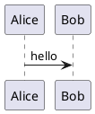

# coolshin blog

Personal Zola blog for `coolshin`, using a local `simple-pure` theme and deployed with GitHub Pages.

## Stack

- Zola
- Local theme: `themes/simple-pure`
- GitHub Pages via GitHub Actions

## Local development

Install `zola` first, then run:

```bash
zola serve --interface 127.0.0.1 --port 1111
```

Build the static site into `public/`:

```bash
zola build
```

Check templates and links:

```bash
zola check
```

Clean generated files:

```bash
rm -rf public
```

## Content structure

- Site config: `config.toml`
- Posts: `content/blog/`
- Standalone pages: `content/about.md`, `content/archives.md`
- Theme templates and assets: `themes/simple-pure/`

## UML diagrams

The theme renders diagram code fences in blog pages on the client side. Supported
languages are `plantuml`/`puml`, `mermaid`, `dot`/`graphviz`,
`flow`/`flowchart`, and `wavedrom`/`wave`.

PlantUML diagrams are encoded in the browser and rendered through the service
configured in `config.toml` under `extra.uml.plantuml_server`.

Example:

````markdown

````

The runtime lives in `themes/simple-pure/static/js/uml-renderer.js`. It follows
the same language routing idea used by VNote: detect diagram fences, load only
the required browser renderer, and replace the original code block with the
rendered diagram.

## Acknowledgements

Thanks to [VNote](https://github.com/vnotex/vnote) for the reference
implementation of Markdown diagram previews. The Zola theme's UML renderer was
implemented by studying VNote's PlantUML, Mermaid, Graphviz, Flowchart.js, and
WaveDrom preview pipeline and reusing compatible browser-side renderer assets.

## Deployment

This repository uses GitHub Pages Actions from [`.github/workflows/pages.yml`](.github/workflows/pages.yml).

- Site URL: https://kgbook.github.io/blog/
- Pages source: GitHub Actions

Push to `main` to trigger a Pages deployment after the repository is connected to GitHub Pages with `GitHub Actions` as the publishing source.
