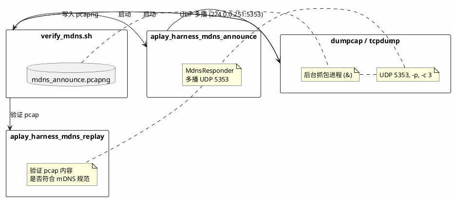

+++
title = "AirPlay mDNS Harness：模拟 AirPlay 设备的技术实现"
date = 2026-06-04

[taxonomies]
categories = ["AI"]
tags = ["mDNS", "AirPlay", "Linux", "C/C++", "网络协议", "测试框架", "harness", "AI"]
+++

在 APlay 项目中，mDNS 服务发现是 AirPlay/RAOP 设备被发现的基础。本文介绍的 AirPlay mDNS harness 借助一个轻量的验证框架，无需真实硬件，在单机上完成了 mDNS 协议实现的验证。本文从流程、代码到协议细节，完整解析这个"模拟设备"是如何工作的。

<!-- more -->

## 背景：为什么需要模拟设备

APlay 是一个支持 AirPlay/RAOP 协议的服务端实现。AirPlay 设备被发现依赖 mDNS（Multicast DNS）广播——设备在局域网内多播 `_airplay._tcp.local` 和 `_raop._tcp.local` 服务公告，客户端浏览到后才知道有哪些设备可用。

在开发和 CI 环境中，显然不能每次都拉一台 Apple TV 过来。APlay 的做法是：

> **自己发包、自己抓包、自己验证**——在同一台机器上，用代码模拟一个 AirPlay 设备，完整走一遍服务发现流程。

## Harness 的现实意义

harness 的价值不只是“能模拟一个设备”，更重要的是把模块功能变成一条可以重复执行的验收线。

后续修改 mDNS 代码、重构 SDK 结构、调整 CMake 目标，或者合入 PR 时，不需要靠人肉回忆“AirPlay 服务发现是不是还能用”。只要跑一次：

```sh
./harness/verify_mdns.sh
```

它就会自动完成构建、启动模拟设备、抓取真实 UDP 5353 包、解析验证结果。如果服务名写错了、TXT 记录少了、RAOP 实例名格式变了、goodbye 包不对，脚本会直接失败。

这对使用 AI agent 改代码尤其有用。agent 可以先改实现，再运行 harness 做自动验收，失败后继续修，直到形成一个闭环：**修改代码 → 自动验证 → 发现问题 → 再修正**。这样 agent 不只是“把代码写出来”，还可以用项目自己的验收标准证明这次修改没有把关键模块改坏。

## 整体架构：三进程协作



`verify_mdns.sh` 的执行流程：

1. **依赖预检** — 确认 `git`、`cmake`、`ninja`、`timeout` 存在，并且至少有 `dumpcap` 或 `tcpdump`。
2. **权限预检** — 用 `probe_dumpcap_capture()` / `probe_tcpdump_capture()` 验证当前用户能否无 sudo 打开抓包接口。
3. **同步 submodule** — 执行 `git submodule sync --recursive` 和 `git submodule update --init --recursive`，保证 Linux SDK 依赖可用。
4. **编译** — 构建 `APlayReceiver`、`aplay_sdk`、`aplay_harness_mdns_announce`、`aplay_harness_mdns_replay` 四个目标。
5. **启动抓包** — `start_capture()` 优先使用 `dumpcap`，不可用或无权限时用 `tcpdump`，后台抓取 UDP 5353 的 3 个包。
6. **发送公告** — 启动 `aplay_harness_mdns_announce --interval-ms 250 APlayHarness`，持续多播 AirPlay/RAOP announcement。
7. **等待抓完** — `wait ${CAPTURE_PID}` 阻塞等待抓包进程结束，然后停止 announce 进程。
8. **验证结果** — 用 `aplay_harness_mdns_replay resources/pcap/mdns_announce.pcapng APlayHarness 02:00:00:00:00:01` 做协议语义和 live capture 校验。

这也解释了为什么验证工具放在 `harness/mdns`，而不是 `example`：`harness` 是 agent/CI 的自动验收入口，负责构建目标、资源路径、执行顺序和 pass/fail 判断；`example` 只保留人可以手动运行、用来体验已实现能力的示例。

## DEVICE_ID：设备的虚拟身份

```sh
DEVICE_ID="02:00:00:00:00:01"
```

这行定义了**模拟设备的 MAC 地址**，由两个 harness 二进制共享：

```sh
./harness/verify_mdns.sh
# ...
"${BUILD_DIR}/harness/mdns/aplay_harness_mdns_announce" --interval-ms 250 "${RECEIVER_NAME}" &
# ...
"${BUILD_DIR}/harness/mdns/aplay_harness_mdns_replay" "${PCAP_CAPTURE}" "${RECEIVER_NAME}" "${DEVICE_ID}"
```

`02:` 前缀是 IEEE 局部管理地址的标志，用于虚拟/测试接口，不与真实厂商冲突。代码中对应的是：

```cpp
// sdk/src/main/cpp/streaming/airplay/include/airplay.hpp
struct ServiceProfile {
    std::string device_id = "02:00:00:00:00:01";
};

// sdk/src/main/cpp/streaming/raop/include/raop.hpp
struct ServiceProfile {
    std::string device_id = "02:00:00:00:00:01";
};
```

这个虚拟 MAC 会在 mDNS TXT 记录中以字符串形式出现，客户端收到后能识别设备身份。

## 抓包命令详解

```sh
timeout 15 dumpcap -i "${CAPTURE_IFACE}" -p -f "udp port 5353" -c 3 \
        -w "${OUTPUT_FILE}" &
```

| 参数 | 含义 |
|---|---|
| `timeout 15` | 15 秒超时，防止 announce 进程卡死导致永远抓不到包 |
| `-i any` | 监听所有网卡（`any` 是 Linux 伪接口，不支持混杂模式） |
| `-p` | **非混杂模式**，避免 Linux `any` 伪接口触发不支持混杂模式的问题 |
| `-f "udp port 5353"` | BPF 过滤表达式，只抓 mDNS 端口 |
| `-c 3` | 只抓 **3 个包**就自动停止 |
| `-w "${OUTPUT_FILE}"` | 写入 pcapng 原始包数据 |
| `&` | **后台运行**，让脚本继续往下走（后面还有 announce 要启动） |

为什么只抓 3 个包？因为当前 `APlayHarness` 的一次 announcement 会被编码成 1 个 UDP 包，里面包含 AirPlay、RAOP 和 host A 记录共 9 条 answer。代码还做了一个兜底：如果 AirPlay + RAOP 合并包超过 1200 字节，就拆成 AirPlay 和 RAOP 两个服务包。因此在当前实现里，一个完整 announcement 最多需要 2 个包，`-c 3` 足够覆盖一次完整公告，并留出一个重复公告的余量。

这个数字不是协议规定，而是 harness 的工程取舍：包数少，验证结束快；replay 会继续检查抓包里是否真的包含 `_airplay._tcp.local`、`_raop._tcp.local` 和当前 receiver 实例名。如果抓到的 3 个包不是目标公告，验证会失败，而不是误报通过。在 mDNS 流量很密集的真实局域网里，`3` 会偏紧，后续可以把抓包数量参数化，或者把默认值提高到 5-10 来提升人工环境的容错性；CI 和本机安静环境下，当前 `3` 个包是够用的。

后台启动后，脚本 sleep 1 秒确认进程存活，然后继续。实际等待发生在 `wait "${CAPTURE_PID}"`，这时 announce 已经在按 250ms 间隔发包。

如果 `dumpcap` 不存在或权限预检失败，脚本会退到 `tcpdump`：

```sh
timeout 15 tcpdump -i "${CAPTURE_IFACE}" -p -n -U -s 0 -c 3 \
        "udp port 5353" -w - >"${OUTPUT_FILE}" &
```

这里 `-U` 让 tcpdump packet-buffered 写出，`-s 0` 保留完整包，`-w - >"${OUTPUT_FILE}"` 则把 pcap 原始流写入 harness 指定路径。默认输出是：

```sh
resources/pcap/mdns_announce.pcapng
```

两个常用覆盖项：

```sh
APLAY_CAPTURE_IFACE=wlan0 ./harness/verify_mdns.sh
APLAY_PCAP_CAPTURE=/tmp/aplay-mdns.pcap ./harness/verify_mdns.sh
```

## 模拟设备的 mDNS 实现

### 服务配置与注册

`mdns_announce.cpp` 构造了一个完整的 mDNS 服务配置：

```cpp
aplay::protocol::mdns::ResponderConfig config;
config.host_name = receiver_name + ".local";
aplay::core::network::parse_ipv4_address("127.0.0.1", config.ipv4_address);

aplay::streaming::airplay::ServiceProfile airplay_profile;
airplay_profile.receiver_name = receiver_name;  // "APlayHarness"
airplay_profile.model = "APlayExample";
config.airplay = aplay::streaming::airplay::make_airplay_service(airplay_profile);

aplay::streaming::raop::ServiceProfile raop_profile;
raop_profile.receiver_name = receiver_name;
config.raop = aplay::streaming::raop::make_raop_service(raop_profile);

aplay::protocol::mdns::MdnsResponder& responder =
    aplay::protocol::mdns::MdnsResponder::instance();
responder.set_config(config);
```

### 每条服务生成 4 条 DNS 记录

`mdns.cpp` 中的 `add_service_records()` 为每个已注册服务生成：

| 记录类型 | 作用 | 示例 |
|---|---|---|
| **PTR** (_services) | 服务发现枚举 | `_services._dns-sd._udp.local` → `_airplay._tcp.local` |
| **PTR** (instance) | 实例名解析 | `_airplay._tcp.local` → `APlayHarness._airplay._tcp.local` |
| **SRV** | 主机 + 端口 | `APlayHarness.local:7000` |
| **TXT** | 设备属性 | `deviceid=02:00:00:00:00:01`, `features=0x527FFEE6` |

RAOP 的服务实例名中直接嵌入 device_id：

```cpp
// mdns_replay.cpp
std::string raop_instance_name(const std::string& receiver_name,
                               const std::string& device_id) {
    // "020000000001@APlayHarness._raop._tcp.local"
    return normalized_device_id + "@" + receiver_name + "._raop._tcp.local";
}
```

### UDP 多播发送

`mdns_responder.cpp` 启动一个专属线程，运行事件循环：

```cpp
int Impl::start() {
    socket_ = core::socket::open_ipv4_udp_multicast_socket(
        kPort, internal::kMulticastAddress, responder_.config_.ipv4_address);
    if (!loop_.add_reader(socket_.fd(), ...)) { ... }
    thread_.start();
}

// 每隔 interval_ms 调用一次
void Impl::announce(std::uint32_t ttl) {
    auto packets = responder_.build_announcement(ttl);
    send_packets(packets, multicast_endpoint(), false);  // 224.0.0.251:5353
}
```

当前 harness 的 announcer 把 responder 配成 `APlayHarness.local` 和 `127.0.0.1`，但抓包仍然观察的是标准 mDNS 多播目的地 `224.0.0.251:5353`。这让测试可以在单机上运行，同时验证真实 UDP 5353 multicast 路径是可观测的。

`mdns_announce` 还有一个很实用的离线模式：

```sh
build/linux/harness/mdns/aplay_harness_mdns_announce --once APlayHarness
```

它只构造 announcement 包并用 `MdnsParser` 解析自检，不打开 UDP 5353，也不会进入持续广播循环。这个模式适合快速确认编码逻辑，`verify_mdns.sh` 则负责完整 live capture 验收。

## 三层设备标识体系

模拟设备在代码中通过三层结构来区分身份：

```
┌──────────────────────────────────────────────────────────────┐
│ 第一层：device_id（字符串 MAC）                                │
│  • AirPlay TXT: "deviceid=02:00:00:00:00:01"                 │
│  • RAOP 实例名: "020000000001@APlayHarness._raop._tcp.local" │
│  → 纯字符串，客户端用于识别设备                                 │
├──────────────────────────────────────────────────────────────┤
│ 第二层：Service.instance（服务实例名）                          │
│  • AirPlay: "APlayHarness._airplay._tcp.local"               │
│  • RAOP:    "020000000001@APlayHarness._raop._tcp.local"     │
│  → device_id 嵌入 RAOP 实例名，支持同名多设备                   │
├──────────────────────────────────────────────────────────────┤
│ 第三层：ResponderConfig（主机层）                               │
│  • host_name   = "APlayHarness.local"                         │
│  • ipv4_address = 127.0.0.1                                   │
│  → SRV 记录指向的主机身份                                       │
└──────────────────────────────────────────────────────────────┘
```

## 验证机制：replay 做了什么

`mdns_replay` 接收一个 pcap 文件和设备参数，执行两层验证：第一层用 APlayHarness 配置离线构造响应，检查 responder 的协议语义；第二层扫描 live pcap，确认当前 harness announcer 的 DNS-SD 名字确实出现在抓包里。

```cpp
bool validate_generated_response() {
    // 1. 让 MdnsResponder 现场构造一个 mDNS 响应包
    responder.set_config(make_config());
    auto query = build_ptr_query({...});
    auto plan = responder.handle_query(query.data(), query.size());

    // 2. 解析这个包，验证记录数量和内容
    auto summary = parse_packet(plan.packets[0]);
    require(summary.answers.size() == 9);
    require(has_ptr(answers, "_services...", "_airplay._tcp.local"));
    require(has_ptr(answers, "_airplay._tcp.local", config.airplay.instance));
    require(has_ptr(answers, "_raop._tcp.local", config.raop.instance));
    require(has_record(answers, config.host_name, kTypeA));
    require(has_txt_item(answers, config.airplay.instance,
                         "features=0x527FFEE6,0x0"));
    require(has_txt_item(answers, config.raop.instance, "sr=44100"));

    // PTR 不应设置 cache-flush；SRV/TXT/A 这类 unique 记录必须设置。
    require_cache_flush_rules(answers);

    // goodbye 包必须能解析，且所有 answer 都使用 TTL=0。
    require_goodbye_ttl_zero(responder);
}

bool validate_pcap_capture(path, receiver_name, device_id) {
    // 3. 扫描 pcap 原始字节，验证 DNS 编码的域名是否存在
    return pcap_contains_dns_name(data, "_airplay._tcp.local") &&
           pcap_contains_dns_name(data, "_raop._tcp.local") &&
           pcap_contains_dns_name(data, "_services._dns-sd._udp.local") &&
           pcap_contains_dns_name(data, receiver_name + "._airplay._tcp.local") &&
           pcap_contains_dns_name(data, raop_instance_name(receiver_name, device_id));
}
```

这样既验证了 SDK 自己生成的响应包结构是否正确，也验证了实际在网卡上发出的二进制内容是否符合 mDNS DNS 名字编码规范。pcap 不是唯一 golden，因为 live capture 每次由当前 announcer 生成；replay 才是协议语义判断的中心。

## 无 sudo 抓包的实现

Linux 上普通用户抓包需要特殊权限。harness 只做检测，不安装包、不改用户组、不设置 capability、不读 sudo 密码。要做到零交互验证，需要在 harness 之外提前配置抓包权限：

**策略一：加入 wireshark 用户组**

```sh
sudo dpkg-reconfigure wireshark-common   # 安装时选择"允许非 root 抓包"
sudo usermod -aG wireshark "$USER"       # 当前用户加入 wireshark 组
newgrp wireshark                         # 刷新组权限
```

**策略二：给二进制加 capability**

```sh
sudo setcap cap_net_raw,cap_net_admin=eip "$(command -v dumpcap)"
sudo setcap cap_net_raw,cap_net_admin=eip "$(command -v tcpdump)"
```

harness 在预检阶段（`probe_dumpcap_capture` / `probe_tcpdump_capture`）用 1 秒超时启动一个真实抓包进程来探测权限，**失败时才报错**，而不是默认请求 sudo。这让 CI 环境可以在镜像构建时一次性配置好权限，harness 每次都能零交互通过。

## 总结

APlay mDNS harness 的设计体现了几个工程思路：

1. **自动验收闭环** — 后续重构、改代码、合 PR，甚至让 AI agent 修改实现，都可以用同一条 harness 命令验证 mDNS 模块有没有退化。
2. **协议测试不依赖硬件** — mDNS/DNS-SD 是结构化 UDP 记录，服务名和 TXT/SRV/PTR/A 记录可由程序生成、抓取和解析验证。
3. **自己发、自己抓、自己验** — 完整覆盖协议栈输出，不依赖外部测试设备或 mock。
4. **权限前置检测** — 预检失败比构建失败更容易定位，也更适合 CI 环境。
5. **多层身份体系** — 从 device_id 到实例名到主机名，逐层模拟了真实 AirPlay 设备的服务发现结构。

---

**相关源码：**

- [harness/verify_mdns.sh](https://github.com/kgbook/APlay/blob/main/harness/verify_mdns.sh) — harness 入口脚本
- [harness/mdns/mdns_announce.cpp](https://github.com/kgbook/APlay/blob/main/harness/mdns/mdns_announce.cpp) — 模拟设备广播
- [harness/mdns/mdns_replay.cpp](https://github.com/kgbook/APlay/blob/main/harness/mdns/mdns_replay.cpp) — pcap 验证
- [sdk/src/main/cpp/protocol/mdns/](https://github.com/kgbook/APlay/tree/main/sdk/src/main/cpp/protocol/mdns/) — mDNS 协议核心实现
- [sdk/src/main/cpp/streaming/airplay/](https://github.com/kgbook/APlay/tree/main/sdk/src/main/cpp/streaming/airplay/) — AirPlay 服务记录构建
- [sdk/src/main/cpp/streaming/raop/](https://github.com/kgbook/APlay/tree/main/sdk/src/main/cpp/streaming/raop/) — RAOP 服务记录构建

**代码仓库：**[APlay (kgbook/APlay)](https://github.com/kgbook/APlay)
