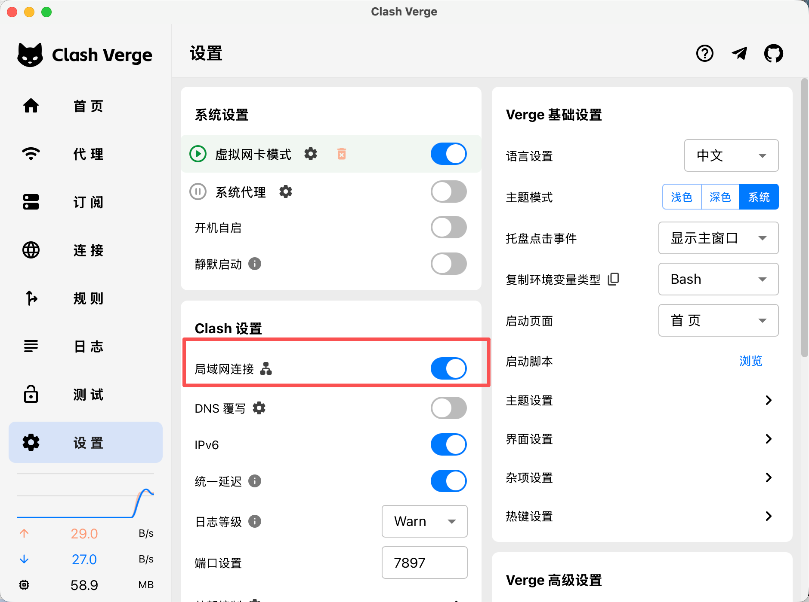
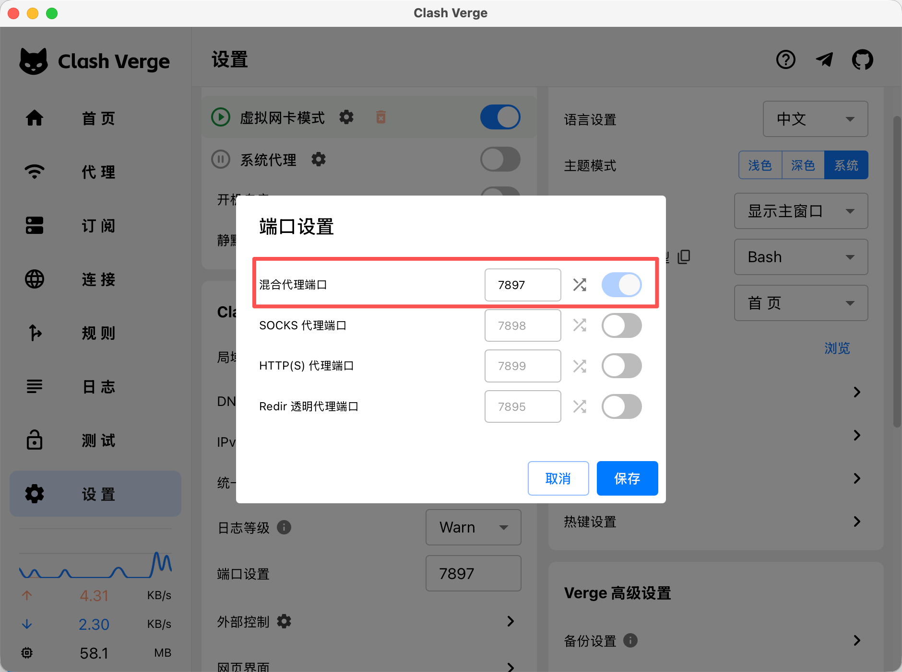
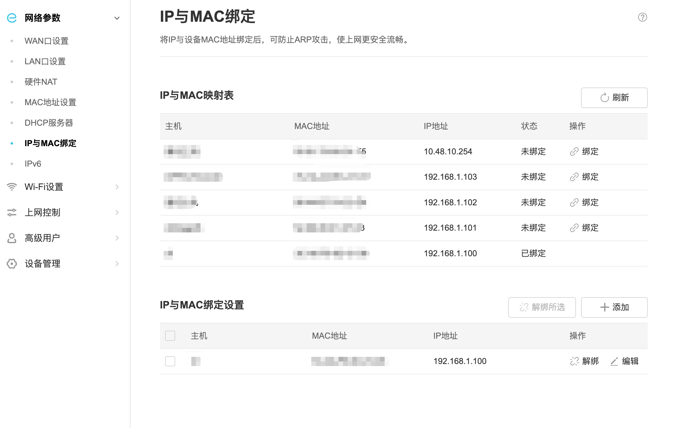
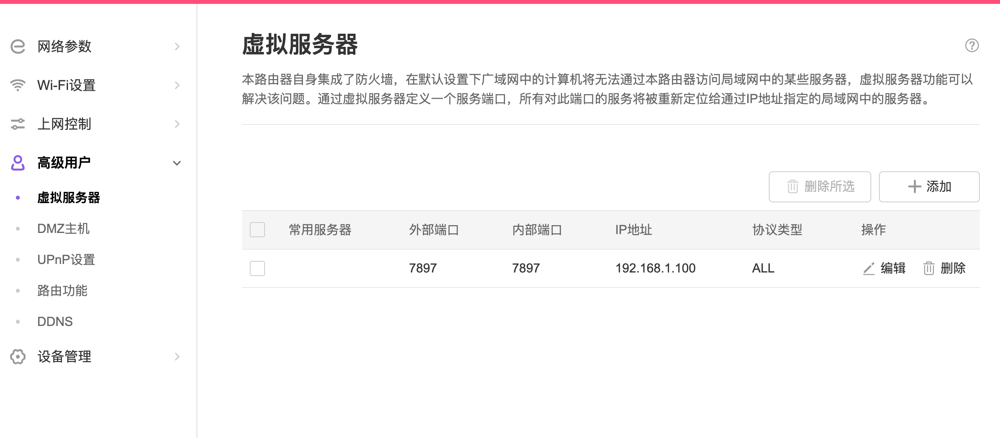
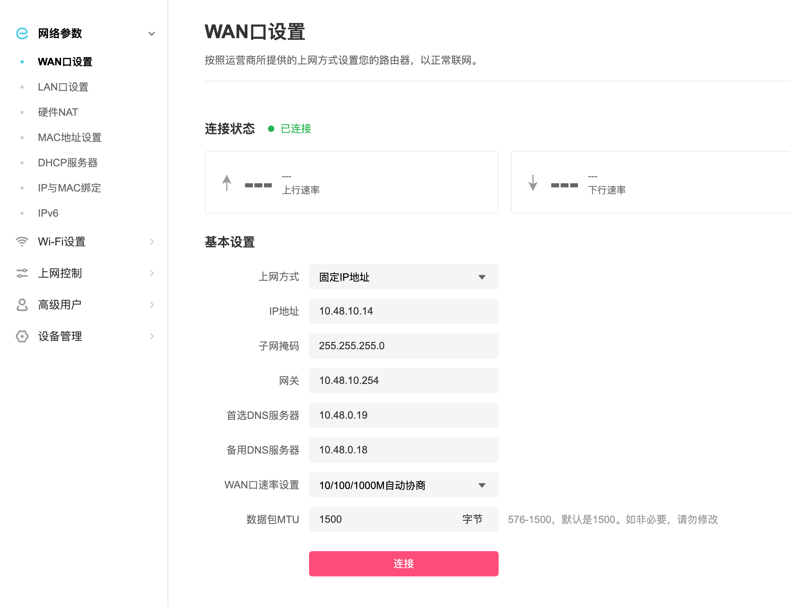

+++
title = "给不能上外网的编译服务器配置 Codex：让 AI 写代码、修 bug"
date = 2026-06-17

[taxonomies]
categories = ["AI"]
tags = ["Codex", "AI 编程", "代理", "Clash Verge", "编译服务器", "端口转发", "工程效率"]
+++

很多公司的编译服务器都不能直接上外网。这很常见：服务器在机房、实验室、内网环境里，能访问代码仓库和构建依赖，但不能直接访问 OpenAI、GitHub、npm、pip 等外部服务。现在多了一个新需求：我们想在这台服务器上跑 Codex，让 AI 直接读代码、改代码、修 bug。

一开始我也尝试过另一种办法：把服务器上的 Android 源码通过 Samba 挂载到本地电脑，然后在本地电脑运行 Codex。这个思路看起来简单，因为本地电脑能上外网，也能打开浏览器登录。

但实际体验很差。Android 源码太大，文件数量非常多，Samba 访问源码树会明显变慢；本地电脑配置又不如编译服务器，索引、搜索、构建、读日志都拖后腿。最后变成了“AI 能跑，但是效率很低”。更合理的做法是：**让 Codex 直接跑在编译服务器上，只把网络请求代理到本地电脑**。

这篇文章讲一个适合个人和小团队落地的方案：**服务器不直接出网，而是通过路由器端口转发，访问本地电脑上的 Clash Verge 代理**。

目标很简单：

```text
编译服务器 10.48.26.9 / 10.48.23.2
  -> 路由器 WAN 口 10.48.10.14:7897
  -> 本地电脑 192.168.1.100:7897
  -> Clash Verge
  -> 外网
```

服务器只需要知道一个代理地址，Codex 就能像普通联网环境一样工作。

## 先把原理讲明白

不要一上来就改一堆配置。先理解这件事在网络上到底发生了什么。

平时我们在自己的电脑上开 Clash Verge，浏览器能访问外网，是因为浏览器把请求发给本机代理端口，比如：

```text
127.0.0.1:7897
```

但是编译服务器不是你的电脑。它不能访问你的 `127.0.0.1`，因为服务器上的 `127.0.0.1` 指的是服务器自己。

所以我们要做两件事：

1. 让 Clash Verge 允许其它机器连接。
2. 让编译服务器跨网段访问到这台运行 Clash Verge 的电脑。

如果服务器和电脑在同一个网段，并且防火墙允许访问，当然可以直接连电脑 IP，不需要端口转发。

本文要解决的是另一种情况：**编译服务器和本地电脑不在同一个网段**。服务器不能直接访问电脑的网卡地址，中间要经过路由器、防火墙或 NAT，所以需要端口转发：

```text
路由器某个端口 -> 本地电脑的 Clash Verge 端口
```

这样服务器访问路由器，路由器再把流量转给本地电脑。

## 准备工作

你需要准备这些东西：

- 一台能正常访问外网的本地电脑，已经安装 Clash Verge。
- 路由器管理权限，可以设置端口转发，以及给本地电脑做 IP 与 MAC 绑定。
- 本地电脑已经能正常登录 Codex，用来复制认证文件到服务器。

下文用这些示例地址，实际操作时替换成你自己的：

| 设备 | 示例地址 |
| --- | --- |
| 本地电脑 LAN 地址 | `192.168.1.100` |
| 路由器 WAN 地址 | `10.48.10.14` |
| 编译服务器 1 | `10.48.26.9` |
| 编译服务器 2 | `10.48.23.2` |
| Clash Verge 端口 | `7897` |

如果你不知道这些地址，可以先在本地电脑上查看。

## 第一步：配置 Clash Verge

打开 Clash Verge，重点检查三项。

第一，允许“局域网连接”。

这个开关非常关键。不开它，Clash 只监听本机 `127.0.0.1`，服务器访问不到。



第二，确认代理端口。

本文实际使用的端口是：`7897`，有些配置会分成 HTTP、SOCKS、Mixed Port。建议优先用 Mixed Port。



第三，放行系统防火墙。

如果电脑系统弹窗询问是否允许 Clash Verge 接收入站连接，要允许。否则服务器虽然知道 IP 和端口，但连接会被电脑防火墙拦掉。

在本地电脑上可以先自测：

```sh
curl -x http://127.0.0.1:7897 https://api.openai.com
```

只要不是“连接被拒绝”，说明本机代理基本可用。

## 第二步：给本地电脑做地址保留

这一步容易被忽略。

DHCP 是动态分配地址的协议。普通情况下，电脑每次联网时向路由器申请一个 IP，路由器可能今天分配 `192.168.1.100`，下次分配另一个地址，比如`192.168.1.110`。

但是很多路由器支持“DHCP 地址保留”或“静态租约”：路由器仍然通过 DHCP 发地址，但它会根据网卡 MAC 地址，给该网卡永远分配到同一个 IP。这个做法也常被路由器界面叫做 **IP 与 MAC 绑定**。

它和“手动静态 IP”不同：

| 做法 | 配置位置 | 含义 |
| --- | --- | --- |
| DHCP 地址保留 / 静态租约 / IP 与 MAC 绑定 | 路由器 | 路由器看到某个 MAC，就固定分配同一个 IP |
| 手动静态 IP | 本地电脑网卡 | 电脑自己写死 IP、网关、DNS |

这篇文章推荐优先用路由器的 IP 与 MAC 绑定。这样本地电脑不用手动改网卡配置，也能避免下次开机 IP 变化，导致端口转发规则失效。

把本地电脑的网卡 MAC 绑定到固定地址，例如：

```text
192.168.1.100
```

保存后，重连一下电脑网络，确认地址没有变化。

本地电脑网卡 MAC 绑定到固定 IP：



## 第三步：配置路由器端口转发

如果服务器和本地电脑不在同一个网段，服务器不能直接访问电脑的 Clash Verge 监听地址，就需要端口转发。路由器后台里通常叫：

```text
端口转发
虚拟服务器
NAT 转发
Port Forwarding
```

添加一条规则：

| 项目 | 示例 |
| --- | --- |
| 外部端口 | `7897` |
| 内部 IP | `192.168.1.100` |
| 内部端口 | `7897` |
| 协议 | `TCP` |

意思是：访问路由器 WAN 口 `10.48.10.14:7897` 的流量，转给本地电脑 `192.168.1.100:7897`



路由器的 WAN 口配置固定 IP：`10.48.10.14`，我们10 网段的 IP 才能访问到内网服务器：



## 第四步：给服务器配置环境变量

测试通过后，把代理写到服务器环境变量里。

可以在 `~/.bashrc` 里写两个函数，方便随时打开或关闭代理：

```sh
proxy-on() {
  export https_proxy=http://10.48.10.14:7897 http_proxy=http://10.48.10.14:7897 all_proxy=socks5://10.48.10.14:7897
  echo "[proxy-on] https_proxy=$https_proxy, http_proxy=$http_proxy, all_proxy=$all_proxy"
}

proxy-off() {
  unset https_proxy http_proxy all_proxy
  echo "[proxy-off] proxies cleared"
}

proxy-on
```

这里的地址要填“服务器实际能访问到的代理入口”。本文最终配置使用的是路由器 WAN 口 `10.48.10.14:7897`，路由器再把流量转发到本地电脑 `192.168.1.100:7897`。

保存后重新加载：

```sh
source ~/.bashrc
```

也可以手动执行 `proxy-on`。这套配置不需要管理员权限，所有改动都在当前用户的 `HOME` 目录里完成。

## 第五步：把本地 Codex 登录认证配置文件复制到服务器

有些编译服务器没有桌面环境，也不方便安装 Firefox、Chrome 这类浏览器。即使服务器代理已经通了，到了网页登录验证这一步也可能卡住。

更省事的办法是：**先在本地电脑完成 Codex 登录，再把本地的 `auth.json` 复制到远程编译服务器**。

先在本地电脑确认 Codex 已经登录过。一般认证文件在：

```text
~/.codex/auth.json
```

然后在服务器上准备目录：

```sh
ssh user@server 'mkdir -p ~/.codex && chmod 700 ~/.codex'
```

再从本地电脑复制到服务器：

```sh
scp ~/.codex/auth.json user@server:~/.codex/auth.json
```

复制完成后，建议在服务器上收紧权限：

```sh
ssh user@server 'chmod 600 ~/.codex/auth.json'
```

这里的 `user@server` 换成你的服务器用户名和地址。

如果你的服务器 SSH 端口不是默认的 `22`，例如是 `2222`，命令要这样写：

```sh
scp -P 2222 ~/.codex/auth.json user@server:~/.codex/auth.json
```

注意，`auth.json` 是登录凭据，不要发到群里，不要提交到 Git，也不要放进项目目录。它应该只放在当前用户的 `~/.codex/` 目录下。

## 第六步：验证 Codex 版本和认证

到服务器上先看版本：

```sh
codex --version
```

如果输出类似下面这样，说明服务器上的 Codex CLI 已经能正常执行：

```text
codex-cli 0.140.0
```

再启动 Codex，如果看到下面这种提示，不一定是失败：

```text
Codex could not find bubblewrap on PATH.
Codex will use the bundled bubblewrap in the meantime.
```

`bubblewrap` 是 Codex 沙箱会用到的系统工具。没有安装时，Codex 会提示你缺少它，并临时使用自带版本。本文的场景没有管理员权限，可以先忽略这个警告，继续验证 Codex 是否能正常进入。

进入 Codex 后，可以输入：

```text
/status
```

正常情况下会看到类似状态信息：

```text
OpenAI Codex (v0.140.0)
Model:                gpt-5.5
Directory:            ~
Permissions:          Workspace (Ask for approval)
Agents.md:            <none>
Account:              user@example.com (Plus)
Collaboration mode:   Default
Session:              <session-id>

5h limit:             [███████████████████░] 94% left
Weekly limit:         [████░░░░░░░░░░░░░░░░] 21% left
```

如果认证文件复制正确，并且代理环境变量也配置好了，通常不需要在服务器上再打开浏览器登录。

## 问题排查

如果跑不通，不要同时怀疑所有东西。按下面顺序查。

### 1. 本地电脑能不能访问外网

先确认 Clash Verge 自己没问题：

```sh
% curl -x http://127.0.0.1:7897 https://api.openai.com
{
    "message": "Welcome to the OpenAI API! Documentation is available at https://platform.openai.com/docs/api-reference"
}
```

本机都不通，就先修 Clash 订阅、节点、规则。

### 2. 服务器能不能访问路由器端口

在服务器上测试端口：

```sh
$ nc -vz 10.48.10.14 7897
Connection to 10.48.10.14 7897 port [tcp/*] succeeded!
```

跨网段场景下，编译服务器应该访问路由器WAN口 `10.48.10.14:7897`。

### 3. 服务器命令有没有真的使用代理

很多人配置了代理，但命令没有读到环境变量。

检查：

```sh
$ env | grep -i proxy
https_proxy=http://10.48.10.14:7897
http_proxy=http://10.48.10.14:7897
no_proxy=127.0.0.1, localhost, gerrit.xxxxx.com, svn.xxxxx.com, nexus.xxxxx.com
all_proxy=socks5://10.48.10.14:7897
```

再用明确指定代理的方式测试：

```sh
curl -x http://10.48.10.14:7897 https://api.openai.com
```

### 4. Codex 是否继承了环境变量

在同一个 shell 会话里先设置代理，再启动 Codex：

```sh
proxy-on
codex
```

不要在一个shell 会话窗口里设置代理，却在另一个没有环境变量的会话窗口里启动 Codex。

## 总结

这套方案的关键点只有三个：

1. 本地电脑用 Clash Verge 并配置`7897`端口真正访问外网。
2. 路由器把 WAN 口 `10.48.10.14:7897` 转发到本地电脑 `192.168.1.100:7897`。
3. 服务器通过 `http_proxy` / `https_proxy` 让 Codex 走代理。

网络打通以后，Codex 的价值就不只是“帮我写一段代码”，而是可以直接在编译服务器上完成更接近真实开发的循环：

```text
读代码 -> 改代码 -> 编译 -> 看错误 -> 再修 -> 验证通过
```

对于不能直接上外网的编译环境，这种方式成本低、改动小、见效快。先把代理链路跑通，再把构建命令、测试命令和项目约束写清楚，AI 才能真正参与到修 bug 和工程交付里。
