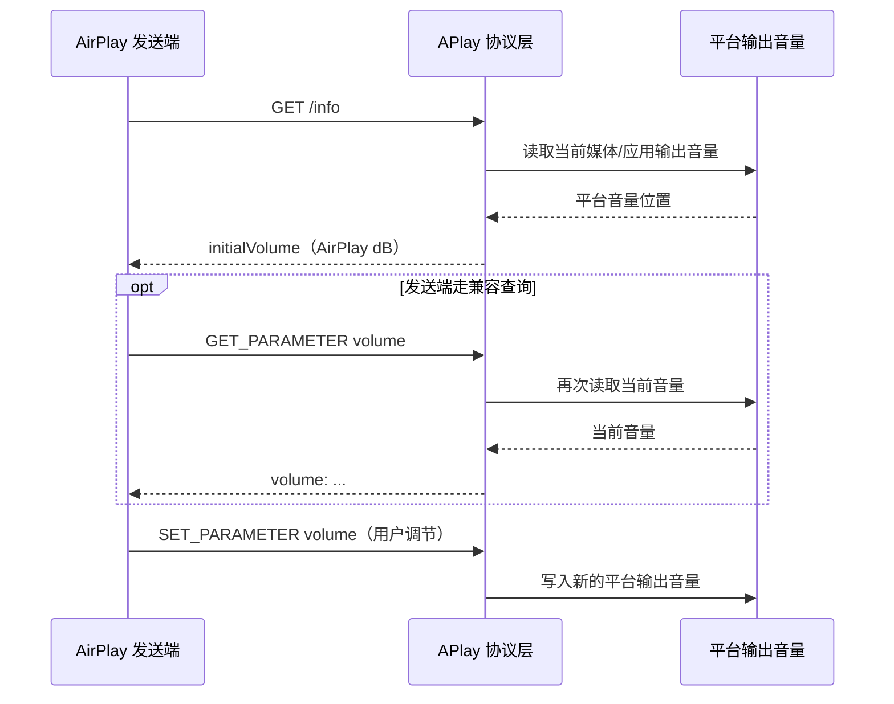
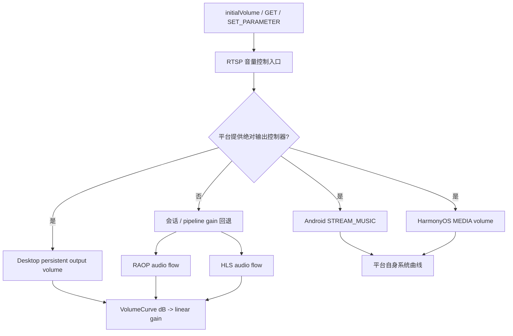

+++
title = "AirPlay 投屏音量控制：初始音量同步、音量曲线与跨平台实现"
date = 2026-08-03
path = "2026/08/03/airplay-cross-platform-volume-control"
[taxonomies]
categories = ["AirPlay"]
tags = ["AirPlay", "RAOP", "HLS", "Android", "HarmonyOS", "Desktop", "Qt", "音量曲线", "APlay"]

+++

## 一个看似简单的满音量问题

先把接收端设备媒体音量调到最低，再从Apple设备发起AirPlay 投屏，投屏收发两端音量都变成满音量了！沿着这个现象继续测试，很快又遇到几组相关但不完全相同的问题：

- 发送端调节音量，已经拖到最低静音位置，接收端仍处于中等音量；
-  断开再投屏后，新的 RAOP 或 HLS 管线会把输出重新推回满音量；
- 修好初始同步后，Bilibili、YouTube 的 HLS 投屏反而不再发送音量调节请求。

这些症状横跨 RTSP、`/info`、系统音量 API、PCM 处理、OHAudio 和
`QAudioSink`。如果把它们都归结为“再乘一个 gain”，很容易修好一条路径，
同时让另一条路径发生双重衰减或彻底失去控制。

这篇文章记录 APlay 中这次问题的完整演进：先从日志和抓包确认谁掌握初始
音量，再区分协议坐标与听感曲线，最后把 Android、HarmonyOS 和 Desktop
放到同一套控制模型中。

---

## 第一条线索：`SET_PARAMETER` 不是初始音量

AirPlay/RAOP 通过 RTSP 的 `SET_PARAMETER` 下发音量，参数是 dB 衰减值：

```http
SET_PARAMETER rtsp://fe80::76b6:480f:e638:57cb/15045326354330175316 RTSP/1.0
Content-Type: text/parameters

volume: -11.123877
```

协议中的特殊值 `-144 dB` 表示静音，普通非静音区间是 `-30..0 dB`。其中
`0 dB` 不是“没有设置音量”，而是零衰减，也就是最大音量。

最初的接收端日志给出了关键时序：

```text
SETUP -> GET /info -> GET_PARAMETER volume -> RECORD
```

发送端在这次会话里确实主动查询了音量，但 APlay 的 RTSP 会话把
`audio_volume_decibels` 固定初始化成 `0.0`，所以返回的是：

```text
volume: 0.000000
```

发送端只是忠实显示了接收端报告的满音量。后续日志中的 `SET_PARAMETER`
直到用户拖动滑块才出现，例如 `-1.875 dB`；它不是开播时用来探测接收端
当前状态的必经请求。

更重要的是，不能依赖所有发送端都先发 `GET_PARAMETER`。当接收端在完整
`/info` 中提供 `initialVolume` 后，有的发送端会直接采用这个值，不再额外
查询。因此正确的初始化链路应该是：



也就是说，`initialVolume` 负责启动同步，`GET_PARAMETER` 是可选兼容路径，
`SET_PARAMETER` 才是运行期控制。三者必须读写同一个权威状态。

---

## 两种“曲线”必须分开

调查中最容易踩坑的地方，是系统音量位置映射和声音增益曲线都被叫作
“音量曲线”，但它们解决的是两件不同的事。

### 协议 dB 与系统音量位置

Android 和 HarmonyOS 提供的是离散系统音量索引，例如 `0..150` 或
`0..15`。平台已经在这些档位背后应用了自己的产品听感曲线。APlay 要做的
只是让 AirPlay 滑块位置与系统滑块位置一致：

```text
  0 dB      最大音量，不衰减
 -1~-29 dB  正常衰减
-30 dB      最小的“非静音”音量
-144 dB     特殊值：明确静音
```

因此双向映射应在位置域线性完成。假设归一化档位为 `level=0..100`：

```cpp
db = -30.0f + level / 100.0f * 30.0f;
level = round((db + 30.0f) / 30.0f * 100.0f);
```

早期实现反过来使用了 PCM 听感曲线。结果发送端的最低 `-30 dB` 被反解成
`level=37`，在一台 `0..150` 的 Android 设备上落到索引 `56`，自然远高于
系统最低音量。这个 bug 的本质不是曲线不够漂亮，而是把“控制器位置”误当成
“声学增益”来求逆。

### dB 与实际线性增益

当平台没有可直接控制的系统输出音量，或者音频管线本身需要应用 gain 时，
才进入第二种转换：把 dB 衰减值转换成渲染器使用的线性增益。

```cpp
gain = std::exp2(db / 6.020599913f);
```

例如 `-30 dB` 对应的线性 gain 约为 `0.0316228`，而不是音量控件的 0%。
这是幅度换算，不能拿来决定 Android 系统音量滑块应该停在哪一格。

APlay 还为产品层的 `0..100` 音量级定义了一条低音量区域更细腻的听感曲线。
控制点在 dB 域线性插值，再转换成 gain：

| level | dB | linear gain（约） |
| ---: | ---: | ---: |
| 0 | 静音 | 0 |
| 1 | -58 | 0.00125893 |
| 20 | -40 | 0.01 |
| 60 | -17 | 0.141254 |
| 100 | 0 | 1 |

构造 `VolumeCurve` 时一次性生成 101 项 LUT，播放时只按 level 查表。这样
既避免简单线性 gain 导致低音量区域变化过粗，也不会在 PCM sample 循环中
执行 `exp`、`pow` 或插值。

可以把两套转换概括成一句话：

> 对系统音量控件映射“位置”，对 PCM 或渲染器映射“幅度”。

---

## 先统一控制面，再让平台决定执行点

共享协议层不应该知道 `AudioManager`、AudioKit 或 `QAudioSink`。APlay 在
RTSP manager 中注入一对平台音量回调：

```cpp
typedef std::function<bool(float&)> AudioVolumeReader;
typedef std::function<bool(float)> AudioVolumeWriter;

configure_audio_volume_controller(reader, writer);
```

只要平台同时提供 reader 和 writer：

- `/info` 通过 reader 生成实时 `initialVolume`；
- `GET_PARAMETER volume` 通过 reader 返回当前接收端音量；
- `SET_PARAMETER volume` 通过 writer 更新接收端音量；
- RAOP、镜像音频和 HLS 不再各自维护互相冲突的“主音量”。

没有外部控制器时，原有会话状态和管线 gain 仍可作为回退。这让协议层只
负责 AirPlay 语义，而系统 API、线程模型和最终增益位置仍归各自 OSAL 后端。



---

## Android：系统音量是唯一主旋钮

Android 使用 `AudioManager.STREAM_MUSIC` 作为媒体输出音量的权威来源。
SDK 启动时保留 application context，Java 层查询最小、当前和最大索引，JNI
层再把索引归一化为 `0..100`，并映射成 AirPlay 的 `-30..0 dB`。

一次真机检查中，设备媒体音量为 `110/150`：

```text
index=110 range=0..150 -> level=73 -> -11.475 dB
```

随后 `/info` 返回同一个 `initialVolume`，手工发送
`SET_PARAMETER volume: -17` 后，系统媒体音量变为 `90/150`。测试结束再把
设备恢复到原先的 `110/150`，避免验证过程改变用户环境。

为什么不继续在 Android PCM 上乘同一份 sender gain？因为这会形成：

```text
最终响度 = Android 系统媒体音量 × APlay PCM gain
```

发送端只知道自己改变了一个值，却无法观察另一个乘数，双端滑块很快再次
失配。启用系统音量桥后，Android 播放链路保持 unity gain，把最终听感交给
系统音量曲线。

不过共享曲线和 PCM gain 处理器仍有存在价值：在没有系统控制器的回退模式
中，Oboe 没有流级音量 API，APlay 必须在 PCM 进入 renderer 前处理。PCM
bypass 与解码输出会汇合到同一个输出点，按实际 sample format 和 channel
count 做 frame 对齐；`gain==1` 直接旁路，避免无意义地遍历 buffer，同一块
PCM 也只能应用一次 gain。

---

## HarmonyOS：AudioKit 状态跨过 NAPI

HarmonyOS 遇到的是同类现象，但不能照抄 JNI。当前目标 API 下，权威媒体
音量来自 ArkTS AudioKit：

- `getMinVolumeSync(MEDIA)`、`getVolumeSync(MEDIA)`、
  `getMaxVolumeSync(MEDIA)` 读取范围；
- `audioManager.setVolume(MEDIA, index)` 写入音量；
- `volumeChange` 监听实体音量键或系统 UI 的外部变化。

启动 receiver 时，ArkTS 把范围和 setter 回调交给 Native。C++ 侧的
`HarmonySystemVolume` 保存线程安全状态，将 AirPlay dB 转成系统索引后，
通过 NAPI 的线程安全函数回调 ArkTS。反方向的实体按键变化则调用
`updateOutputVolume()`，刷新 `/info` 和后续查询看到的状态。

Harmony 的 OHAudio renderer 本身支持设置流音量。没有系统桥时，它可以
接收共享 `VolumeCurve` 输出的线性 gain，并在 renderer 重建后恢复；启用
系统媒体音量桥时则保持 unity，避免与 AudioKit 再乘一次。

这层实现的重点不只是 API 名称，而是生命周期：receiver 启动时注册监听，
启动失败或停止时注销；异步 set 失败后重新查询真实系统音量，不能让 Native
缓存长期停留在一个平台并未接受的值。

---

## Desktop：分开“输出音量”和“管线音量”

Linux、macOS 和 Windows 共用 Qt desktop 后端。Qt 没有一套在三平台上都
等价的系统主音量接口，因此这里把共享 `QAudioSink` 的应用输出音量定义为
AirPlay 接收端的绝对音量。

最初 Desktop 只有一个 `volume_`。这会把两种不同生命周期的状态混在一起：

- 接收端输出音量应该跨投屏会话保留；
- HLS/RAOP pipeline gain 属于当前管线，管线重建时可能重新初始化。

修复后分别保存：

```cpp
float playbackVolume_;       // 当前管线增益
float outputVolumeDecibels_; // AirPlay 接收端绝对音量
float outputVolume_;         // 上者转换后的线性 gain
```

最终交给 Qt 的值是两者乘积，并限制到 `[0, 1]`：

```cpp
combined = clamp(playbackVolume_ * outputVolume_, 0.0f, 1.0f);
audioSink->setVolume(combined);
```

新建 `QAudioSink` 后立即恢复 `combinedVolume()`，于是断开、重投或音频格式
变化都不会悄悄回到满音量。所有 `QAudioSink` 操作通过
`QMetaObject::invokeMethod(..., Qt::QueuedConnection)` 回到 Qt owner thread；
状态本身由 mutex 保护，避免音频管线 teardown 与音量更新竞争。

这里的乘法不会形成 Android 那种“双重主音量”，因为
`playbackVolume_` 和 `outputVolume_` 的职责已经显式分离：前者是内部管线
系数，后者才是发送端可见、跨会话持久的接收器输出音量。

---

## 一次反直觉的回归：声明得越多，功能反而越少

初始音量同步完成后，Android 的 `/info` 一度同时返回：

```text
initialVolume=-27.9
volumeControlType=4
```

本地检查很漂亮：发送端能显示正确初始值，手工 `GET_PARAMETER` 和
`SET_PARAMETER` 也都能工作。但真实 Bilibili、YouTube HLS 投屏却不再调节
音量。新日志和抓包中没有任何 `SET_PARAMETER volume`。

这时如果只看渲染链路，很容易误判为 HLS 忘了调用 `setVolume()`。新旧抓包
对比给出了更强的证据：

| 证据 | 旧版本 | 回归版本 |
| --- | ---: | ---: |
| `VideoVolumeControl` feature bit 3 | 1 | 1 |
| Bilibili `GET_PARAMETER volume` | 1 次 | 0 次 |
| Bilibili `SET_PARAMETER volume` | 29 次 | 0 次 |
| `volumeControlType=4` | 无 | 有 |

新增的其他 feature 位在更早的正常抓包中已经存在，不能解释行为变化。真正
改变发送端选择的是 `volumeControlType=4`：这个值来自 Apple TV 4K 的
`/info` 样例，但 APlay 实际只实现了 RTSP `GET/SET_PARAMETER` 控制通道。
发送端看到这个声明后，选择了 APlay 没有实现的另一条绝对音量路径，于是
RTSP 请求整个消失。

最终方案不是删除初始同步，也不是关闭 mDNS 的视频音量能力，而是：

- 保留 `/info.initialVolume`；
- 保留 feature bit 3 `VideoVolumeControl`；
- 删除不匹配实现能力的 `volumeControlType=4`；
- 继续以 RTSP `GET_PARAMETER`/`SET_PARAMETER` 作为权威控制通道。

这次回归提醒了一个很实用的协议调试原则：设备样例里的字段不是“多写总比
少写好”。能力声明会改变对端状态机；只声明自己真正实现的通道。

---

## 如何验证：把控制面、数值和听感分开

跨平台音量修复不能只用“听起来变小了”验收。APlay 把验证分成四层。

### 1. 曲线数值

先独立检查边界和关键控制点：

```text
level 0/1/20/60/100
gain  0/0.00125893/0.01/0.141254/1
AirPlay -30 dB -> gain 0.0316228
```

同时覆盖 level 越界 clamp、`-144 dB` 静音、NaN/无穷值拒绝，以及系统索引
与 AirPlay dB 的双向舍入。这里验证的是数学，不需要网络投屏。

### 2. 协议载荷

检查完整和限定 `/info`、mDNS feature 与 RTSP 请求：

- `/info` 在平台控制器可用时包含实时 `initialVolume`；
- `/info` 不再包含 `volumeControlType`；
- `GET_PARAMETER volume` 返回 `volume: %.6f`；
- `SET_PARAMETER` 能命中 receiver controller，而不是错误的独立 gain；
- mDNS、限定 `/info` 和完整 `/info` 都保留 bit 3。

构建产物还可以做字符串抽查：Android 两个 ABI 与 Linux/Desktop 产物包含
`initialVolume`，不包含 `volumeControlType`。它不能替代运行测试，但能及时
发现旧字段因条件编译重新混入。

### 3. 平台构建与设备控制

改动完成后，Linux/Desktop、Android 和 HarmonyOS 都通过了项目包装构建；
Android 生成两个 ABI 的 APK/AAR，HarmonyOS 生成 HAP。Android 真机进一步
验证了 `/info`、兼容 `GET_PARAMETER` 和受控 `SET_PARAMETER` 对系统媒体
音量的双向映射。

还要专门测试 renderer/pipeline 重建：保持一个非满音量，触发 HLS/RAOP
切换、格式变化或断开重投，确认新 renderer 恢复旧 gain，而不是使用构造
默认值 1.0。

### 4. 真实投屏矩阵

最终仍需要真实 sender 与 receiver，因为发送端会根据能力字段改变行为，
本地模拟请求无法证明 Bilibili 或 YouTube 会选择哪条通道。

| 场景 | 启动同步 | 运行期调节 | 额外检查 |
| --- | --- | --- | --- |
| RAOP 音乐 | 非满音量启动 | 最小/中间/最大/静音 | 重投后保持 |
| 镜像音频 | 两端滑块一致 | 连续调节无突跳 | 画面切换后保持 |
| HLS 视频 | `/info` 初始值一致 | 抓包重新出现 `SET_PARAMETER` | 广告/正片切换后保持 |
| Android | `STREAM_MUSIC` 一致 | 实体键与 sender 双向更新 | 无 PCM 双重衰减 |
| HarmonyOS | MEDIA volume 一致 | AudioKit 事件双向更新 | 监听生命周期正确 |
| Desktop | 应用输出音量一致 | Qt owner thread 更新 | `QAudioSink` 重建恢复 |

本地构建、静态协议复核和手工 RTSP 请求只能证明实现具备这些能力，不能代替
真实网络投屏验收。回归修复后尤其应该保存一份新的接收端日志和包含 TCP
7000/49152 单播流量的抓包，用它确认 `/info` 有 `initialVolume`、没有
`volumeControlType`，并且拖动 HLS 音量时重新出现 `SET_PARAMETER volume`。
截至这笔提交整理时，这一轮回归修复后的完整真机矩阵仍需要用新日志和抓包
闭环，因此不能把三平台包装构建通过写成“投屏问题已经实机验收”。

## 

如果只看最终代码，会觉得 reader、writer 和几个 gain 字段并不复杂。真正困难
的是确定每一层“音量”究竟代表控制器位置、协议衰减、系统媒体音量，还是
PCM 幅度，并找出哪个状态应该跨会话保留。

最终形成的设计可以压缩成四条规则：

1. `initialVolume`、`GET_PARAMETER` 和 `SET_PARAMETER` 必须指向同一权威状态。
2. 系统音量索引按位置映射；PCM/renderer 按 dB 转线性 gain，二者不能互相反解。
3. 同一个音量只在一个执行点生效，系统音量桥与软件 gain 不重复叠加。
4. 能力字段会选择协议路径，只声明已经实现并验证过的能力。

音量问题最终不是一道公式题，而是一道状态所有权题。把状态的主人、坐标系、
生命周期和执行点说清楚以后，Android、HarmonyOS 与 Desktop 的差异仍然
存在，却不再需要三套彼此冲突的播放策略。
