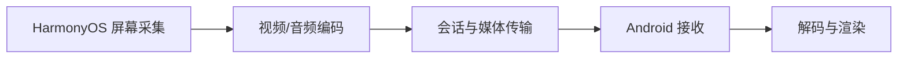
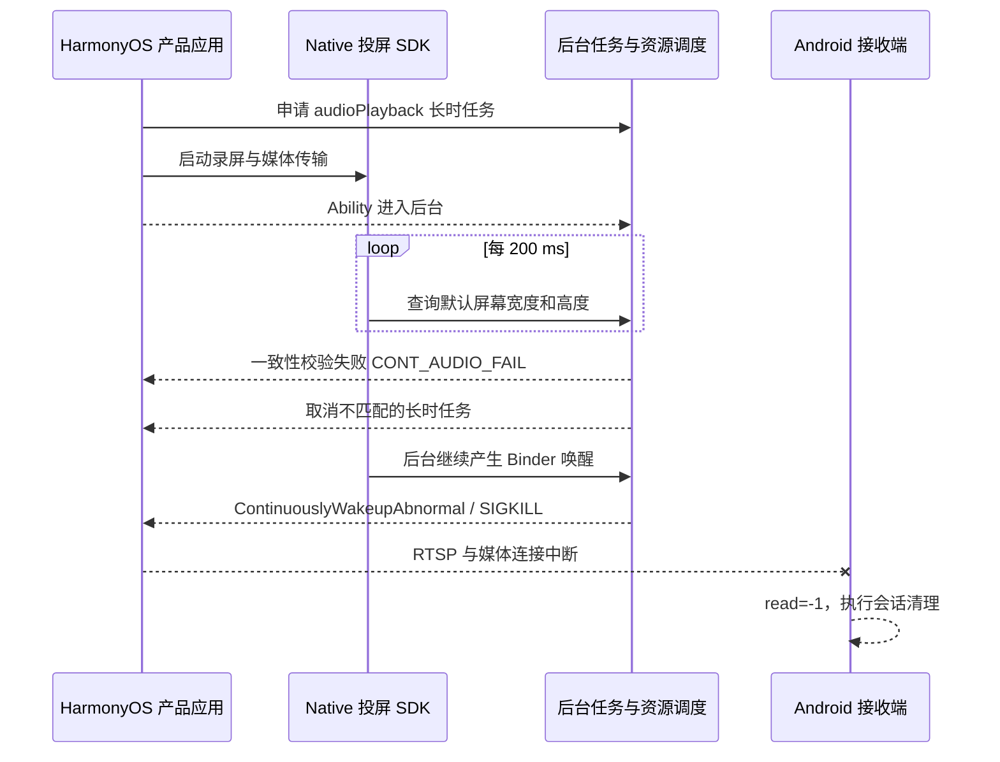

+++
title = "消失在第十分钟的投屏：HarmonyOS 后台任务与 Binder 唤醒排查实录"
date = 2026-07-29
path = "2026/07/29/harmonyos-screen-cast-ten-minute-disconnect"
[taxonomies]
categories = ["HarmonyOS"]
tags = ["HarmonyOS", "Android", "投屏", "Binder", "后台任务", "性能优化", "故障排查"]

+++

## 第十分钟，投屏画面突然消失

这是一个很有迷惑性的故障。

一台 HarmonyOS 手机把屏幕镜像到 Android 接收端。连接建立顺利，视频和
音频都正常，横竖屏切换也能工作。手机停留在投屏应用里时一切稳定；切到
视频应用，让投屏应用退到后台，画面仍然流畅。

然后，大约十分钟后，Android TV 的投屏画面突然消失。
没有逐渐增加的马赛克，没有越来越高的网络延迟，也没有明显的卡顿过程。

最初的嫌疑人很多：

- 网络波动，Wi-Fi 短时断网；
- 心跳或会话定时器；
- 应用自己的“十分钟超时”逻辑。

最终根因却是两个看起来互不相关的改动叠加：

1. 产品应用为录屏投屏申请了错误的长时任务类型；
2. Native SDK 为解决横竖屏响应问题，增加了每 200 ms 查询屏幕尺寸的
   DisplayManager 轮询。

错误的长时任务先被系统取消，失去保护的后台进程又持续制造 Binder
唤醒，最终被系统以异常后台唤醒为由强制终止。Android 端只是最后收到
EOF 的那个人。


## 投屏链路

这套投屏系统由两个工程组成：

- 产品应用负责 UI、设备连接、权限、Ability 生命周期和后台任务；
- 媒体 SDK 负责录屏、编码、媒体传输以及横竖屏适配。

发送端和接收端的主链路可以简化为：



这样的分层很常见，但也会制造一种排障陷阱：产品层申请后台资源，SDK
层制造系统调用，Android 端表现为连接断开。问题跨越三个边界，单看任何
一个模块都很难得到完整答案。

## 如何稳定复现

复现条件并不复杂：

1. HarmonyOS 发送端和 Android 接收端接入同一局域网；
2. 发送端建立镜像投屏；
3. 确认 Android 端已持续播放；
4. 在发送端打开另一个前台应用，使投屏应用进入后台；
5. 保持屏幕亮起并继续播放至少 12 分钟。

前台停留通常不会触发问题，必须让投屏 Ability 真正进入后台。复现时还要
避免反复切回投屏应用，因为回到前台可能重置系统对后台进程的观察窗口。

为了让三端时间线可对齐，开始前先清空日志：

```bash
hdc shell hilog -r
adb logcat -c
```

随后分别持续保存 HarmonyOS 和 Android 日志：

```bash
hdc shell hilog > harmony-live.log
adb logcat -v threadtime > android-live.log
```

如果 Android 接收设备允许抓包，可以同时保存：

```bash
adb shell tcpdump -i any -s 0 -w /data/local/tmp/cast.pcap
```

复现结束后，至少检查这些关键词：

```bash
rg -n 'CONT_AUDIO_FAIL|ContinuouslyWakeupAbnormal|PROCESS_KILL|signal 9' harmony-live.log
rg -n 'disconnected|Buffer read -1|onSocketError' android-live.log
```

还要记录发送端进程是否更换（比如重启）：

```bash
hdc shell pidof com.example.cast
```

这里使用的是示例包名。真实项目中，日志归档前还应继续清理包名、IP、设备序列号、账号和内部服务器地址。

## 第一层证据：Android 只是收到了 EOF

Android 日志在故障点附近只有很短的一条链：

```text
Receiver: Client <sender-ip> disconnected. Buffer read -1
Client: onSocketError
ReceiverActivity: finish
```

`read()` 返回 `-1` 只能说明控制连接已经不可继续读取。

> 这里的 Buffer read -1 是 Android Java NIO 层构造的 `EOFException`
> 消息。`SocketChannel.read(ByteBuffer)` 以 `-1` 表示流末尾，
> 而 `0` 仅表示本次非阻塞读取暂时没有读到数据。
  
它不能证明：

- 是 Android 主动断开；
- 是 HarmonyOS 应用崩溃；
- 网络不稳定
- 还是操作系统杀掉了发送端。

但它至少确定了一件事：Android 的页面退出是连接错误之后的清理动作，
不是故障的起点。

这一步很重要。跨端问题如果不先判断“谁先失去生命体征”，很容易在接收端
增加重连、放宽超时，最后只是给真正的发送端故障盖上一层布。

## 第二层证据：断开前网络一直健康

故障前最后几秒，发送端仍在稳定输出, 接收端也在同一时段持续收到相近码率。
没有看到 RTT 持续爬升、发送队列堆积、心跳连续失败或媒体先停而控制连接仍存活的过程。

这不能证明局域网永远没有丢包，却足以推翻“网络逐渐恶化导致会话超时”
这个假设。真实的故障更像发送进程在正常工作时突然消失。

抓包在这里的价值不是“看到 UDP 就宣布网络没问题”，而是帮助回答三个
具体问题：

1. 媒体流在故障前是否仍双向活动；
2. 控制连接是谁先发 FIN/RST，还是随着进程消失直接失效；
3. 日志中的心跳、码率和线上的包是否处于同一时间段。

排查实时传输问题时，抓包必须和进程日志一起看。包停止只是结果，无法单独
解释发送程序为什么停止。

## 第三层证据：不是崩溃，是系统杀进程

HarmonyOS 应用日志在故障点戛然而止，没有 C++ 异常、ArkTS 未捕获异常，
也没有常见的 native crash 栈。继续查看系统日志后，真正的结案信息出现了：

```text
17:11:50  continuously binder wakeup: cnt=101
17:11:50  Kill Reason:ContinuouslyWakeupAbnormal
17:11:50  process exited, signal 9
```

这里有三个决定性字段：

- `ContinuouslyWakeupAbnormal`：系统认定后台持续唤醒异常；
- `Kill Reason`：终止来自系统策略，不是应用主动退出；
- `signal 9`：进程收到 `SIGKILL`，没有机会执行清理或输出崩溃栈。

这解释了为什么应用侧日志如此干净。`SIGKILL` 不能捕获，也不能在退出前
补写日志。若只导出应用域 hilog，而没有系统资源调度、内存管理和进程管理
日志，这类问题很可能永远停留在“偶现断流”。

不同设备的系统时钟可能有几百毫秒偏差，因此不应拿 Android 和 HarmonyOS
日志的小数秒机械比较先后。更可靠的方法是结合进程终止原因、TCP 方向和
相对时间线判断因果。

## 把时间线往前拨十分钟

发现系统杀进程还不够。`ContinuouslyWakeupAbnormal` 描述的是最后一击，
并没有解释应用为什么进入了容易被处罚的状态。

继续向前搜索，能看到更早的一组事件：

```text
17:01:00  投屏应用进入后台
17:01:00  UpdatePriorityLocked CONT_AUDIO_FAIL
17:01:00  长时任务通知被系统取消
17:11:50  continuously binder wakeup: cnt=101
17:11:50  Kill Reason:ContinuouslyWakeupAbnormal
```

第 60 秒出现的 `CONT_AUDIO_FAIL` 是整条链上最容易被忽略的证据。它距离
最终断流还有十分钟左右，如果只截取故障前后几十秒的日志，根本看不到。

继续追踪代码，镜像启动时申请的是：

```ts
backgroundTaskManager.BackgroundMode.AUDIO_PLAYBACK
```

但这个业务并没有在本机后台播放媒体。它正在做的是：

- 采集屏幕和声音；
- 编码视频、音频；
- 通过网络向另一台设备传输。

按照 [OpenHarmony 的长时任务定义](https://gitee.com/openharmony/docs/blob/master/zh-cn/application-dev/task-management/continuous-task.md)，
`audioPlayback` 对应后台音视频播放，`audioRecording` 对应录音、录屏退后台，
`dataTransfer` 对应非托管网络传输。系统还会做一致性校验，
检查声明的任务类型与真实业务是否一致。

因此 `audioPlayback` 不是一个“名字差不多也能用”的保活选项。系统等待
一段观察时间后，没有发现与播放类型匹配的本机播放行为，于是记录
`CONT_AUDIO_FAIL` 并取消长时任务。

### 长时任务是一份契约，不是免死金牌

移动系统允许应用在后台持续工作，是因为用户正在感知某项合理业务，而不是
给应用一个无限运行开关。

可以把长时任务理解成应用和系统之间的契约：

```text
应用声明：我正在录屏并传输
系统授予：后台继续运行、通知用户、允许使用对应资源
系统校验：是否真的存在录屏和传输行为
应用结束：主动停止或恢复到剩余任务类型
```

声明错类型有两个后果：

1. 正确业务得不到正确保护；
2. 应用的真实负载会被系统看成与声明不一致。

原本已经为设备连接持有 `dataTransfer` 长时任务，投屏模块又独立申请`audioPlayback`类型，
最终只有一条长时任务通知和一套系统状态。正确做法是统一管理任务类型，
而不是让两个模块各自 `start`/`stop`。

## 另一根引线：每 200 ms 一次的 DisplayManager 轮询

长时任务被取消解释了“失去保护”，却还不能单独解释
`continuously binder wakeup`。

继续审查最近的 SDK 改动，发现了一个新线程。它原本是为了解决横竖屏切换
响应不及时：

```cpp
while (running) {
    waitFor(200ms);
    getDefaultDisplayWidth();
    getDefaultDisplayHeight();
    updateCaptureSizeIfNeeded();
}
```

这个修复的出发点很合理：某些场景下系统报告的横竖屏状态更新较晚，而录屏
编码尺寸必须尽快跟随系统显示区域的宽高变化。200 ms 轮询确实让视频进入
或退出全屏等场景中的画面尺寸调整更及时。

问题在于，`DisplayManager` 的 getter 虽然长得像普通本地函数，背后访问的却是
系统显示服务。每轮查询宽、高至少涉及两次跨进程调用：

```text
5 次轮询/秒 × 2 次查询 ≈ 10 次系统服务调用/秒
```

十分钟就是约 6000 次调用。系统日志中的 `cnt=101` 不应直接解释成“总共
只有 101 次 Binder 调用”，它更可能是策略窗口里的异常唤醒计数；但代码和
系统事件已经能对应起来：后台唯一新增的固定频率系统服务访问，就是这个
DisplayManager 监控线程。

前台时，这种轮询可能只表现为一点额外功耗。长时任务因类型不匹配被取消后，
同样的行为落入后台资源策略视野，最终触发异常唤醒治理。

## 完整因果链

把所有证据连起来，故障就不再神秘：



这次故障由两个问题共同造成：

- **产品层错误**：录屏业务申请 `audioPlayback`，导致后台保护在约 60 秒后
  被取消；
- **SDK 层错误**：200 ms 轮询持续访问显示系统服务，成为异常 Binder
  唤醒来源。

系统杀进程和 Android EOF 都是后果。

## 为什么总是在“十分钟左右”

很多人看到稳定的十分钟，第一反应是全文搜索：

```text
600000
10 * 60
SESSION_TIMEOUT
KEEPALIVE_TIMEOUT
```

这次代码里没有这样的业务定时器。稳定时长来自两层系统策略：

1. 应用退后台后，系统先观察长时任务类型是否与真实行为匹配；
2. 长时任务取消后，资源调度继续观察后台 Binder 唤醒负载；
3. 达到策略阈值时，系统终止进程。

于是用户看到的是“十分钟后断开”，代码里却找不到“十分钟”。这也是系统
策略类问题的典型特征：时间很稳定，但定时器不在应用进程里。

## 修复思路：两层都要改

只改一层都不够稳妥：

- 只修正长时任务，200 ms 轮询仍然浪费功耗，也可能在未来策略或其他后台
  状态下再次被处罚；
- 只删除轮询，错误的长时任务仍会被取消，录屏和网络传输可能被挂起或回收。

最终方案同时修正产品层语义和 SDK 层行为。

## 产品层：把录屏和传输放进同一任务状态

首先在 `module.json5` 为 Ability 声明真实可能使用的后台模式：

```json
{
  "backgroundModes": [
    "audioRecording",
    "dataTransfer"
  ]
}
```

如果应用还有真实的本机音视频播放功能，可以继续声明 `audioPlayback`；
但镜像运行时申请的模式必须与当时的真实业务一致， 投屏是由对端设备实现播放功能。

设备连接已经持有 `dataTransfer` 时，镜像启动不应该再创建一条互相竞争的
任务，而是更新现有任务：

```ts
await backgroundTaskManager.updateBackgroundRunning(
  context,
  ['dataTransfer', 'audioRecording']
);
```


## SDK 层：横竖屏显示切换时更新录屏尺寸

旧实现每隔 200 ms 查询一次屏幕宽高，用来判断当前画面是否在横屏和竖屏
之间切换。

这里的横竖屏显示切换，不只来自用户旋转手机。视频应用进入全屏时，可能会
要求系统切换为横屏；退出全屏后，画面又可能恢复为竖屏。对投屏 SDK 来说，
触发切换的原因并不重要，真正需要关注的是系统显示区域的宽高关系是否变化。

更合理的做法是删除轮询线程，使用
[DisplayManager Native API](https://gitee.com/openharmony/docs/blob/master/zh-cn/application-dev/reference/apis-arkui/capi-oh-display-manager-h.md#oh_nativedisplaymanager_registerdisplaychangelistener)
提供的显示变化回调：

```cpp
OH_NativeDisplayManager_RegisterDisplayChangeListener(
    DisplayChangeCallback,
    &listenerIndex
);
```

回调发生时再读取真实显示尺寸：

```cpp
void ScreenCastSource::DisplayChangeCallback(uint64_t displayId) {
    std::lock_guard<std::mutex> lock(instanceMutex);
    if (currentSource != nullptr) {
        currentSource->checkDisplaySize();
    }
}

void ScreenCastSource::checkDisplaySize() {
    int32_t displayWidth = 0;
    int32_t displayHeight = 0;

    OH_NativeDisplayManager_GetDefaultDisplayWidth(&displayWidth);
    OH_NativeDisplayManager_GetDefaultDisplayHeight(&displayHeight);

    if (isOrientationChanged(displayWidth, displayHeight)) {
        resizeCapture(displayHeight, displayWidth);
    }
}
```

这里不再依赖可能延迟更新的系统横竖屏状态，而是比较实际宽高关系：

```text
displayWidth > displayHeight  -> 横屏
displayWidth < displayHeight  -> 竖屏
```

这种实现同时满足两个目标：

- 显示区域未发生变化时，不访问显示系统服务；
- 收到显示变化回调时，立即读取最终尺寸并调整采集。

### 横竖屏显示切换不只是交换两个整数

投屏过程中修改采集尺寸，还要保持发送链路一致。完整流程是：

1. 暂停现有媒体发送；
2. 调整录屏画布；
3. 只有调整成功才更新内部宽高；
4. 恢复发送；
5. 请求编码器立即输出 IDR 帧。

简化代码如下：

```cpp
bool resizeStream(int32_t width, int32_t height) {
    pauseStreaming();

    const bool resized =
        screenCapture != nullptr &&
        screenCapture->resizeCanvas(width, height);

    resumeStreaming();

    if (resized && videoEncoder != nullptr) {
        videoEncoder->requestIDR();
    }
    return resized;
}
```

请求 IDR 很重要。分辨率变化后如果继续等待普通 P/B 帧，接收端可能缺少
新尺寸对应的解码参考，表现为短暂黑屏、花屏或恢复缓慢。

### 回调生命周期管理

事件驱动不代表没有并发问题。Native listener 还需要处理：

- SDK 对象销毁后，静态回调不能继续访问旧指针；
- `stop()` 和 display callback 可能并发；
- 注册失败和采集启动失败都要清理 listener；
- 重复 `stop()` 不能二次注销；
- 尺寸调整与流停止需要使用一致的锁顺序。

因此最终实现还增加了：

- 当前实例访问锁；
- listener 注册状态；
- 析构和 `stop()` 共用的注销函数；
- 采集状态锁；
- resize 成功后才提交新尺寸。

这些改动没有 200 ms 线程那么显眼，却决定了事件驱动方案能否长期稳定。


## 总结

### 系统 getter 也可能是 IPC

函数名里有 `Get`，不代表它只是读一块本地内存。移动平台的显示、音频、
窗口、传感器和电源 API 经常代理到系统服务。把它放进 200 ms 循环前，
至少要确认调用成本、后台策略和事件接口。

### 轮询通常是缺少事件设计的信号

轮询不是绝对禁止，但应该满足：

- 没有可靠事件源；
- 频率由业务最坏延迟推导，而不是随手填写；
- 前后台使用不同策略；
- 有退避、上限和停止条件；
- 指标能证明它没有制造异常唤醒。

如果系统已经提供 display change listener，轮询就不应该是第一选择。

### 后台任务类型属于业务模型

它不应散落在某个工具类里，由各功能随意 start/stop。更合理的设计是把
后台任务做成一个小型状态机，统一合并当前业务所需的模式。

```text
仅连接              -> dataTransfer
连接 + 镜像         -> dataTransfer + audioRecording
独立镜像            -> audioRecording
镜像结束但连接保留  -> dataTransfer
全部结束            -> stop
```


## 结语

这个问题表面上是“投屏十分钟后断开”，真正的故事却横跨产品层、Native
SDK、HarmonyOS 资源调度和 Android 接收端：

```text
错误的后台任务类型
    -> 一致性校验失败
    -> 长时任务被取消
    -> 高频 DisplayManager Binder 轮询暴露
    -> 系统判定持续唤醒异常
    -> SIGKILL 发送进程
    -> Android 收到 EOF
```

最值得记住的不是某条 kill 日志，而是排查顺序：先判断谁先倒下，再确认是
网络、崩溃还是系统策略；找到最终事件后继续向前追，直到每个中间状态都能
落回具体代码。

当三端日志、运行指标、代码 diff 和反事实验证能够讲出同一个故事，所谓
“十分钟玄学”就只剩下一条可以解释、可以修复、也可以复验的因果链。

## 参考资料

- [OpenHarmony：长时任务（ArkTS）](https://gitee.com/openharmony/docs/blob/master/zh-cn/application-dev/task-management/continuous-task.md)
- [OpenHarmony：后台任务管理 API](https://gitee.com/openharmony/docs/blob/master/zh-cn/application-dev/reference/apis-backgroundtasks-kit/js-apis-resourceschedule-backgroundTaskManager.md)
- [OpenHarmony：DisplayManager Native API](https://gitee.com/openharmony/docs/blob/master/zh-cn/application-dev/reference/apis-arkui/capi-oh-display-manager-h.md)
