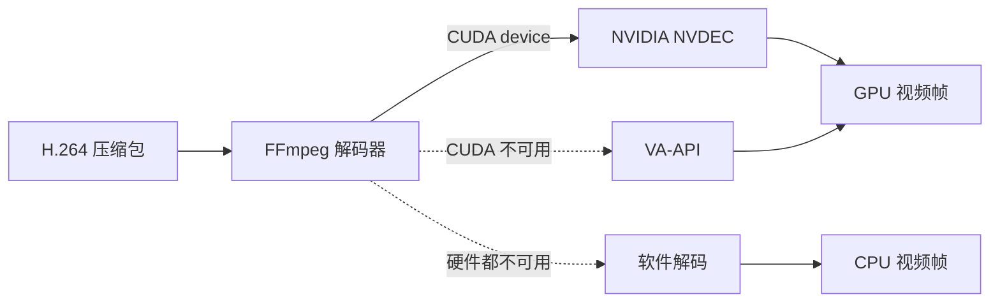

+++
title = "一次 NVIDIA 解码误诊：从 VA-API 报错到 CUDA/NVDEC 真相"
date = 2026-07-19
path = "2026/07/19/ffmpeg-cuda-nvdec-debugging"
[taxonomies]
categories = ["Linux"]
tags = ["FFmpeg", "NVIDIA", "CUDA", "NVDEC", "VA-API", "AirPlay", "APlay"]

+++

## 一条报错引发的“换发动机”计划

故事从一条很吓人的 FFmpeg 输出开始：

```text
Failed to initialise VAAPI connection: -1 (unknown libva error).
```

当时的场景是一台装有 NVIDIA 显卡的 Linux 电脑，正在接收 AirPlay
H.264 视频。看到 `Failed` 和 `VAAPI`，第一反应很自然：硬件解码坏了，
是不是要修 VA-API 驱动，甚至退回软件解码？

但画面又能播放。这像汽车仪表盘亮起红灯，车却还在正常前进。真正应该问的
不是“怎么消灭这行报错”，而是三个更具体的问题：

1. NVIDIA 内核驱动是否正常？
2. 当前 FFmpeg 是否支持 CUDA 硬件设备？
3. 应用最后究竟使用了哪一种解码设备？

查完日志和代码后，答案出人意料：**NVIDIA 驱动和 FFmpeg CUDA 都正常，
应用也成功用了 CUDA；问题只是探测顺序先碰了不适合这台机器的 VA-API。**

最终修复不是“让 VA-API 在 NVIDIA 上强行工作”，而是让 CUDA 排在前面，
由 FFmpeg 的 CUDA 硬件设备走 NVDEC；VA-API 只作为 Intel、AMD 等环境的
后备选择。

---

## 先认识故事里的四个角色

初学者很容易把 CUDA、NVDEC、VA-API 和 FFmpeg 混成一件事。可以把视频
解码想象成一家餐厅：

- **FFmpeg** 是店长，负责选择后厨并把压缩视频送进去。
- **CUDA hardware device** 是 NVIDIA 后厨的入口。
- **NVDEC** 是 NVIDIA 芯片里真正负责 H.264/HEVC 解码的专用设备。
- **VA-API** 是 Linux 上另一套通用入口，常用于 Intel、AMD 驱动。

因此日志里的 `hardware=cuda` 并不表示“拿 CUDA 核心写了一个软件解码器”。
在 FFmpeg 的硬件解码路径中，它表示创建了 CUDA 设备上下文，H.264/HEVC
帧由 NVIDIA 的 NVDEC 能力处理。



这里最重要的区别是：**探测某个后厨失败，不等于所有后厨都失败。**

---

## 第一幕：不要只截取最响亮的报错

旧日志中两行相邻的记录已经讲完了整个故事：

```text
Failed to initialise VAAPI connection: -1 (unknown libva error).
FFmpeg video decoder configured codec=h264 hardware=cuda
```

第一行说“VA-API 入口没有打开”，第二行说“CUDA 入口已经成功”。如果只在
群里贴第一行，结论会变成“硬件解码失败”；把上下文一起看，正确结论则是
“一次无意义的 VA-API 探测失败，随后 CUDA 成功”。

排查 FFmpeg 硬件问题时，我会先用下面几组命令建立事实：

```bash
# 内核驱动和 GPU 是否可见
nvidia-smi

# 当前 FFmpeg 编译进了哪些硬件设备入口
ffmpeg -hide_banner -hwaccels

# 单独验证 CUDA 设备上下文能否创建
ffmpeg -hide_banner -init_hw_device cuda=cuda:0 \
  -filter_hw_device cuda -f lavfi -i nullsrc -t 0.1 -f null -
```

`nvidia-smi` 成功只能证明驱动基本可用，`ffmpeg -hwaccels` 只能证明 FFmpeg
编译时声明了相关支持。真正有价值的是设备创建能否成功，以及应用自己的
最终配置日志。

对本次 APlay 运行日志搜索：

```bash
rg "hardware=|VAAPI|VA-API|cuda|CUDA" aplay.log
```

修复后的四次 H.264 会话都出现了同样的结果：

```text
FFmpeg video decoder configured codec=h264 hardware=cuda
```

没有先出现 VA-API 初始化噪声，也没有软件回退警告。

---

## 第二幕：顺着日志走进代码

硬件设备不是 FFmpeg 随机挑选的，应用给了它一张候选名单。原来的 Linux
顺序把 VA-API 放在 CUDA 前面，大意如下：

```cpp
devices.push_back(AV_HWDEVICE_TYPE_VAAPI);
devices.push_back(AV_HWDEVICE_TYPE_CUDA);
devices.push_back(AV_HWDEVICE_TYPE_VDPAU);
```

随后程序依次调用 `av_hwdevice_ctx_create()`。所以在 NVIDIA-only 环境里，
每次播放都会先尝试一次 VA-API，失败后才轮到本来就能工作的 CUDA。

这不是“自动选择最优设备”，而是“按数组顺序试门把手”。数组第一项写错了
优先级，日志自然会制造一次假警报。

修复后的策略是：

```cpp
// FFmpeg's CUDA hardware context uses NVDEC for H.264/HEVC decoding.
devices.push_back(AV_HWDEVICE_TYPE_CUDA);
devices.push_back(AV_HWDEVICE_TYPE_VAAPI);
devices.push_back(AV_HWDEVICE_TYPE_VDPAU);
```

这个顺序表达了明确的桌面 Linux 平台策略：

1. 优先创建 CUDA 设备，让 NVIDIA 机器直接使用 NVDEC。
2. CUDA 确实不可用时，再尝试 VA-API。
3. 保留 VDPAU 和软件解码作为更后的退路。

Windows 仍使用自己的 D3D11VA/DXVA2 顺序，没有被 Linux 策略影响。

---

## 为什么不把 VA-API 删掉？

因为“这台 NVIDIA 机器不需要”不等于“所有 Linux 机器都不需要”。

一套桌面程序可能运行在：

- NVIDIA 独显机器：优先 CUDA/NVDEC；
- Intel 核显机器：通常依赖 VA-API；
- AMD 显卡机器：也常通过 VA-API；
- 没有可用硬件设备的虚拟机：最后需要软件解码。

因此正确做法是调整优先级并保留降级链，而不是为了消灭一条本机报错，把
其他平台的门一起焊死。

还有一个常见误区：看到 `/dev/dri/renderD128` 就认定 VA-API 一定能用。
设备节点存在只表示 DRM 设备存在，不保证 libva 能找到合适驱动，更不保证
它适合当前 NVIDIA 解码路径。最终仍要以设备上下文创建和解码日志为准。

---

## 第三幕：怎样证明不是“看起来修好了”

这次验证分成三层。

### 1. 编译层

使用项目构建包装脚本完成 Linux 全量构建：

```bash
./scripts/linux_build.sh
```

这样不仅编译修改过的解码器，也会检查 FFmpeg、Qt 渲染和 SDK 的链接关系。

### 2. 配置层

真实投屏日志连续记录：

```text
FFmpeg video decoder configured codec=h264 hardware=cuda
```

它证明 `av_hwdevice_ctx_create()` 成功，并且解码上下文采用了 CUDA 设备。

### 3. 行为层

观察实际画面、CPU 占用和会话重建。尤其要多次开始、停止投屏，避免只验证
第一次初始化成功，却漏掉资源释放后的第二次启动问题。

项目中这一修改已经通过编译，日志也证明 CUDA 优先级在真实会话中生效。
不过任何网络投屏和显卡组合的最终验收，都应该在目标机器上重新播放并保存
新日志，而不能只凭本地模拟测试下结论。

---

## 一套可复用的 VDEC 排查顺序

以后再遇到“硬件解码失败”，可以从便宜、确定的证据开始：

1. **看完整上下文**：失败后是否紧跟另一个硬件设备成功？
2. **查驱动**：GPU 是否被内核和厂商工具识别？
3. **查 FFmpeg 能力**：目标构建是否列出 CUDA、VA-API 等入口？
4. **单独创建设备**：区分“编译支持”和“运行时可用”。
5. **查应用候选顺序**：它是否先试了不适合当前平台的设备？
6. **查最终配置日志**：codec、hardware 和像素格式是否符合预期？
7. **保留回退链**：优化优先级，不要破坏其他 GPU 和软件解码场景。

这次问题最有价值的经验不是“CUDA 要写在 VA-API 前面”，而是：**一条底层
报错只描述了一次尝试，只有把驱动、FFmpeg、应用策略和最终日志串起来，
才能知道视频究竟走了哪条路。**
