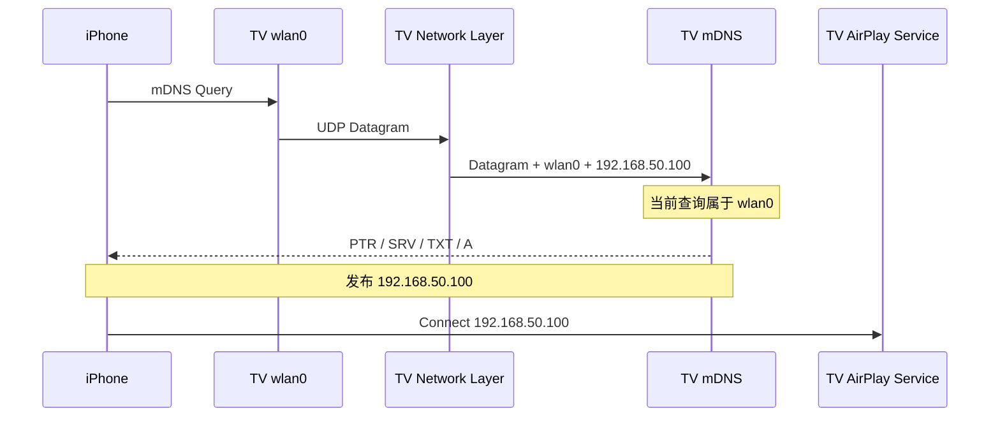
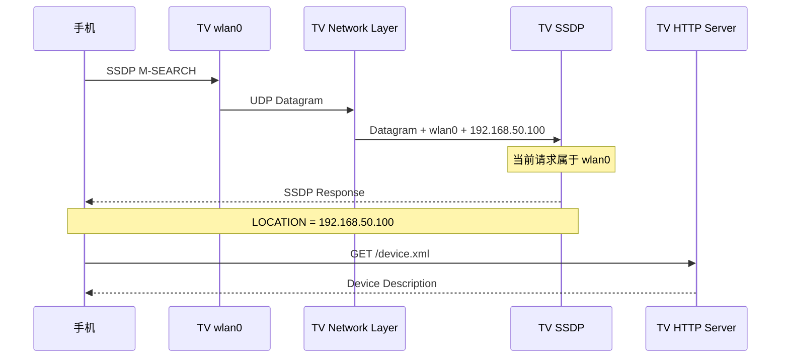

+++
title = "多网卡设备通信及其应用：mDNS 与 SSDP 服务发现"
date = 2026-08-12
path = "2026/08/12/multi-nic-network-communication"

[taxonomies]
categories = ["Network"]
tags = ["Socket", "TCP", "UDP", "Multicast", "IP_PKTINFO", "SO_BINDTODEVICE", "IP_MULTICAST_IF", "mDNS", "SSDP", "AirPlay", "DLNA", "Chrome Cast"]
+++

## 背景：当一台 TV 同时连接有线网络和 Wi-Fi

一台智能 TV 同时连接了 Ethernet 和 Wi-Fi。

```text
TV

eth0
192.168.1.100
    │
    └── 有线网络 A

wlan0
192.168.50.100
    │
    └── Wi-Fi 网络 B
```

TV 上运行着多个网络服务，例如：

```text
Chrome Cast Receiver
AirPlay Receiver
DLNA Receiver
HTTP Server
其他投屏或控制服务
```

与此同时，一台手机连接到了 Wi-Fi 网络 B：

```text
手机
192.168.50.20
```

现在手机希望发现并连接这台 TV。

从业务角度看，需求很简单：

```text
手机
  │
  │ 发现 TV
  ▼
TV
  │
  │ 返回自己的服务地址
  ▼
手机连接 TV
```

但因为 TV 有两张网卡，“TV 自己的地址是什么”突然变成了一个不能随便回答的问题。

TV 同时拥有：

```text
192.168.1.100
192.168.50.100
```

两个地址都没有错。

但对于当前这台手机来说，真正有意义的可能是：

```text
192.168.50.100
```

因为手机的请求是从 TV 的 `wlan0` 这一侧进入的。

因此，多网卡通信真正的问题不是：

> TV 的 IP 地址是什么？

而是：

> **对于当前这次通信，TV 应该使用哪个网络接口，以及这张接口对应的哪个 IP 地址？**


## 一个典型问题：手机能发现 TV，却连接不上

假设手机：

```text
192.168.50.20
```

通过 Wi-Fi 发现 TV。

请求路径是：

```text
手机
192.168.50.20
        │
        │ 请求
        ▼
TV wlan0
192.168.50.100
```

TV 上的网络服务成功收到了请求。

但是 TV 软件中存在一个很常见的函数：

```cpp
std::string getLocalIp();
```

这个函数遍历本机网卡后，第一个找到的是：

```text
eth0
192.168.1.100
```

于是 TV 回复手机：

```text
我的服务地址：

192.168.1.100
```

整个通信过程就变成：

```text
手机
192.168.50.20
        │
        │ 发现请求
        ▼
TV wlan0
192.168.50.100
        │
        │ 请求成功到达
        ▼
TV 网络服务
        │
        │ 错误公布
        ▼
192.168.1.100
        │
        X
手机无法访问
```

这时非常容易出现：

```text
TV 能被发现
       ↓
TV 出现在设备列表
       ↓
用户点击 TV
       ↓
连接失败
```

从软件日志来看：

```text
发现协议正常
TV 收到了请求
TV 也发送了响应
```

但真正的问题是：

> **TV 发布了另一张网卡上的地址。**

这就是一个典型的多网卡通信问题。


# 多网卡通信需要保存哪些信息？

对于 TV 收到的一次网络请求，只保存：

```text
对端 IP
```

有时是不够的。

例如 TV 收到手机的 UDP 数据包：

```text
peer = 192.168.50.20
```

TV 最好同时知道：

```text
对端地址
peer = 192.168.50.20

TV 本地地址
local = 192.168.50.100

接收网口
interface = wlan0

网口编号
ifindex = 7
```

对于组播，还可能需要知道：

```text
目的地址
destination = 224.0.0.251
```

所以一个完整的通信上下文更接近：

```text
       一个收到的数据包

peer ───────────── 192.168.50.20

local ──────────── 192.168.50.100

interface ──────── wlan0

ifindex ────────── 7

destination ────── 224.0.0.251
```

这些信息回答的是不同问题：

```text
peer
→ 谁发来的？

local
→ TV 使用哪个本机地址接收？

interface
→ 从 TV 的哪张网卡进来的？

destination
→ 原始数据包是发给哪个地址的？
```

这就是后面进行正确回复和地址选择的基础。


## 有 Socket fd，为什么还需要这些信息？

TV 上无论运行 TCP Server 还是 UDP Server，最终都会创建 Socket：

```cpp
int fd = socket(...);
```

于是一个很自然的问题是：

> 已经知道数据从哪个 socket fd 收到了，直接从这个 fd 回复不就行了吗？

答案取决于：**TCP 还是 UDP**
两者的 Socket 使用模型并不完全一样。


## TCP：连接建立后，Socket 已经对应具体通信关系

假设 TV 上运行一个 TCP Server：

```cpp
bind(listen_fd, 0.0.0.0:7000);
listen(listen_fd, ...);
```

这里：

```text
0.0.0.0:7000
```

意味着 TV 可以通过不同本机地址接受连接：

```text
192.168.1.100:7000
192.168.50.100:7000
```

现在手机连接：

```text
手机
192.168.50.20:52000
        │
        ▼
TV
192.168.50.100:7000
```

TV 调用：

```cpp
int client_fd = accept(listen_fd, ...);
```

得到的 `client_fd` 已经代表这一条具体 TCP 连接：

```text
TV Local Endpoint

192.168.50.100:7000

        ↕

Phone Remote Endpoint

192.168.50.20:52000
```

所以：

```cpp
send(client_fd, ...);
```

不会突然把数据发送到有线网络上的另一台主机。

因为这个 socket 已经属于：

```text
192.168.50.100:7000
        ↕
192.168.50.20:52000
```

这条连接。


## TCP 如何知道手机连接的是 TV 哪个地址？

可以通过：

```cpp
getsockname(client_fd, &addr, &addrlen);
```

获得 TV 这一侧实际使用的地址：

```text
192.168.50.100
```

通过：

```cpp
getpeername(client_fd, &addr, &addrlen);
```

获得手机地址：

```text
192.168.50.20
```

因此对于已经建立的 TCP Connection：

```text
client_fd
   │
   ├── TV Local Address
   │
   └── Phone Remote Address
```

连接上下文本身已经比较完整。

这也是为什么 TCP 通常不会出现：

> “我明明拿着这条连接的 fd，结果数据回给了另一台手机。”

这种问题。


## UDP：同一个 Socket 可以同时收到多张网卡的数据

假设 TV 上运行：

```cpp
bind(fd, 0.0.0.0:5353, ...);
```

同一个 UDP socket 可能同时服务：

```text
TV eth0

192.168.1.100
      \
       \
        \
       fd = 10
        /
       /
      /
TV wlan0

192.168.50.100
```

例如先后收到两个数据包：

```text
Packet A

来源主机：
192.168.1.20

进入 TV：
eth0

socket：
fd = 10
```

随后：

```text
Packet B

来源手机：
192.168.50.20

进入 TV：
wlan0

socket：
fd = 10
```

两次`fd`完全一样。

因此：

> **共享 UDP Socket 的 fd 并不能告诉我们某一个具体 Datagram 是从 TV 的哪张网卡收到的。**

这就是 TCP 与 UDP 在多网卡通信中的一个关键区别。

可以粗略理解成：

```text
TCP

Socket
  ↓
Connection
  ↓
通信上下文


UDP

Socket
  ↓
很多 Datagram
  ↓
每个 Datagram 都可能有不同网络上下文
```

所以：

> **TCP 的网络上下文更多属于 Connection，而 UDP 的网络上下文往往属于每一个 Datagram。**


## `recvfrom()` 能告诉 TV 什么？

普通 UDP Server 经常使用：

```cpp
sockaddr_in peer{};

recvfrom(
    fd,
    buffer, sizeof(buffer),
    0,
    reinterpret_cast<sockaddr*>(&peer),
    ...);
```

TV 可以得到：

```text
peer = 192.168.50.20
```

也就是：

> 手机 192.168.50.20 给 TV 发来了数据。

但是如果：

```cpp
bind(fd, 0.0.0.0:5353);
```

仅有 `peer` 和 `fd`，可能还不知道：

```text
这个 Datagram 是从 TV 的 eth0 收到？

还是从 wlan0 收到？
```

对于一个只有 Wi-Fi 的 TV，这不是问题。

但对于：

```text
Ethernet + Wi-Fi
```

同时工作的 TV，这个信息就非常重要。


## 操作系统其实知道数据从哪张网卡进来

当数据包真正进入 TV 时，操作系统网络栈本来就知道：

```text
Source Address

Destination Address

Ingress Interface

Routing Information
```

例如：

```text
Source
192.168.50.20

Destination
224.0.0.251

Ingress Interface
wlan0

Interface Index
7
```

只是普通 `recvfrom()` 没有把这些 Metadata 全部返回给应用。

因此 Socket API 还提供了一类：

```text
Ancillary Data
Control Message
```

机制。

可以简单理解成：

> 内核除了把 UDP Payload 给 TV 应用，还顺便附上一张描述这个数据包网络路径的信息单。


## `IP_PKTINFO`：获得 UDP 数据包的网络接口信息

IPv4 中，一个典型机制就是：`IP_PKTINFO`; IPv6中，可以使用`IPV6_RECVPKTINFO`!

以 Linux IPv4为例：

```cpp
int enabled = 1;

setsockopt(
    fd,
    IPPROTO_IP,
    IP_PKTINFO,
    &enabled,
    sizeof(enabled));
```

然后不是简单使用：

```cpp
recvfrom()
```

而是：

```cpp
recvmsg()
```

从 Control Message 中获得：

```cpp
struct in_pktinfo {
    unsigned int   ipi_ifindex;
    struct in_addr ipi_spec_dst;
    struct in_addr ipi_addr;
};
```

于是 TV 可以获得类似：

```text
这个 UDP Datagram：

来自：
192.168.50.20

进入 TV：
wlan0

TV 网口编号：
7

对应 TV 地址：
192.168.50.100

原始目的地址：
224.0.0.251
```

这时 TV 网络模块就不需要根据 `192.168.50.20` 再去猜是哪张网卡了，内核已经直接告诉了应用答案。

### `IP_PKTINFO` 不只用于接收，也可以用于发送

`IP_PKTINFO` 可以理解为 **Datagram 级别的网络接口上下文**。

接收时：

```text
recvmsg()
   │
   └── IP_PKTINFO
          │
          ├── 这包从哪个网口收到？
          ├── 本机对应哪个地址？
          └── 原始目的地址是什么？
```

发送时，则可以通过：

```text
sendmsg()
   │
   └── IP_PKTINFO
          │
          ├── 这一包从哪个网口发送？
          └── 这一包使用哪个本地源地址？
```

例如，同一个共享 UDP Socket 可以针对不同 Datagram 选择不同的出口：

```text
Shared UDP Socket
        │
        ├── Datagram A
        │      └── ifindex = eth0
        │
        └── Datagram B
               └── ifindex = wlan0
```

因此，`IP_PKTINFO` 并不只是一个“收包时查询网卡”的机制，更准确地说，它允许程序在 **单个 UDP Datagram 的粒度**上保留或指定网络接口上下文。

## 这不是 Linux 特有能力

虽然 `IP_PKTINFO` 经常出现在 Linux 网络代码中，但本文讨论的核心并不是 Linux API。

真正具有通用意义的是：

> **获得一个 UDP Datagram 对应的 Network Interface Context。**

不同平台只是具体接口不同。

例如：

| 平台 | UDP 接收 API | Interface / Packet 信息 |
|---|---|---|
| Linux | `recvmsg()` | `IP_PKTINFO` |
| Windows | `WSARecvMsg()` | `IP_PKTINFO` |
| macOS | `recvmsg()` | `IP_PKTINFO` / BSD 相关机制 |

所以对于一个跨平台 TV 投屏 SDK，更合理的设计不是让 AirPlay 或 DLNA 协议层直接处理，而是在底层屏蔽这些差异。


## 推荐保存统一的 UDP 网络上下文

例如定义：

```cpp
struct UdpPacketInfo {
    sockaddr_storage peer_address;
    sockaddr_storage local_address;
    sockaddr_storage destination_address;

    uint32_t interface_index;
};
```

假设 TV 从 Wi-Fi 收到数据：

```text
UdpPacketInfo

peer
    192.168.50.20

local
    192.168.50.100

destination
    224.0.0.251

interface_index
    7
```

上层协议只需要知道：

```text
这个请求属于 TV 的 wlan0 网络
```

不需要知道：

```text
Linux 是 recvmsg()

Windows 是 WSARecvMsg()

macOS 是 recvmsg()
```

## 从哪张网卡发出去

识别接收网口只是多网卡通信的一半。

TV 还需要知道：**响应应该从哪张网卡发出去？**

假设 TV 同时连接：

```text
eth0
192.168.1.100

wlan0
192.168.50.100
```

如果 TV 需要分别在两个网络发送 Multicast，发送接口就不能完全依赖系统默认路由。

对于 IPv4 Multicast，常见机制是：`IP_MULTICAST_IF`！ 它设置的是 **Socket 级别的默认 Multicast 发送接口**。例如：

```text
mDNS Socket
    │
    └── IP_MULTICAST_IF = wlan0
```

之后这个 Socket 的 Multicast 数据默认从 `wlan0` 发出。

另一种方式是：

```text
sendmsg()
+
IP_PKTINFO
```

它可以在 **单个 Datagram** 的粒度指定发送接口或本地源地址：

```text
Shared UDP Socket
        │
        ├── Datagram A → eth0
        └── Datagram B → wlan0
```

因此可以把两者简单理解为：

| 机制 | 粒度 | 典型作用 |
|---|---|---|
| `IP_MULTICAST_IF` | Socket 级 | 设置这个 Socket 默认从哪张网卡发送 Multicast |
| `IP_PKTINFO + sendmsg()` | Datagram 级 | 为当前这个 Datagram 指定发送接口或源地址 |

所以完整的多网卡 UDP 模型应该同时考虑：

```text
RX
─────

手机
 ↓
TV wlan0
 ↓
Datagram
 ↓
识别 ingress interface


TX
─────

Response
 ↓
选择 egress interface
 ↓
TV wlan0
 ↓
手机
```

## 多网卡通信不能简单等同于“选择 IP”

还有一个容易混淆的问题：

> IP 地址和 Network Interface 并不是同一个概念。

例如 TV 的 Wi-Fi 接口 wlan0 可能同时拥有：

```text
192.168.50.100

fe80::1234:...

某个 Global IPv6 Address

某个 Temporary IPv6 Address
```

一个接口可以对应多个地址。

所以更准确的网络模型是：

```text
Interface
    │
    ├── IPv4 Address
    ├── IPv6 Link-Local Address
    ├── IPv6 Global Address
    └── ...
```

因此多网卡通信应该同时关注：

```text
Interface

Address

Route
```

## 两种常见的多网卡 UDP 实现

这里需要先把“共享 Socket”这个词说清楚。

**Socket 是否共享，至少有两个不同维度：**
- Peer 维度： 一个 Socket 是否同时服务多个手机 / 多个对端？
- Interface 维度： 一个 Socket 是否同时服务 TV 的多张网卡？

因此，“共享 Socket”并不天然等于“多网卡共享 Socket”。

例如，一个只属于 `wlan0` 的 UDP Socket，完全可以同时服务很多手机：

```text
手机 A ──┐
手机 B ──┼── TV wlan0 ── UDP Socket
手机 C ──┘
```

这个 Socket 在 **Peer 维度是共享的**，但在 **Interface 维度只属于 wlan0**。

为了避免混淆，本文把多网卡 UDP Socket 架构明确分成两类：

- 方案一：单网口共享 Socket： 一个 Socket 只服务一张网卡，但可以服务该网卡上的多个 Peer / Datagram。

- 方案二：多网口共享 Socket： 一个 Socket 同时服务 eth0、wlan0 等多个 Interface，每个 Datagram 再携带自己的 Interface Context

两者真正的区别是：

> **Interface Context 是固定属于 Socket，还是需要在每一个 Datagram 上单独识别。**

### 方案一：单网口共享 Socket（Per-Interface Shared Socket）

假设 TV 有：

```text
eth0
192.168.1.100

wlan0
192.168.50.100
```

可以分别创建两个 UDP Socket：

```text
TV eth0
192.168.1.100
    │
    └── UDP Socket A
          ├── Peer 1
          ├── Peer 2
          └── Peer ...

TV wlan0
192.168.50.100
    │
    └── UDP Socket B
          ├── Phone A
          ├── Phone B
          └── Phone ...
```

这里的“一个网口一个 Socket”并不意味着一个 Socket只能服务一个客户端！

恰恰相反，UDP 本身没有 TCP 那样的 `accept()` 连接模型。

一个 `wlan0` Socket 仍然可以连续收到：

```text
Phone A → Datagram A
Phone B → Datagram B
Phone C → Datagram C
```

只是这些 Datagram 都属于同一个 Interface Context：

```text
Socket B
   │
   └── TV wlan0
       192.168.50.100
```

因此网络模块可以直接维护：

```text
Socket A → eth0
Socket B → wlan0
```

从 Socket B 收到 Datagram，本身就已经能够确定：

```text
这个 Datagram 属于 TV 的 wlan0 网络上下文
```

这种架构可以更准确地称为：

> **单网口共享 Socket：Socket 在 Peer 层面共享，但不跨 Interface 共享。**

#### Linux 下可以使用 `SO_BINDTODEVICE`

在 Linux 上，`SO_BINDTODEVICE` 可以进一步把 Socket 明确约束到指定 Interface。

例如：

```cpp
const char* ifname = "wlan0";

setsockopt(
    fd,
    SOL_SOCKET,
    SO_BINDTODEVICE,
    ifname,
    strlen(ifname) + 1);
```

此时：

```text
Phone A ──┐
Phone B ──┼── TV wlan0 ── Socket B
Phone C ──┘
                         SO_BINDTODEVICE=wlan0
```

Socket B 仍然是一个“共享 Socket”：

```text
一个 fd
可以服务多个 Peer
可以收发多个 Datagram
```

但它是单网口共享，而不是多网口共享！

因此，从架构对应关系上看：

> **`SO_BINDTODEVICE` 很适合实现“单网口共享 Socket”。**

不过，“单网口共享 Socket”和 `SO_BINDTODEVICE` 仍然不能直接画等号。

前者是一种架构设计；后者只是 Linux 下把 Socket 约束到某个 Network Interface 的一种实现手段。

单网口 Socket 还可以结合：

```text
绑定对应 Local Address

在指定 Interface 加入 Multicast Membership

IP_MULTICAST_IF 指定 Multicast 发送 Interface

应用维护 socket → interface 映射
```

例如：

```text
TV wlan0
192.168.50.100
      │
      └── UDP Socket B
            │
            ├── bind / Local Address
            ├── Multicast Membership → wlan0
            ├── IP_MULTICAST_IF → wlan0
            └── 可选 SO_BINDTODEVICE → wlan0
```

所以 `SO_BINDTODEVICE` 的价值在于：

> 把“这个 Socket 只属于 wlan0”这一约束直接下沉到 Linux Socket 层。

对于 TV、机顶盒、会议终端、IoT 网关等网卡数量和用途比较固定的产品，这种方式通常非常直观。

### 方案二：多网口共享 Socket（Multi-Interface Shared Socket）

另一种架构则是真正的：

> **一个 Socket 同时服务多张 TV 网卡。**

例如：

```text
TV eth0
192.168.1.100
       \
        \
         \
      Shared UDP Socket
        fd = 10
         /
        /
       /
TV wlan0
192.168.50.100
```

Socket 可以：`bind(0.0.0.0:port)` 并且不把它固定约束到某一个具体的 `eth0` 或 `wlan0`。

于是同一个 fd 可能连续收到：

```text
Datagram A

peer      = 192.168.1.20
interface = eth0
fd        = 10


Datagram B

peer      = 192.168.50.20
interface = wlan0
fd        = 10
```

这里`fd = 10`已经不能代表 Interface Context。

因为：

```text
同一个 Socket
        │
        ├── Datagram A 属于 eth0
        └── Datagram B 属于 wlan0
```

这时才是 `IP_PKTINFO` 最典型的使用场景。

接收：

```text
recvmsg()
   │
   └── IP_PKTINFO
          │
          ├── Datagram A → ifindex=eth0
          └── Datagram B → ifindex=wlan0
```

从每个 Datagram 获得：

```text
ifindex
local address
destination address
```

于是 Socket 负责共享收发，而 Packet Metadata 负责回答：

> **这一包具体属于 TV 的哪张网卡？**

发送时同样可以：

```text
sendmsg()
   │
   └── IP_PKTINFO
          │
          ├── Datagram A → eth0
          └── Datagram B → wlan0
```

针对每一个 Datagram 分别选择 egress Interface 或 Source Address。

因此这种架构中：

```text
Socket Context
    = 多 Interface 共享

Interface Context
    = 每个 Datagram 独立
```

这就是“多网口共享 Socket”和“单网口共享 Socket”最本质的区别。

### `SO_BINDTODEVICE` vs `IP_PKTINFO`

这样再比较两者，就不容易混淆了：

> **`SO_BINDTODEVICE`：Interface Context 固定在 Socket 上。**
> 
> **`IP_PKTINFO`：Interface Context 可以跟随每一个 Datagram。**

因此：

```text
单网口共享 Socket

Phone A ──┐
Phone B ──┼── wlan0 ── Socket
Phone C ──┘
                    │
                    └── 可使用 SO_BINDTODEVICE=wlan0
```

而：

```text
多网口共享 Socket

eth0 ─────┐
          ├── Shared Socket
wlan0 ────┘
                │
                └── IP_PKTINFO
                      ├── Datagram A → eth0
                      └── Datagram B → wlan0
```

此时它仍然可以服务多个 Peer、多个 Datagram，所以仍然是“共享 Socket”；只是共享发生在 Peer/Datagram 维度，而不再发生在 Interface 维度。

两种方案解决的是同一个问题，真正重要的并不是：

> 一定要使用一个 Socket，还是多个 Socket？

也不是：

> 一定要使用 `SO_BINDTODEVICE` 或 `IP_PKTINFO`？

而是：

> **当数据进入 TV 的网络模块以后，不要把“它属于哪张网卡”这条信息丢掉。**

## 为什么不应该在业务层猜网卡？

假设底层只给 AirPlay 模块：

```text
peer = 192.168.50.20
```

AirPlay 模块再遍历 TV 地址：

```text
192.168.1.100
192.168.50.100
10.8.0.2
```

然后根据网段猜 `192.168.50.100` 应该比较合适。

这种办法在简单家庭网络中可能有效。

随着网络环境复杂起来，可能逻辑会越来越复杂。

更好的原则是：

> **内核收到数据包的时候已经知道它从 TV 哪张网卡进入，就应该在这个阶段把信息保存下来。**

而不是到了 AirPlay、mDNS 或 DLNA 层以后重新推断。

## 主动连接同样存在多网卡选择

前面主要讨论 TV 作为服务端接收手机请求。

但 TV 主动访问其他主机时，也存在同样的问题。

例如：

```text
TV Application
      │
      ▼
connect(10.0.0.20)
```

TV 操作系统需要根据：

```text
Routing Table

Route Metric

Source Address Selection

Policy Routing
```

决定：

```text
走 eth0？

走 wlan0？

走 VPN？
```

普通业务通常直接依赖操作系统路由即可。

但某些产品可能有明确要求：

```text
控制流量走 Wi-Fi（比如 Miracast WiFi-Direct场景）

大带宽媒体流走 Ethernet

管理流量走 VPN
```

这时应用可能需要进一步控制：

```text
Local Address

Interface

Route
```

因此：

> **多网卡通信并不只存在于组播和设备发现，它本质上是网络路径选择问题。**

mDNS 和 SSDP 只是非常容易暴露这个问题的应用场景。


## 应用案例一：mDNS / DNS-SD

前面的多网卡机制在 mDNS 中非常典型。

mDNS IPv4 使用：

```text
224.0.0.251:5353
```

DNS-SD 使用：

```text
PTR
SRV
TXT
A
AAAA
```

描述局域网服务。

这套机制广泛应用于：

```text
AirPlay
Google Cast / Chromecast
AirPrint / 网络打印机
HomeKit
NAS
各种 IoT 产品
```

下面只以 AirPlay 为例。

### AirPlay：TV 如何在 Wi-Fi 网络发布自己？

假设 TV：

```text
eth0: 192.168.1.100
wlan0: 192.168.50.100
```

iPhone：

```text
192.168.50.20
```

iPhone 查询：

```text
_airplay._tcp.local
```

数据经过：

```text
iPhone
192.168.50.20
        │
        │ mDNS Query
        ▼
224.0.0.251:5353
        │
        ▼
TV wlan0
192.168.50.100
```

TV 的 UDP 网络层应该得到：

```text
peer: 192.168.50.20

ingress interface: wlan0

local: 192.168.50.100
```

然后把这个 Network Context 交给 mDNS 模块。



这里 mDNS 不是负责判断 TV 到底有哪些网卡, 它只需要使用底层已经提供的 Network Context，然后在 wlan0 这一侧公布`192.168.50.100`

后续 iPhone 再连接 `192.168.50.100`，这就是多网卡上下文在真实业务中的一个典型应用。

## 如果 mDNS 选错 TV 地址会怎样？

如果请求明明从 TV wlan0 收到，但 mDNS 发布 `192.168.1.100`，就会出现：

```text
iPhone
   │
   │ mDNS Query
   ▼
TV wlan0（192.168.50.100）
   │
   │ Publish （192.168.1.100）
   ▼
AirPlay TV 被发现
   │
   ▼
iPhone 获得地址：192.168.1.100
   │
   X
AirPlay Connection Failed
```

于是TV设备被发现而连接失败，根本原因仍然是：TV 没有正确处理多网卡 Network Context。


## 应用案例二：SSDP

SSDP 是另一种典型的多网卡 UDP 应用， 比如 DLNA 投屏！

IPv4 SSDP 使用 `239.255.255.250:1900`， 假设手机仍然位于`192.168.50.20`，手机向局域网寻找 DLNA TV：

```http
M-SEARCH * HTTP/1.1
HOST: 239.255.255.250:1900
MAN: "ssdp:discover"
MX: 2
ST: ssdp:all
```

数据路径：

```text
手机
192.168.50.20
        │
        │ SSDP M-SEARCH
        ▼
239.255.255.250:1900
        │
        ▼
TV wlan0
192.168.50.100
        │
        ▼
TV SSDP Module
```

TV Network Layer 应该提供：

```text
peer
192.168.50.20

interface
wlan0

local
192.168.50.100

destination
239.255.255.250
```

SSDP 模块根据这个 Context 构造响应：

```http
LOCATION: http://192.168.50.100:49152/device.xml
```

然后手机访问`http://192.168.50.100:49152/device.xml`。

完整流程：



如果 TV 错误返回：

```http
LOCATION: http://192.168.1.100:49152/device.xml
```

仍然会出现：

```text
手机发现 TV
      ↓
拿到错误 LOCATION
      ↓
访问另一张 TV 网卡
      ↓
  访问失败
```

所以 mDNS 与 SSDP 表面上完全不同：

```text
mDNS
→ A / AAAA / SRV

SSDP
→ LOCATION
```

但使用多网卡能力的方式本质相同：

```text
收到 Datagram
       ↓
识别 TV ingress interface
       ↓
得到该网口 Local Address
       ↓
上层协议使用该地址
       ↓
使用正确 Network Context 继续通信
```

## mDNS 和 SSDP 不应该各自实现网卡判断

如果 TV 同时实现：

```text
AirPlay
Google Cast
DLNA
Printer Discovery
```

不推荐：

```text
AirPlay
  └── 自己找 Local IP

mDNS
  └── 自己判断 wlan0

SSDP
  └── 自己比较 Subnet

DLNA
  └── 再做一套 Interface 判断
```

更合理的是：

```text
                 TV Network Layer
                       │
                       ▼
                 Network Context
                       │
            ┌──────────┴──────────┐
            │                     │
          mDNS                   SSDP
            │                     │
     ┌──────┼──────┐              │
     │      │      │              │
 AirPlay   Cast  Printer        DLNA
```

底层统一解决：

```text
Interface Discovery

Address Management

Ingress Interface

Egress Interface

Multicast Join

Packet Info
```

上层协议只使用结果，无需重复实现多网卡判断。

# 总结

本文一直使用同一个具体场景：一台通过 Wi-Fi 通信的手机：192.168.50.20; 一台多网卡设备 eth0： 192.168.1.100， wlan0： 192.168.50.100，应该使用哪张网卡和哪个本机地址？

对于 TCP, 连接建立以后，可以通过`getsockname`， `getpeername` 获得比较完整的通信上下文。

对于 UDP，需要进一步区分 Socket 的共享范围, 工程上可以采用两类架构：

- 单网口共享 Socket

每张网卡分别拥有自己的 Socket；该 Socket 可以同时服务该网口上的多个 Peer。在 Linux 上，可以进一步使用 `SO_BINDTODEVICE`, 把 Socket 明确约束到对应 Interface。

- 多网口共享 Socket + Packet Info

让一个 Socket 同时服务 `eth0`、`wlan0` 等多个 Interface，再通过 `IP_PKTINFO` 在每个 Datagram 上识别或指定 Interface。

但两种架构都应该遵守同一个原则：

> **不要让 Network Interface Context 在 Socket 层被丢失。**

mDNS 和 SSDP 是这套机制非常典型的两个应用案例。

mDNS 中，TV 根据接收网口选择正确的 `A / AAAA` 等服务地址， AirPlay、Google Cast、打印机等都可以复用这套能力。

SSDP 中，TV 根据接收网口生成正确的 `LOCATION`，供手机、平板访问 DLNA / UPnP 服务。

整个设计原则总结成一句话：

> **单网卡程序往往只需要关心 IP；多网卡程序还需要明确当前通信属于哪一个 Interface、使用哪个 Address，以及后续数据应该沿哪条网络路径继续。**