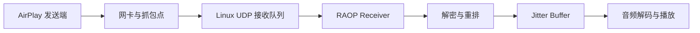

+++
title = "35 个包去了哪里：用日志和 Wireshark 追踪 AirPlay 音频丢包"
date = 2026-07-19
path = "2026/07/19/raop-udp-packet-loss-debugging"
[taxonomies]
categories = ["Linux"]
tags = ["AirPlay", "RAOP", "RTP", "UDP", "Wireshark", "Linux", "FFmpeg", "APlay"]

+++

## 深夜日志里的数字 35

一次 AirPlay 音频调试快结束时，日志里突然出现了这样一行：

```text
audio UDP receive queue overflow session=8 dropped_total=35
```

会话关闭时，它又留下了一份“结案统计”：

```text
audio_packets=35191 ... audio_kernel_drops=35 control_kernel_drops=0
audio continuity received=35202 duplicates=23458 gaps=1
retransmit_requests=1 lost=0 decrypt_failures=0
```

`audio_kernel_drops=35` 已经很明确，但明确不等于根因清楚。是 Wi-Fi 真丢了
35 个包？发送端漏发了？抓包程序没抓全？Linux 收到了却来不及交给应用？
还是应用自己错误地把重复包当成丢包？

这次调查使用一份 578 秒、155,306 帧的真实抓包，把每一层的计数像查账一样
对齐。最后发现：**35 个 UDP 数据报全部到过接收机的抓包层，却在应用读取
socket 之前被 Linux 接收队列丢弃。**

更有意思的是，RAOP 重传把真正缺失的 11 个音频序列在约 5 ms 内补了回来，
所以处理器最终统计 `lost=0`。这不是一个“网络坏了，多重传几次”的故事，
而是一个“仓库收货太慢，货车已经到了门口”的故事。

---

## 先画出包要经过的五道门

UDP 包从手机到扬声器，中间不是一条直线：



每一层说的“丢包”可能不是同一件事：

- 抓包缺序列：包可能没到机器，也可能抓包本身丢了。
- `SO_RXQ_OVFL` 增长：包到过内核，但 socket 队列装不下。
- RTP 重排出现 gap：应用看到序列号不连续，原因尚未确定。
- jitter buffer 的 `late`：包到了播放调度层，但错过了适合的时间。
- 听到卡顿：最终用户症状，还可能来自解码、时钟或渲染阻塞。

所以不能看见 `gap` 就立刻归咎于 Wi-Fi，也不能通过“多发重传”掩盖所有
上游问题。先确定包消失在哪一道门，修复才不会南辕北辙。

---

## 第一幕：让内核自己作证

普通的 `recvfrom()` 只能告诉应用“这次读到了什么”，不能告诉它“排队时
丢过多少”。Linux 提供了 `SO_RXQ_OVFL`：开启后，`recvmsg()` 的辅助数据中
会带一个累计丢包计数。

核心网络层因此增加了一个很小的通用结果结构：

```cpp
struct UdpReceiveInfo {
    bool kernel_drop_count_available = false;
    std::uint32_t kernel_drop_count = 0;
};
```

非 Windows 平台用 `recvmsg()` 检查控制消息：

```cpp
if (header->cmsg_level == SOL_SOCKET &&
    header->cmsg_type == SO_RXQ_OVFL) {
    std::memcpy(&info.kernel_drop_count, CMSG_DATA(header),
                sizeof(info.kernel_drop_count));
}
```

有了这项观测，日志不再只有含糊的“RTP gap”，而是能指出 Linux UDP 队列
确实累计丢了 35 个数据报。控制端口仍是 0，说明问题集中在高流量音频端口。

这里还有一个容易看错的数字。程序请求了 1 MiB 接收缓冲区，日志却显示：

```text
data_receive_buffer=425984 control_receive_buffer=425984
```

检查本机设置：

```bash
cat /proc/sys/net/core/rmem_default
cat /proc/sys/net/core/rmem_max
```

两者都是：

```text
212992
```

Linux 对 `SO_RCVBUF` 的查询值会包含双倍记账开销，所以 `425984` 正好是
`212992 × 2`。这意味着应用请求的 1 MiB 没有真正拿到，已被系统上限钳制。

---

## 第二幕：让抓包和日志对账

抓包文件是 `aplay-airplay-raop2.pcapng`。先看全局信息：

```bash
capinfos -c -a -e -u aplay-airplay-raop2.pcapng
```

结果显示捕获从 `02:50:07` 到 `02:59:46`，共约 155k 帧。日志中的第 8 个
音频会话使用 UDP 数据端口 `6028`，因此把该端口强制按 RTP 解码，再导出
序列号：

```bash
tshark -r aplay-airplay-raop2.pcapng \
  -d udp.port==6028,rtp \
  -Y 'udp.dstport == 6028 && rtp.p_type == 96' \
  -T fields -e rtp.seq > rtp-sequences.txt
```

对序列号计数后得到：

| 项目 | 数量 |
| --- | ---: |
| 抓包中的普通音频数据报 | 35,226 |
| 不同 RTP 序列号 | 11,744 |
| 出现 3 次的序列号 | 11,739 |
| 出现 2 次的序列号 | 4 |
| 只出现 1 次的序列号 | 1 |

为什么一个序列号大多出现三次？发送端启用了 AirPlay 的
`AudioRedundant` 能力，会发送冗余副本来抵抗 UDP 丢包。重复不是 bug，
而是一种“同一封信寄三份”的保护策略。

真正决定性的是下面这组等式：

```text
抓包普通音频包 35226 - 内核丢包 35 = receiver 收到 35191
receiver 35191 + 重传回复 11 = processor 收到 35202
processor 35202 - 重复包 23458 = 唯一音频序列 11744
```

每个数字都能在日志或抓包中找到，没有无法解释的差额。

抓包里的不同序列从 40924 连续到 52667，共 11,744 个，一个不少。也就是说，
发送端发了，接收机抓包点也看见了。缺失发生在抓包点之后、应用读取之前，
这正是 `SO_RXQ_OVFL` 所描述的 Linux socket 队列。

---

## 第三幕：35 个数据报为什么变成 11 个缺失序列？

溢出发生时，应用发出了这一条请求：

```text
retransmit request session=8 seq=47581 count=11 sent=1
```

抓包中，47581 到 47591 的三份普通副本其实都存在。连续 11 个序列，每个
三份，就是 33 个数据报；再加上相邻序列的两个冗余副本，恰好可以解释
35 个队列丢包为什么在 RTP 语义上表现为 11 个连续缺口。

RAOP 规范为此定义了两个控制包：

- payload type 85：接收端请求从哪个序列开始、需要多少个；
- payload type 86：发送端回复，并附带完整的原始音频 RTP 包。

本次 PT=85 请求在 `02:58:47.561832` 发出，第一份回复约 4.875 ms 后到达，
11 份回复约 4.903 ms 内到齐。最终处理器记录：

```text
gaps=1 retransmit_requests=1 lost=0
```

这证明重传机制有效，也说明“发现 gap 后马上跳过去”的旧策略太着急。旧代码
只要后续序列跨度超过 8 个就释放缺口，可能在 5 ms 的回复到来之前已经把
序列判死刑。

修复后，缺口满足下列条件之一才跳过：

- 等待恢复达到 80 ms；
- 重排缓存超过 32 个包，需要保护内存和实时性。

重传仍然只在观察到真实序列缺口时发送，不会周期性轰炸发送端，也不会对
普通重复包重传。

---

## 第四幕：为什么接收线程会来不及？

继续放大溢出前后的抓包时间戳，可以看到同一个 1 ms 窗口里记录了 120 个
音频 UDP 数据报。网卡卸载和抓包时间戳批处理可能让显示出的瞬时程度更高，
但对应用来说，它仍然是一个必须尽快排空的突发队列。

原接收循环的工作方式近似这样：

```text
收 1 包 -> 分配内存 -> 解密 -> 重排 -> 交给下游 -> 再收下一包
```

而本次会话中 35,202 个处理器输入里，有 23,458 个是重复包，约占三分之二。
也就是说，接收线程在为大量最终要丢弃的冗余副本做 AES 解密，内核“收件箱”
却还在不断进货。

修复分成四步：

1. 数据和控制 socket 使用非阻塞模式。
2. 优先读取控制端口，让重传回复尽快进入重排缓存。
3. 一次最多读取 256 个音频包，先把内核队列排空，再统一交给处理流。
4. 解析出扩展序列号后先查重，重复包不再分配解密输出和执行 AES。

新的节奏变成：

```text
快速收一批包 -> 内核队列腾出空间 -> 逐包查重 -> 只解密需要的包
```

应用还会请求 4 MiB 数据接收缓冲区。如果操作系统仍然把它钳制到较小值，
会输出包含 `requested`、`actual` 和 `reason=platform-limit` 的警告，避免配置
问题再次藏在一个看似正常的数字后面。

在确认内存预算后，Linux 管理员也可以调整 `net.core.rmem_max`。但系统参数
只是安全网：如果接收线程一直在收件箱门口拆包、解密，单纯把仓库扩大会推迟
溢出，却不会消除根因。

---

## `late=35` 是否等于又丢了 35 个？

会话末尾还有一行：

```text
audio continuity emitted=11696 duplicates=0 late=35 overflow=0
max_queue=13 downstream_blocked_us=91408
```

这里的 `late` 属于 jitter buffer 层，`audio_kernel_drops` 属于 socket 层。
两者数值相同很醒目，但不能只凭数字相同就认定是同一个计数器。晚到的冗余
副本、重传包和下游阻塞都可能影响 jitter 统计。

正确做法是分别保留每层指标：

- socket：内核究竟扔了多少 UDP 数据报；
- RTP processor：多少 gap、重复、重传和最终未恢复序列；
- jitter buffer：多少包太晚、队列多深、下游阻塞多久；
- renderer：是否真正发生欠载或可听卡顿。

分层统计能避免把一个计数器的修复误报成整条播放链都已验证。

---

## 一套适合初学者的丢包排查清单

遇到实时音频断续，可以按下面顺序逐步缩小范围：

1. **先保存同一时段的日志和抓包**，记下会话端口与开始、结束时间。
2. **检查抓包自身是否丢帧**，不要把采集工具的问题当成网络问题。
3. **按 RTP 序列号统计唯一包和副本数**，区分缺失与协议冗余。
4. **启用 `SO_RXQ_OVFL`**，判断包是否死在 Linux UDP 接收队列。
5. **做计数守恒**：抓包数、socket 数、重传数、重复数和唯一序列要能对账。
6. **测量重传往返时间**，恢复窗口必须比真实回复时间长，又不能无限等待。
7. **观察瞬时突发而非平均码率**，平均每秒不高也可能在 1 ms 内塞满队列。
8. **把收包和重活拆开**，优先排空内核队列，再解密、解析和渲染。
9. **最后才调大系统缓冲区**，并记录请求值与实际值。
10. **回到真实设备复测**，比较新的 kernel drops、lost、late 和听感。

本次旧日志和抓包已经把根因定位到内核队列，并证明重传能在约 5 ms 内恢复
缺口；新的批量排空与提前查重代码也已通过 Linux 全量构建。网络投屏行为仍
必须用真实发送端和接收端复测，只有新日志再次显示 `audio_kernel_drops=0`，
并且用户确认没有可听异常，才能把“代码修复”升级为“真实场景验收通过”。

这次调查最值得记住的不是 35 这个数字，而是那条完整证据链：**抓包证明包
到过机器，内核计数证明包死在队列，RTP 重传证明缺口可恢复，代码路径解释
了队列为什么来不及排空。** 当所有数字能像账本一样对上，丢包就不再是玄学。
