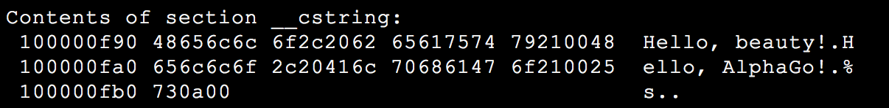
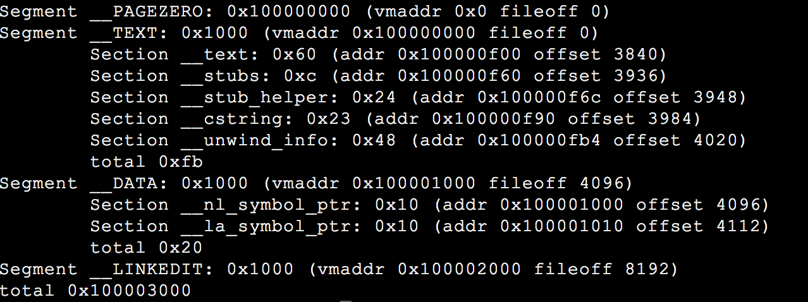

+++
title = "segfault 问题分析"
date = 2018-06-09
path = "2018/06/09/segfault_analysis"
[taxonomies]
categories = ["Linux"]
tags = ["内存", "C/C++"]
+++

本文结合过往项目经验，介绍了内存分段管理的起源，总结了一下遇到 `segmentation fault` 问题时如何调试。

## 关于段

### 段的含义

> A segment, in the 8086/8088 is a 64kb chunk of memory addressable by any particular value in a segment register. Specifically, there are four segment registers, Code Segment, Data Segment, Stack Segment, and Extra Segment.

段是一块 64 KB 的可寻址的内存空间，8086/8088 CPU 中主要有四种段，代码段（CS）、数据段（DS）、堆栈段（SS）和附加段（ES）。

### 内存分段管理的起源

> Each is used in the context of a particular instruction by multiplying the segment register by 16 (left shift 4) and then adding the particular offset contained in the instruction. This gives access to 1Mb of memory (a 20 bit address bus) using only a 16 bit segment register and a 16 bit offset but, in only one instruction, you only have access to 64kb at a time. It would take two instructions to access any location in memory; one to load the segment register, and one to access the desired location.

8086 CPU 有 20 根地址线，最大可寻址内存空间为 2^20 byte 即 1 MB。然而 8086 的寄存器（IP、SI、DI 等）只有 16 位，16 位的地址最大可寻址区域为 2^16 byte 即 64 KB。为了实现对 1 MB 内存空间的寻址，引入了内存分段。1 MB 空间划分为 2^4 即 16 个段，每个段内存空间不超过 64 KB。

## 关于段错误

> In computing, a segmentation fault (often shortened to segfault) or access violation is a fault, or failure condition, raised by hardware with memory protection, notifying an operating system (OS) the software has attempted to access a restricted area of memory (a memory access violation).

段错误指非法访问错误的内存空间的行为，例如访问了只读的内存地址，或者系统保护的内存地址。

sample-1：

```c
#include <stdio.h>
#include <string.h>

int main(int argc, char **argv)
{
    char *pcStr = "Hello, beauty!";

    strcpy(pcStr, "Hello, AlphaGo!");
    printf("%s\n", pcStr);

    return 0;
}
```

查看可执行程序对应 section 的内容：

```sh
kang $ gcc test.c -g -Wall
kang $ objdump -s a.out
```

目标文件 `a.out` 的构成 `__cstring section` 部分截图：



`kang $ size -x -l -m a.out`

目标文件各 section 布局（Mac OSX 环境）：



字符串常量存储于 `__cstring section`，该 section 位于 `__TEXT segment`。`__TEXT` 以可读和可执行的方式映射，即 `pcStr` 指向了一个可读的内存区域，无法进行写操作。

## 调试手段

### 1. 利用 gdb 和 core dump 文件定位问题

配置 core dump 文件大小限制，生成 core 文件，`gdb` 调试，`backtrce` 观察 call stacks。

- 方法1，`ulimit -c unlimited`。
- 方法2，`setrlimit` 系统调用。

```c
#include <sys/resource.h>

void enableCoreDump(void)
{
    struct rlimit stCoreLimit = {.rlim_cur = -1, .rlim_max = -1;};

    if (0 != setrlimit(RLIMIT_CORE, &stCoreLimit))
    {
        printf("[%s:%d]Couldn't set core limit!\n", __func__, __LINE__);
        return;
    }
}
```

sample-2：

```c
#include <stdio.h>
#include <stdlib.h>
#include <string.h>

#define SUCCESS   (0)
#define FAILURE  (-1)

#define PRINT_DEBUG
#define HELLO_STR   "hello, github!"

#ifdef PRINT_DEBUG
#define print_debug(format, args...)   printf("[%s:%d]"format"\n", __func__, __LINE__, ##args)
#endif

#define CHECK_PTR_RET(ptr, ret) \
do \
{ \
    if (NULL == ptr) \
    { \
        print_debug("NULL pointer!"); \
        return ret; \
    } \
} while (0)

#define CHECK_FUNC_RET(func_expr, ret_expr, ret) \
do \
{ \
    if (!(ret_expr)) \
    { \
        print_debug("%s failed, ret = 0x%x", func_expr, ret); \
        return ret; \
    } \
} while (0)

int GetMem(void *pMem, int slLen)
{
    //CHECK_PTR_RET(pMem, FAILURE);
    pMem = malloc(slLen);

    return SUCCESS;
}

int main(int argc, char **argv)
{
    char *acBuf = NULL;
    int slLen = 1 << 8;
    int slRet = SUCCESS;

    slRet = GetMem((void *)acBuf, slLen);
    CHECK_FUNC_RET("GetMem()", SUCCESS == slRet, FAILURE);

    strncpy(acBuf, HELLO_STR, strlen(HELLO_STR));
    printf("%s\n", acBuf);

    return SUCCESS;
}
```

```sh
$ gcc test.c -o test -g -Wall
$ ./test
```

`gdb test core`，提示：

> Missing separate debuginfo

根据提示，安装 kernel debuginfo。

call stacks 信息：

```sh
(gdb) bt
#0  0x0000003d24e896d1 in memcpy () from /lib64/libc.so.6
#1  0x0000000000400641 in main (argc=1, argv=0x7ffcc9a37ca8) at test.c:52
(gdb) f 1
#1  0x0000000000400641 in main (argc=1, argv=0x7ffddcb629b8) at test.c:52
Line number 52 out of range; test.c has 7 lines.
(gdb) info locals
acBuf = 0x0
slLen = 256
slRet = 0
__func__ = "main"
```

由上结果，程序运行结束到 `test.c:52`，`acBuf` 仍为 `0x0`，我们进一步验证：

```sh
(gdb) b 38
Breakpoint 1 at 0x4005a3: file test.c, line 38.
(gdb) b 40
Breakpoint 2 at 0x4005b4: file test.c, line 40.
(gdb) b 50
Breakpoint 3 at 0x4005f4: file test.c, line 50.
(gdb) r
Starting program: /home/kangdl/test

Breakpoint 1, GetMem (pMem=0x0, slLen=256) at test.c:38
Line number 38 out of range; test.c has 7 lines.
Missing separate debuginfos, use: debuginfo-install glibc-2.12-1.209.el6_9.2.x86_64
(gdb) c
Continuing.

Breakpoint 2, GetMem (pMem=0x601010, slLen=256) at test.c:40
Line number 40 out of range; test.c has 7 lines.
(gdb) c
Continuing.

Breakpoint 3, main (argc=1, argv=0x7fffffffe528) at test.c:50
Line number 50 out of range; test.c has 7 lines.
(gdb) p acBuf
$2 = 0x0
```

`pMem` 传入为 `0x0`，`malloc()` 后 `pMem` 被赋值为 `0x601010`，`GetMem()` 调用结束后，`acBuf` 仍为 `0x0`。`strncpy` 时访问了 `0x0` 的内存地址，非法访问了操作系统的起始地址。

### 2. Valgrind 内存检测工具

[valgrind 官网](https://valgrind.org/)下载源代码，编译安装。
