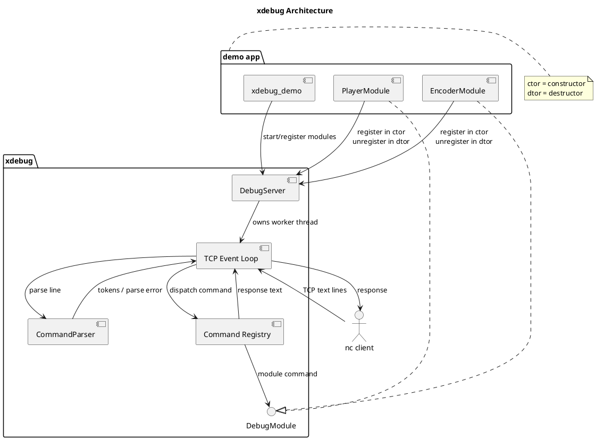
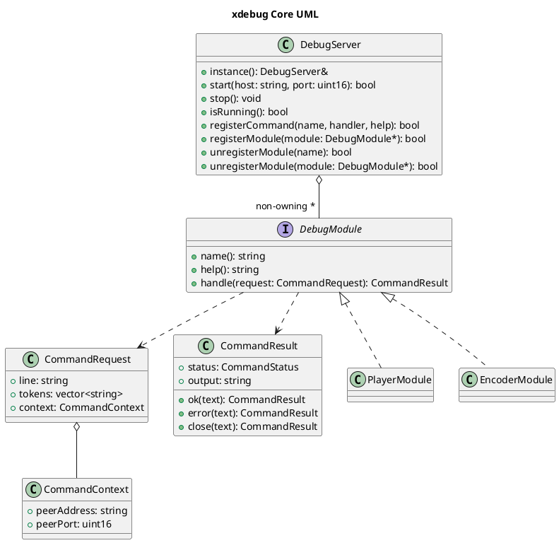
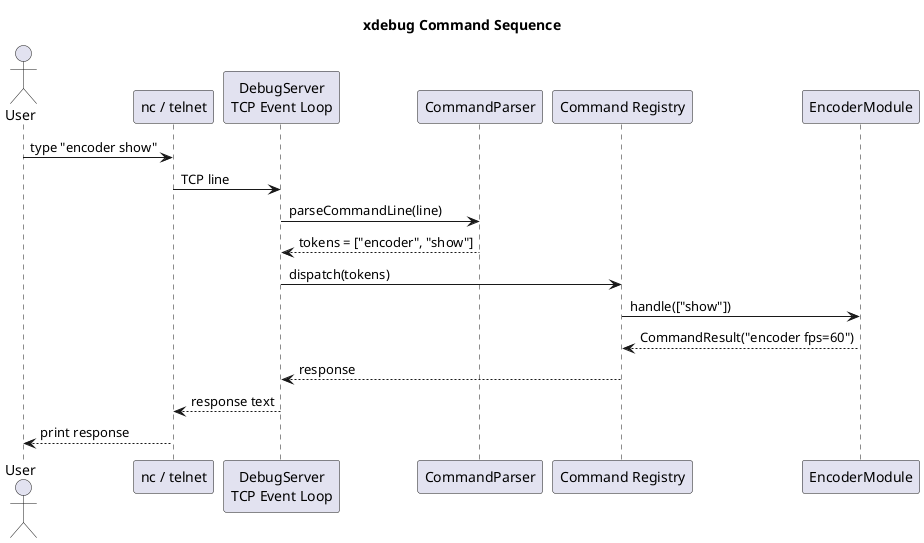

+++
title = "xdebug：一个面向跨平台 Native 服务的 TCP 调试入口"
date = 2026-05-25

[taxonomies]
categories = ["Linux"]
tags = ["C/C++", "Linux", "Android", "RTOS", "网络调试", "nc", "telnet"]
+++

[TOC]

很多 Native 服务一旦跑起来，最难处理的不是"有没有日志"，而是"我现在能不能在不中断进程的情况下问它几个问题"。

比如一个投屏服务、音视频服务或嵌入式后台任务，现场经常需要临时确认：

- 当前模块是否还活着。
- 编码器参数是否按预期生效。
- 某个状态机卡在哪一步。
- 是否可以临时触发一次 IDR、刷新、重连或 dump。
- 日志之外的运行时状态能不能直接读出来。

只靠日志不够。日志是被动输出，调试入口是主动查询。`xdebug` 的目标就是提供一个足够小、足够通用、方便跨平台移植的主动调试入口。

## 设计目标

`xdebug` 是一个进程内 TCP 文本命令服务。应用启动时打开一个监听端口，调试人员用 `nc` 或 `telnet` 连上去，输入一行命令，服务返回一段文本。

它不追求做成完整 RPC 框架，也不追求复杂权限模型。它解决的是工程现场最常见的问题：在 Linux、Android Native、RTOS 网络栈等环境里，用最少依赖暴露一个可控的运行时调试面。

核心约束有几个：

1. 调试协议必须简单，最好能用系统自带工具访问。
2. 模块注册要靠模块负责人维护生命周期，不能让调试服务持有业务对象所有权。
3. 服务端监听不能写死 `127.0.0.1`，多网口设备上要能从以太网、Wi-Fi、loopback 等不同入口访问。
4. 代码要能裁剪，方便迁移到 Linux、Android 或 RTOS。

## 整体架构

先看整体结构。`xdebug_demo` 只是示例应用，真正可以复用的是 `xdebug` 库。业务模块通过 `DebugModule` 接口挂到 `DebugServer` 上，客户端通过 TCP 发送文本命令，服务端解析后分发给对应模块。



这张图里有两个边界很重要。

第一，网络入口和命令解析属于 `xdebug`。业务模块不需要关心 `accept()`、`poll()`、粘包拆行、客户端断开这些细节。

第二，模块对象属于应用。`DebugServer` 只保存非持有指针，不决定业务对象什么时候销毁。这样可以避免调试系统反过来影响业务模块的生命周期。

## 为什么是 TCP 文本协议

很多调试系统一开始容易走向 HTTP、WebSocket、gRPC 或自定义二进制协议。它们都能工作，但在嵌入式和跨平台场景里会放大部署成本。

TCP 文本协议的优势很直接：

- 不需要浏览器。
- 不需要 curl、Python 或额外 SDK。
- 一条命令一行文本，抓包和日志都容易看。
- 对端工具极多，`nc`、`telnet`、串口网关、脚本都能接。
- RTOS 上实现成本低，只要有 socket API 或兼容封装即可。

例如：

```bash
nc 192.168.1.104 59695
# telnet 192.168.1.104 59695
```

连上后输入：

```text
modules
encoder show
encoder request-idr
player set-volume 80
```

这类命令不需要复杂客户端。现场工程师只要知道 IP、端口和命令，就能直接操作。

## nc 与 telnet 的区别

`nc` 更适合做 xdebug 的首选客户端，因为它基本就是"把标准输入输出接到 TCP socket 上"。对 xdebug 这种一行一命令的协议来说，`nc` 的行为最干净。

```bash
nc 10.48.11.15 59695
```

它适合：

- 自动化测试。
- shell 脚本批量执行命令。
- 发送原始 TCP 文本。
- 排查服务端返回是否符合预期。

`telnet` 的优势是历史更久，在一些系统里比 `nc` 更容易找到：

```bash
telnet 10.48.11.15 59695
```

它适合：

- 人工登录式调试。
- 现场机器没有 `nc` 但有 `telnet`。
- 临时验证端口是否能连通。

但 telnet 有一个关键差异：telnet 不完全等同于原始 TCP 客户端。部分 telnet 实现会在连接开始时发送 option negotiation 字节。如果服务端协议没有处理这些协商字节，第一条输入可能看起来像带了乱码。

可以按场景这样选：

| 场景 | 推荐工具 | 原因 |
| --- | --- | --- |
| 本机或 PC 自动化脚本 | `nc` | 原始 TCP，输入输出稳定，适合重定向和管道 |
| CI 或冒烟测试 | `nc` | 可以直接 `printf "server status\n" \| nc host port` |
| 现场人工排查 | `nc` 优先，`telnet` 备选 | `nc` 更干净，`telnet` 覆盖老系统 |
| 设备只内置 telnet | `telnet` | 可用于手动输入命令，但要注意协商字节 |
| 需要验证纯协议行为 | `nc` | 不引入 telnet option negotiation |

所以实践建议是：

- 自动化和协议验证优先用 `nc`。
- 手工现场排查可以用 `telnet`。
- 如果 telnet 下命令异常，先换 `nc` 判断是不是 telnet 协商字节影响。

例如自动化探测服务状态可以这样写：

```bash
printf "server status\nquit\n" | nc 192.168.1.104 59695
```

而 telnet 更像一个人工控制台：

```bash
telnet 192.168.1.104 59695
```

连上后逐行输入 `help`、`modules`、`encoder show` 这类命令即可。

## 多网口监听：为什么不能写死 127.0.0.1

很多 demo 喜欢监听：

```text
127.0.0.1:59695
```

这只允许本机 loopback 访问。对桌面开发还可以，但对电视、盒子、Android 设备、嵌入式板卡就不够了。

真实设备经常有多个接口：

```text
lo    127.0.0.1
eth0  10.48.11.15
wlan0 192.168.1.104
```

调试请求可能来自本机，也可能来自同网段 PC。服务端应该监听：

```text
0.0.0.0:59695
```

这表示绑定 IPv4 wildcard address。内核会把发往本机任意 IPv4 接口、目标端口为 `59695` 的连接交给同一个监听 socket。

于是以下请求都可以进入同一个服务：

```bash
nc 127.0.0.1 59695
nc 10.48.11.15 59695
nc 192.168.1.104 59695
```

当然，能否从远端连通还取决于路由、防火墙、设备是否在同网段、Android SELinux/权限策略等外部条件。

## 单例服务，模块自管理生命周期

`xdebug` 采用进程级单例：

```cpp
xdebug::DebugServer& server = xdebug::DebugServer::instance();
server.start("0.0.0.0", 59695);
```

这样做的原因是，一个进程通常只需要一个调试入口。多个模块都把命令注册到同一个入口，调试人员也只需要连一个端口。

但服务端不应该拥有业务模块。业务模块什么时候创建、什么时候销毁，应该由模块负责人决定。`xdebug` 只保存非持有指针。

推荐模式是模块在构造函数注册，在析构函数注销：

```cpp
class EncoderDebugModule final : public xdebug::DebugModule {
public:
    EncoderDebugModule() {
        xdebug::DebugServer::instance().registerModule(this);
    }

    ~EncoderDebugModule() override {
        xdebug::DebugServer::instance().unregisterModule(this);
    }

    std::string name() const override {
        return "encoder";
    }

    std::string help() const override {
        return "encoder show\nencoder request-idr";
    }

    xdebug::CommandResult handle(const xdebug::CommandRequest& request) override {
        if (request.tokens.empty() || request.tokens[0] == "show") {
            return xdebug::CommandResult::ok("encoder fps=60");
        }
        if (request.tokens[0] == "request-idr") {
            return xdebug::CommandResult::ok("idr requested");
        }
        return xdebug::CommandResult::error("unknown encoder command");
    }
};
```

这个模式的好处是边界清楚：

- `DebugServer` 负责网络、解析、分发。
- 业务模块负责自己的命令和生命周期。
- 模块销毁时自动从调试入口摘除。
- 服务端不通过 shared_ptr 延长业务对象生命周期。

核心类关系可以画成这样：



这里故意让 `DebugServer` 只拿 `DebugModule*`，而不是 `shared_ptr<DebugModule>`。调试服务只是索引入口，不应该用引用计数改变业务模块的销毁时机。模块负责人最清楚对象什么时候有效，也最适合在构造和析构里维护注册状态。

## 命令分发模型

命令协议是一行一条：

```text
encoder set-fps 30
```

解析后第一个 token 是模块名或内置命令：

```text
encoder
```

剩余 token 交给模块：

```text
set-fps 30
```

这和很多命令行工具的结构一致，使用者容易记：

```text
help
modules
server status
encoder show
player show
quit
```

内置命令保留给服务本身；业务命令按模块命名空间隔离，减少冲突。

一次 `encoder show` 的完整链路如下：



这里的关键点是：TCP 层只负责收发文本行，Parser 只负责把一行拆成 token，Registry 只负责找到目标命令或模块，业务模块只处理自己的子命令。每层职责都比较窄，后续迁移到不同平台时也更容易替换。

## 跨平台考虑

当前实现面向 POSIX socket，Linux 和 Android Native 可以直接适配。RTOS 场景需要看网络栈能力，常见迁移点包括：

- `socket/bind/listen/accept/recv/send/close` 的封装。
- `poll()` 替换为 RTOS 支持的 select、事件组或网络线程阻塞读。
- `std::thread` 替换为平台线程。
- `std::mutex` 替换为平台锁。
- 动态内存策略按项目要求收敛。

也就是说，`xdebug` 的分层应该保持清楚：命令解析、注册表、模块接口是平台无关部分；socket event loop 是平台相关部分。

可以把跨平台适配分成三层：

| 层级 | 内容 | 迁移难度 |
| --- | --- | --- |
| 模块接口层 | `DebugModule`、`CommandRequest`、`CommandResult` | 低，基本平台无关 |
| 命令层 | token 解析、注册表、内置命令 | 低，只依赖 C++ 标准库 |
| 网络事件层 | socket、监听、客户端读写、唤醒退出 | 中，需要按 OS/RTOS 网络栈适配 |

在 Linux 上，`poll()` 和 pipe 唤醒是很自然的组合。`stop()` 时向 wake pipe 写入 1 字节字符 `1`，让 `poll()` 返回，然后事件循环可以退出并清理 fd。

在 Android Native 上，模型基本一致，只是要考虑 SELinux、应用沙箱、端口暴露方式和 `adb forward`。

在 RTOS 上，如果没有 `poll()`，可以把网络线程改成阻塞 `accept()` 加客户端任务，或者用系统提供的 select/event group。只要保留"一行命令 -> token -> 模块处理 -> 文本响应"这个核心协议，客户端侧体验不需要变化。

在 Android 上，常见使用方式是 native service 或 JNI 底层库启动调试入口，然后通过：

```bash
adb shell
nc 127.0.0.1 59695
```

或者通过端口转发：

```bash
adb forward tcp:59695 tcp:59695
nc 127.0.0.1 59695
```
或
```bash
nc <设备IP> 59695
```

在 Linux 设备上，可以直接从 PC 连设备 IP：

```bash
nc 192.168.1.104 59695
```

在 RTOS 上，如果系统只有 telnet 客户端，没有 nc，也可以用 telnet 先做人工调试，但自动化仍建议准备一个 raw TCP client。

## 安全边界

调试入口是能力入口，不应该无条件暴露到不可信网络。

基本建议：

- 默认只在 debug 构建打开。
- 生产构建通过编译选项关闭。
- 必须远程调试时，限制端口所在网络。
- 命令设计要避免直接执行 shell。
- 高风险命令需要二次确认或只在本地构建启用。

`0.0.0.0` 解决的是多网口可达性，不等于安全策略。真正上线时要结合防火墙、认证、编译开关一起考虑。

## 代码下载

[xdebug](https://github.com/kgbook/xdebug)

## 小结

`xdebug` 的价值不在于协议复杂，而在于工程上足够顺手：

- 一个进程一个调试入口。
- 模块自己维护注册生命周期。
- TCP 文本协议容易接入。
- `nc` 适合脚本和自动化。
- `telnet` 适合没有 nc 的人工现场。
- `0.0.0.0` 适合多网口设备。
- 平台相关部分集中在 socket event loop，方便向 Android、Linux、RTOS 裁剪。

对长期运行的 Native 服务来说，这样的入口能显著降低现场问题定位成本。
