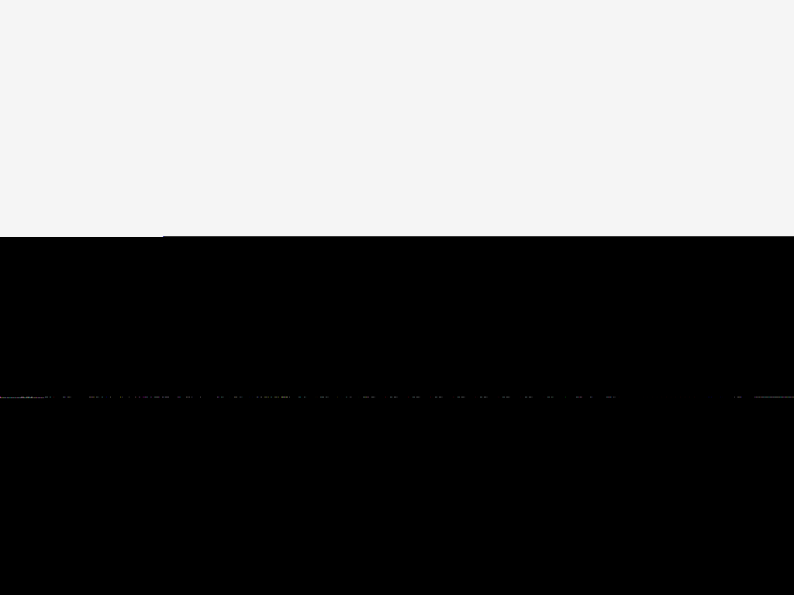
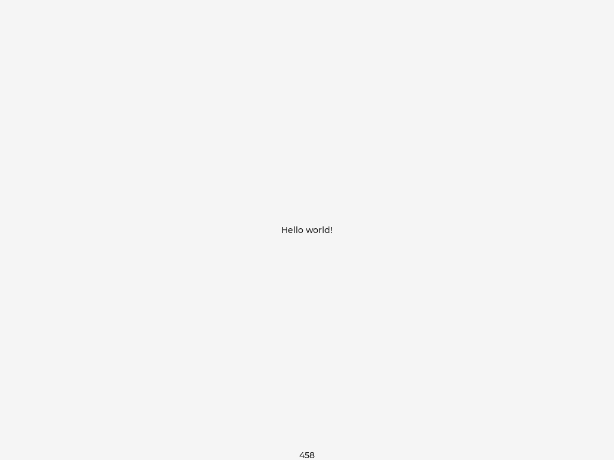
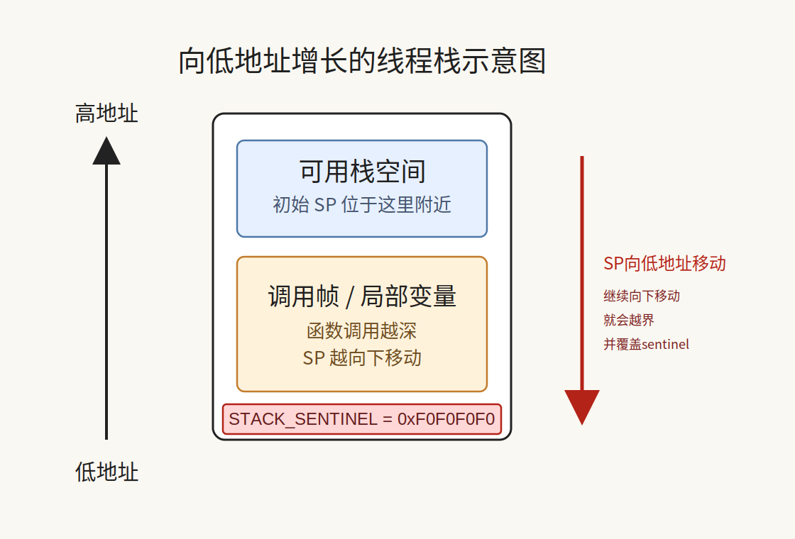

+++
title = "Zephyr LVGL 异常显示问题分析"
date = 2026-04-09
path = "2026/04/09/zephyr_lvgl_stack_overflow_analysis"
[taxonomies]
categories = ["RTOS"]
tags = ["RTOS", "Zephyr", "LVGL", "QEMU"]
+++

本文记录一次 `Zephyr + LVGL + qemu_riscv64` 的问题排查过程。表面现象是图形界面显示异常，最开始很像 `ramfb` 驱动或者像素格式问题；最终定位下来，根因其实是 `main()` 线程栈太小，导致 `LVGL redraw/flush` 路径运行时栈溢出。

目标样例是：

- `zephyr/samples/subsys/display/lvgl`

最终修复落在：

- `zephyr/samples/subsys/display/lvgl/boards/qemu_riscv64.conf`

相关 PR：

- [https://github.com/zephyrproject-rtos/zephyr/pull/106993](https://github.com/zephyrproject-rtos/zephyr/pull/106993)

## 问题现象

最开始并不是“无法编译”，而是：

1. `west build` 可以通过
2. QEMU 可以启动
3. 但画面不对，不是预期的 LVGL 基础界面

这个 sample 正常应该显示：

- 中间一行 `Hello world!`
- 底部一个递增计数器

实际失败时，抓图长这样：



修复后效果图：



对比很直观：

- 失败前：上半部分浅色，下半部分大面积黑屏，中间还有一条杂色像素线
- 修复后：完整浅色背景，中心文字和底部计数器都正常出现

如果只看失败图，很容易先怀疑：

- `QEMU ramfb` 像素格式不匹配
- LVGL 局部刷新和 framebuffer 不兼容
- 驱动 flush 路径有问题

但这些都不是最终根因。

## 复现方式

```bash
cd ~/workspace/opensource/zephyrproject-rtos
export ZEPHYR_TOOLCHAIN_VARIANT=zephyr
export ZEPHYR_SDK_INSTALL_DIR=~/.local/zephyr-sdk-1.0.1

west build -b qemu_riscv64 zephyr/samples/subsys/display/lvgl \
  -d build/lvgl_qemu_riscv64 -p always

west build -d build/lvgl_qemu_riscv64 -t run
```

如果要查看某次构建生效后的最终配置，直接看 build 目录下的：

```text
build/<build-dir>/zephyr/.config
```

例如：

- `build/lvgl_qemu_riscv64_verify/zephyr/.config`
- `build/lvgl_qemu_riscv64_4k_fail/zephyr/.config`

## “显示错了”还是“程序没画完”？

最开始的思路很自然会落到显示链路上：

1. 检查板级 DTS 是否有 `ramfb`
2. 检查 QEMU 是否带 `-device ramfb -vga none`
3. 检查 LVGL 颜色深度
4. 检查 `full refresh` / `partial refresh`

这一步并不算错，但它只能说明“值得怀疑显示链路”，还不能证明根因就在显示驱动。

为了避免被 SDL 窗口现象误导，更稳的做法是直接抓 framebuffer：

- 用 headless QEMU
- 通过 QEMU monitor 执行 `screendump`
- 直接检查 guest 写出来的图像

也就是文首那两张图。

这一步的意义是：

1. 不依赖桌面窗口显示
2. 可以保留静态证据
3. 可以判断 guest 到底有没有把一帧完整画出来

## 运行时日志分析，不是纯显示问题

继续运行后，串口日志里出现了关键错误：

```text
[00:00:00.980,000] <err> os: call trace:
[00:00:00.980,000] <err> os:       0: sp: 00000000800ae1a0 ra: 00000000800461ea
[00:00:00.980,000] <err> os:       1: sp: 00000000800ae1a8 ra: 0000000080003f78
[00:00:00.980,000] <err> os:       2: sp: 00000000800ae228 ra: 00000000800478ce
[00:00:00.980,000] <err> os:       3: sp: 00000000800ae270 ra: 0000000080045376
[00:00:00.980,000] <err> os:       4: sp: 00000000800ae290 ra: 000000008004573c
[00:00:00.980,000] <err> os:       5: sp: 00000000800ae2c0 ra: 000000008000cf6c
[00:00:00.980,000] <err> os:       6: sp: 00000000800ae2f0 ra: 000000008000e2bc
[00:00:00.980,000] <err> os:       7: sp: 00000000800ae300 ra: 000000008000878e
[00:00:00.980,000] <err> os: >>> ZEPHYR FATAL ERROR 2: Stack overflow on CPU 0
[00:00:00.980,000] <err> os: Current thread: 0x8005ee38 (unknown)
```

这段日志非常关键，因为它把问题从“显示异常”收敛成了“线程栈溢出”：

- 系统不是静默失败
- 不是纯粹的显示驱动初始化失败
- 内核已经明确报告 `Stack overflow on CPU 0`

## addr2line 还原调用栈

Zephyr 的 `call trace` 已经给出了每一帧的 `ra` 地址。只要把这些地址交给 `addr2line`，就能从十六进制地址还原出函数名和源码位置。

先从日志里摘出这些地址：

```text
0x00000000800461ea
0x0000000080003f78
0x00000000800478ce
0x0000000080045376
0x000000008004573c
0x000000008000cf6c
0x000000008000e2bc
0x000000008000878e
```

然后对失败版本的 ELF 跑：

```bash
/home/cory/.local/zephyr-sdk-1.0.1/gnu/riscv64-zephyr-elf/bin/riscv64-zephyr-elf-addr2line \
  -e /home/cory/workspace/opensource/zephyrproject-rtos/build/lvgl_qemu_riscv64_4k_fail/zephyr/zephyr.elf \
  -f -C \
  0x00000000800461ea \
  0x0000000080003f78 \
  0x00000000800478ce \
  0x0000000080045376 \
  0x000000008004573c \
  0x000000008000cf6c \
  0x000000008000e2bc \
  0x000000008000878e
```

解析结果如下：

```bash
z_check_stack_sentinel
/home/cory/workspace/opensource/zephyrproject-rtos/zephyr/kernel/thread.c:347
ramfb_write
/home/cory/workspace/opensource/zephyrproject-rtos/zephyr/drivers/display/display_qemu_ramfb.c:99
memcpy
??:?
lvgl_flush_display
/home/cory/workspace/opensource/zephyrproject-rtos/zephyr/modules/lvgl/lvgl_display.c:148
lvgl_flush_cb_32bit
/home/cory/workspace/opensource/zephyrproject-rtos/zephyr/modules/lvgl/lvgl_display_32bit.c:27
call_flush_cb
/home/cory/workspace/opensource/zephyrproject-rtos/modules/lib/gui/lvgl/src/core/lv_refr.c:1439
refr_invalid_areas
/home/cory/workspace/opensource/zephyrproject-rtos/modules/lib/gui/lvgl/src/core/lv_refr.c:807
obj_invalidate_area_internal
/home/cory/workspace/opensource/zephyrproject-rtos/modules/lib/gui/lvgl/src/core/lv_obj_pos.c:1342
```

按 `frame 0..7` 顺序对齐后，可读成：

```bash
frame 0  ra=0x00000000800461ea -> z_check_stack_sentinel
frame 1  ra=0x0000000080003f78 -> ramfb_write
frame 2  ra=0x00000000800478ce -> memcpy
frame 3  ra=0x0000000080045376 -> lvgl_flush_display
frame 4  ra=0x000000008004573c -> lvgl_flush_cb_32bit
frame 5  ra=0x000000008000cf6c -> call_flush_cb
frame 6  ra=0x000000008000e2bc -> refr_invalid_areas
frame 7  ra=0x000000008000878e -> obj_invalidate_area_internal
```

这一条链非常有用，因为它说明：

1. 内核已经检测到线程栈越界
2. 当时正在走 `ramfb_write`
3. 更上层是 LVGL 的 flush 路径
4. 更深层是 LVGL redraw / invalid area 处理

也就是说，问题不是“驱动初始化前就死掉”，而是：

- 主线程已经走进 `LVGL redraw/flush`
- 并在这条路径上把栈打爆了

## `z_check_stack_sentinel` 是什么?

很多人看到回溯顶部的 `z_check_stack_sentinel()`，第一反应会误以为“就是这个函数有问题”。其实不是。

它的作用是**检查当前线程栈底的哨兵值有没有被踩坏**。

```c
void z_check_stack_sentinel(void)
  {
        uint32_t *stack;

        if ((_current->base.thread_state & _THREAD_DUMMY) != 0) {
                return;
        }

        stack = (uint32_t *)_current->stack_info.start;
        if (*stack != STACK_SENTINEL) {
                *stack = STACK_SENTINEL;
                z_except_reason(K_ERR_STACK_CHK_FAIL);
        }
  }
```

它做的事很简单：

1. 取当前线程 `_current`
2. 找到这个线程栈的起始地址 `stack_info.start`
3. 检查那里是否还是魔数 `STACK_SENTINEL`
4. 如果魔数被改坏了，说明栈已经越界写到了栈底，直接触发 `K_ERR_STACK_CHK_FAIL`


Zephyr 在线程创建时，会在栈底最低 4 字节写入一个魔数：

```c
#define STACK_SENTINEL 0xF0F0F0F0
```

运行过程中，内核会在一些调度/检查点调用 `z_check_stack_sentinel()`。如果发现这个魔数已经被覆盖，就触发`K_ERR_STACK_CHK_FAIL`，也就是刚看到的：

````bash
Stack overflow on CPU 0
````

所以它是**发现栈溢出的人**，不是**导致栈溢出的人**。

## 栈区不是 FIFO，而是 LIFO

这里顺便要澄清一个容易混淆的点： 栈是 LIFO, **Last In, First Out** 后入先出!

函数调用时，新调用帧压到栈顶；函数返回时，最近压入的那一帧最先弹出。

对 *qemu_riscv64* 这种场景，可以按“栈向低地址增长”来理解：

1. 初始 `SP` 在较高地址
2. 调用越深，`SP` 越往低地址移动
3. 如果继续向下写，最终就会踩穿栈底

Zephyr 把 `STACK_SENTINEL` 写在栈区最低地址处，正是为了检测这种**向下踩穿栈底**的溢出。

可以简单画成这样：



所以这次问题在内存层面的直观含义就是：

- 主线程函数 `main()` 在 LVGL `redraw`/`flush` 路径上压栈太深
- `SP` 一路向低地址移动
- 最终把栈底 sentinel 覆盖掉
- `z_check_stack_sentinel()` 把它检测出来了

## 为什么是 `CONFIG_MAIN_STACK_SIZE`

Zephyr 里有很多和栈相关的配置：

- `CONFIG_MAIN_STACK_SIZE`
- `CONFIG_ISR_STACK_SIZE`
- `CONFIG_IDLE_STACK_SIZE`
- `CONFIG_SYSTEM_WORKQUEUE_STACK_SIZE`
- 应用自己 `K_THREAD_STACK_DEFINE(...)` 的线程栈

但这次必须关注的是 `CONFIG_MAIN_STACK_SIZE`

原因很直接，Zephyr 内核在 *kernel/init.c* 里用它创建 `z_main_thread`，然后通过 `bg_thread_main()` 调用应用的 `main()`。

```c
/* init/main and idle threads */
K_THREAD_PINNED_STACK_DEFINE(z_main_stack, CONFIG_MAIN_STACK_SIZE);
struct k_thread z_main_thread;

__boot_func
static char *prepare_multithreading(void)
{
	char *stack_ptr;

	/* _kernel.ready_q is all zeroes */
	z_sched_init();

#ifndef CONFIG_SMP
	_kernel.ready_q.cache = &z_main_thread;
#endif /* CONFIG_SMP */
	stack_ptr = z_setup_new_thread(&z_main_thread, z_main_stack,
				       K_THREAD_STACK_SIZEOF(z_main_stack),
				       bg_thread_main,
				       NULL, NULL, NULL,
				       CONFIG_MAIN_THREAD_PRIORITY,
				       K_ESSENTIAL, "main");
	z_mark_thread_as_not_sleeping(&z_main_thread);
	z_ready_thread(&z_main_thread);

	z_init_cpu(0);

	return stack_ptr;
}
```

而这个 sample 的关键路径都在 main.c 里执行：

1. 创建 label 和计数器
2. 调用 `lv_timer_handler()`
3. 在线程循环里持续调用 `lv_timer_handler()`

也就是说，LVGL 的 `redraw`/`flush` 是直接在 `main()` 线程函数里跑的，不是 ISR，不是 idle 线程，也不是 system workqueue。

所以一旦这个路径的栈不够，首先对应的就是 `CONFIG_MAIN_STACK_SIZE`

## 配置 `CONFIG_MAIN_STACK_SIZE` 大小

样例 *zephyr/samples/subsys/display/lvgl/prj.conf* 里本来就写了：

```conf
CONFIG_MAIN_STACK_SIZE=4096
```

这说明 `4 KiB` 不是板级默认值， 而是 sample 自己显式设定的主线程栈大小

后续做了逐步验证：

- `4096`：失败，稳定触发 `Stack overflow on CPU 0`
- `5120`：通过
- `6144`：通过
- `8192`：通过
- `16384`：只是调试初期临时用过的保守大值

所以最终可以收敛出明确结论：

1. `4 KiB` 对这个组合不够
2. `5 KiB` 已经足够
3. 没必要保留 `16 KiB` 那种调试阶段的大冗余

## Full Refresh v.s Partial Refresh

在 Zephyr 的 LVGL glue 里：

- `CONFIG_LV_Z_FULL_REFRESH=y`：强制整帧刷新
- 不启用它：默认就是 partial refresh

调试初期曾临时打开 `full refresh`，目的只是先用最保守的方式排除变量。

但后续验证表明：

1. partial refresh 在 `qemu_riscv64` 上是正常的
2. 这次故障的根因不是刷新策略
3. 根因是主线程栈溢出

因此最终修复没有保留 `CONFIG_LV_Z_FULL_REFRESH=y`，而是保持默认 partial refresh。

## `CONFIG_SHELL=n` / `CONFIG_LV_Z_SHELL=n`

- shell 不是根因
- 但它会增加 bring-up 阶段的资源占用和控制台干扰
- 在这个 sample 上先关掉，能让问题更聚焦

## 最终修复

```conf
# qemu_riscv64 hits a main-thread stack overflow during LVGL redraw with the
# sample defaults. Local validation showed 5 KiB is enough, while the default
# 4 KiB stack overflows during redraw.
CONFIG_QEMU_RAMFB_DISPLAY=y
CONFIG_LV_COLOR_DEPTH_32=y
CONFIG_MAIN_STACK_SIZE=5120

# Disable the shell on this target to avoid extra stack and console pressure
# while bringing up the ramfb-based LVGL sample under QEMU.
CONFIG_SHELL=n
CONFIG_LV_Z_SHELL=n
```

## 小结

这次问题的核心教训很简单：

1. 看到图形异常，不要立刻断定是显示驱动问题
2. 对图形问题，日志、回溯、抓图要结合起来用
3. 调试阶段可以临时用保守配置稳定现场，但最终提交必须收敛到最小必要改动