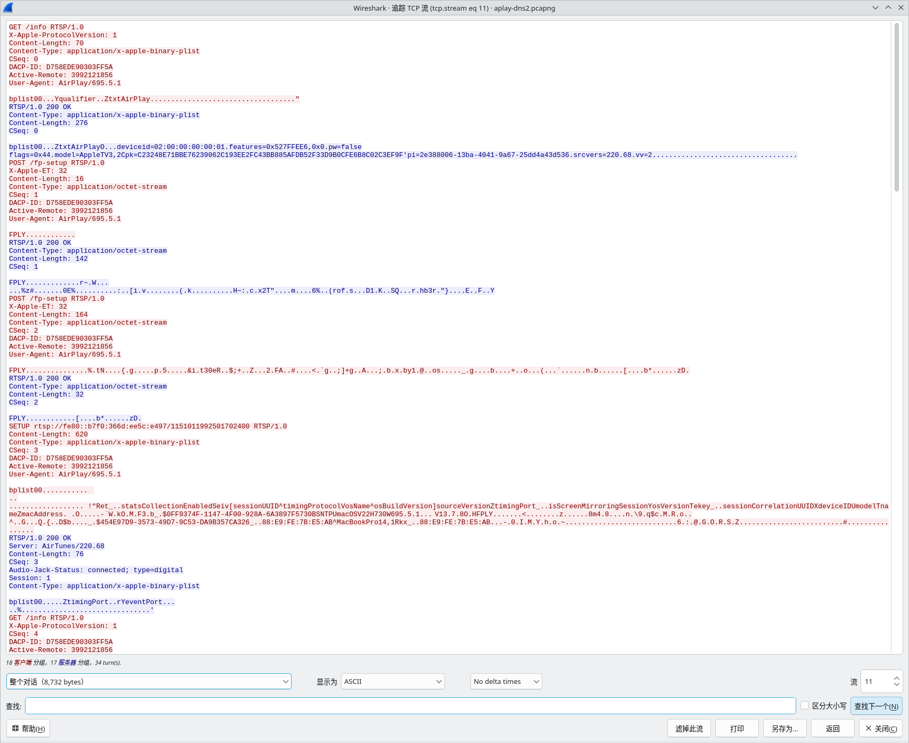
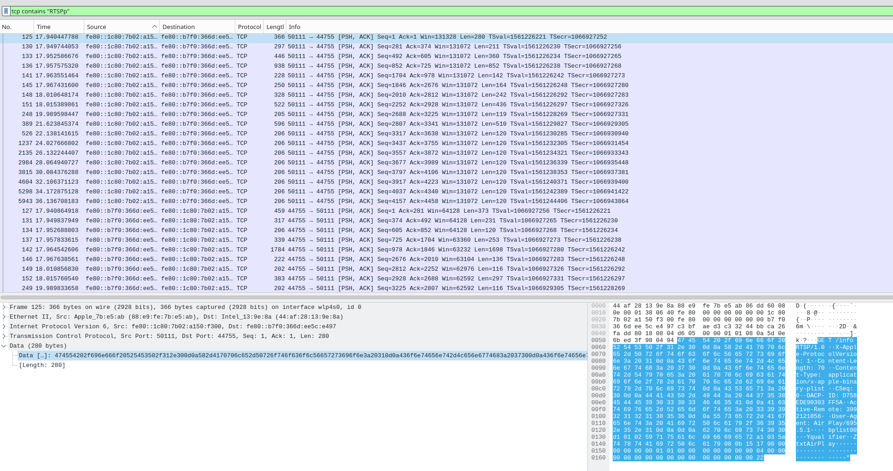
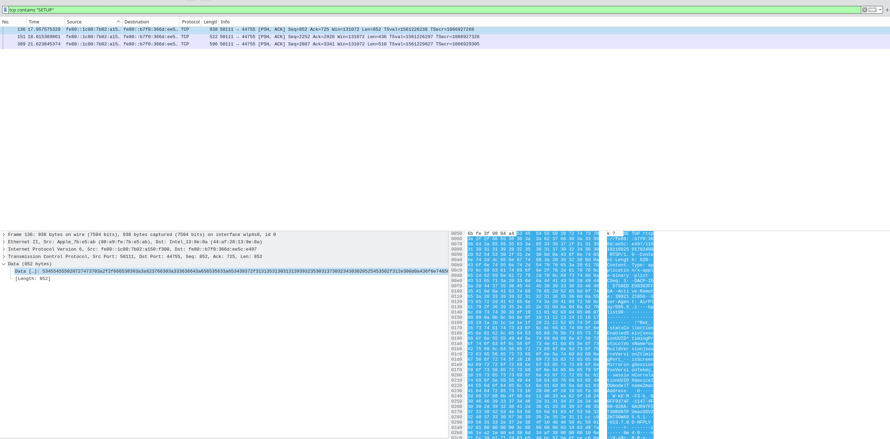

+++
title = "Wireshark 分析 AirPlay 投屏"
date = 2026-06-19
path = "2026/06/19/airplay-wireshark-rtsp-analysis"
[taxonomies]
categories = ["Linux"]
tags = ["AirPlay", "RTSP", "Wireshark", "APlay", "FairPlay", "RTP", "plist", "mDNS"]

+++

## 背景

在调试 AirPlay 投屏接收端时，最容易遇到一个反直觉现象：接收端日志里明明已经收到了 `SETUP`、`RECORD`、`SET_PARAMETER` 等 RTSP 请求，但 Wireshark 里使用下面的``rtsp`显示过滤器却是空的：

这很容易让人怀疑：

- 是不是根本没有抓到 RTSP？
- 是不是 AirPlay 使用的不是标准 RTSP？
- 日志中为什么会有多次`SETUP`请求？

本文基于一次实际 AirPlay 投屏抓包，整理一种更可靠的 Wireshark 分析方法：不要一开始就依赖 Wireshark 的 `rtsp` 过滤器，而是从 mDNS、TCP payload、RTSP-like 文本关键字、binary plist body 和后续媒体端口几个层面还原完整会话。

本文重点不是讲 AirPlay 协议规范，而是讲工程调试中如何定位：**AirPlay 投屏控制流为什么 Wireshark 解析为空，以及如何解释多次 `SETUP` 请求。**

---

## 结论先行

这次抓包里的 AirPlay 控制流确实是 RTSP-like 协议，但它不是传统意义上完全标准的 RTSP。它具有这些特点：

1. 控制连接不在 RTSP 默认端口 `554`，而是在接收端动态端口上。
2. 请求行长得像 RTSP，例如 `SETUP ... RTSP/1.0`。
3. 同时又混用了类似 HTTP 的方法和路径，例如 `GET /info RTSP/1.0`、`POST /fp-setup RTSP/1.0`、`POST /feedback RTSP/1.0`。
4. 关键参数没有放在标准 RTSP 的 `Transport:` header 里，而是放在 `application/x-apple-binary-plist` body 中。
5. 投屏会话会分阶段建立：先建立 session/timing/key，再建立屏幕主数据流，再建立音频流，所以会看到多次 `SETUP`。

因此，Wireshark 的 `rtsp` 过滤器为空，并不代表没有 RTSP 控制数据，只能说明 Wireshark 没有自动把这条 TCP 流识别成 RTSP。

---

## 一、为什么 `rtsp` 过滤器可能为空？

### 1. Wireshark 的协议识别依赖端口和启发式解析

传统 RTSP 常见端口是 `554`。但是 AirPlay 投屏场景里，服务端口通常由 mDNS/DNS-SD 广播出来，可能是 `7000`，也可能是其他动态端口。

本次抓包中，实际控制连接是：

```text
sender   fe80::1c80:7b02:a150:f300:50111
receiver fe80::b7f0:366d:ee5c:e497:44755
```

也就是说，AirPlay 控制流跑在接收端 `44755` 端口上，而不是 `554`。

如果 Wireshark 没有根据端口或 payload 自动识别，就不会把它标成 `rtsp`， 自然看不到任何结果。

### 2. AirPlay 控制流是 RTSP-like，不是纯标准 RTSP

抓包中可以看到这样的请求：

```text
GET /info RTSP/1.0
POST /fp-setup RTSP/1.0
SETUP rtsp://fe80::b7f0:366d:ee5c:e497/1151011992501702400 RTSP/1.0
RECORD rtsp://fe80::b7f0:366d:ee5c:e497/1151011992501702400 RTSP/1.0
SET_PARAMETER rtsp://fe80::b7f0:366d:ee5c:e497/1151011992501702400 RTSP/1.0
POST /feedback RTSP/1.0
```

这些请求的第一行确实带 `RTSP/1.0`，但又不是普通 RTSP 客户端常见的纯 `OPTIONS`、`DESCRIBE`、`SETUP`、`PLAY` 流程。

特别是 AirPlay 使用了大量 Apple 私有 body：

```text
Content-Type: application/x-apple-binary-plist
```

很多协商字段都藏在 binary plist 里，而不是标准 RTSP header 里。

所以更准确的叫法是： AirPlay proprietary **RTSP-like** protocol。

工程调试时，不要机械地认为 Wireshark 没显示 `rtsp` 就是没有 RTSP。

---

## 二、推荐的 Wireshark 分析方法

### 1. 先从 mDNS 找 AirPlay 服务和端口

AirPlay 发现阶段通常依赖 mDNS/DNS-SD，常见服务包括：

```text
_airplay._tcp
_raop._tcp
```

Wireshark 过滤器：`mdns` 或者更聚焦一点：

```text
mdns && (dns.ptr.domain_name contains "airplay" || dns.ptr.domain_name contains "raop")
```

重点看 SRV 记录里的端口，以及 TXT 记录里的能力字段。不要假设控制端口一定是 `7000` 或 `554`。

### 2. 不要先用 `rtsp`，先看 TCP payload

如果知道发送端和接收端 IP，可以先用：

```text
ipv6.addr == fe80::1c80:7b02:a150:f300 && ipv6.addr == fe80::b7f0:366d:ee5c:e497 && tcp.len > 0
```

如果是 IPv4，则类似：

```text
ip.addr == <sender-ip> && ip.addr == <receiver-ip> && tcp.len > 0
```

然后右键关键包：

```text
Follow -> TCP Stream
```


如果流里能看到 `RTSP/1.0`、`SETUP`、`RECORD` 这些文本，就说明控制协议是明文 RTSP-like，只是 Wireshark 没自动识别。

### 3. 用关键字过滤，而不是协议过滤

比 `rtsp` 更稳的方式是直接搜 payload：

```text
tcp contains "RTSP"
```



或者：

```text
tcp contains "SETUP"
```



也可以分别找 AirPlay 常见控制方法：

```text
tcp contains "GET /info"
tcp contains "POST /fp-setup"
tcp contains "RECORD"
tcp contains "SET_PARAMETER"
tcp contains "POST /feedback"
```

本次抓包中，使用 payload 关键字能直接找到控制流；使用 `rtsp` 则容易为空。

### 4. 必要时手动 Decode As

如果已经确认某个 TCP 端口上跑的是 RTSP-like 控制流，可以手动指定解析：

```text
右键 TCP 包
Decode As...
TCP port 44755 -> RTSP
```

然后再观察 Wireshark 是否能够部分解析 RTSP header。

不过要注意：即使手动 Decode As，AirPlay 私有的 binary plist body 也不一定能被完整解释。很多时候仍然需要手工看 TCP Stream，或者把 body 提取出来用 plist 工具解析。

---

## 三、一次 AirPlay 投屏会话的实际流程

本次抓包中，控制连接大致如下：

```text
sender   fe80::1c80:7b02:a150:f300:50111
receiver fe80::b7f0:366d:ee5c:e497:44755
```

控制流中可以看到以下阶段。

### 1. `GET /info`：获取接收端能力

请求：

```text
GET /info RTSP/1.0
X-Apple-ProtocolVersion: 1
Content-Type: application/x-apple-binary-plist
CSeq: 0
User-Agent: AirPlay/695.5.1
```

响应中包含接收端信息，例如：

```text
model=AppleTV3,2
srcvers=220.68
features=0x527FFEE6,0x0
vv=2
```

后续还会再次 `GET /info`，返回更完整的能力集，例如 RAOP、音频格式、display 信息等。

### 2. `POST /fp-setup`：FairPlay 相关握手

抓包里有两次 `POST /fp-setup`：

```text
POST /fp-setup RTSP/1.0
X-Apple-ET: 32
Content-Type: application/octet-stream
CSeq: 1
```

以及：

```text
POST /fp-setup RTSP/1.0
X-Apple-ET: 32
Content-Type: application/octet-stream
CSeq: 2
```

body 以 `FPLY` 开头，属于 FairPlay 相关握手数据。这里 Wireshark 通常无法直接解释业务含义，只需要确认请求和响应都正常即可。

### 3. 第一次 `SETUP`：建立投屏 session、timing 和加密上下文

第一次 `SETUP`：

```text
SETUP rtsp://fe80::b7f0:366d:ee5c:e497/1151011992501702400 RTSP/1.0
Content-Type: application/x-apple-binary-plist
CSeq: 3
```

body 中可以看到这些关键字段：

```text
isScreenMirroringSession = true
timingProtocol = NTP
timingPort = 52416
et = 32
ekey
eiv
sessionUUID
sourceVersion = 695.5.1
osName = macOS
model = MacBookPro14,1
```

服务端响应：

```text
RTSP/1.0 200 OK
CSeq: 3
Session: 1
```

响应 body 中包含：

```text
timingPort = 6002
eventPort = 0
```

这个 `SETUP` 不是具体音频或视频流的 SETUP，而是建立整个 screen mirroring session 的基础信息：

- 分配 `Session: 1`
- 协商 timing/NTP 端口
- 传递加密相关字段
- 声明这是 screen mirroring session

后续抓包中也能看到 timing UDP 包在使用：

```text
sender timingPort 52416 <-> receiver timingPort 6002
```

### 4. `RECORD`：开始投屏 session

之后出现：

```text
RECORD rtsp://fe80::b7f0:366d:ee5c:e497/1151011992501702400 RTSP/1.0
```

这一步表示 session 已经建立，发送端准备开始向接收端推送媒体数据。

### 5. 第二次 `SETUP`：建立屏幕镜像主数据流

第二次 `SETUP`：

```text
SETUP rtsp://fe80::b7f0:366d:ee5c:e497/1151011992501702400 RTSP/1.0
CSeq: 7
Content-Type: application/x-apple-binary-plist
```

这次 body 里出现 `streams` 数组，其中关键字段是：

```text
streams = [
  {
    type = 110
    latencyMs = 100
    streamConnectionID = ...
    timestampInfo = ...
  }
]
```

服务端响应里给出了数据端口：

```text
streams = [
  {
    type = 110
    dataPort = 6003
    streamConnectionID = ...
  }
]
```

随后抓包中出现新的 TCP 大流：

```text
sender:50113 -> receiver:6003
```

这个连接承载屏幕镜像主数据流。抓包中该 TCP 流数据量明显大于普通控制流，因此可以判断这是投屏主媒体数据通道。

### 6. 第三次 `SETUP`：建立音频流

第三次 `SETUP`：

```text
SETUP rtsp://fe80::b7f0:366d:ee5c:e497/1151011992501702400 RTSP/1.0
CSeq: 9
Content-Type: application/x-apple-binary-plist
```

这次 body 明显是音频 stream：

```text
streams = [
  {
    type = 96
    isMedia = true
    usingScreen = true
    audioMode = default
    audioFormat = 16777216
    sr = 44100
    spf = 480
    redundantAudio = 2
    controlPort = 49254
    supportsDynamicStreamID = true
  }
]
```

服务端响应：

```text
streams = [
  {
    type = 96
    streamID = 1
    dataPort = 6000
    controlPort = 6001
  }
]
```

随后可以看到音频相关 UDP 包：

```text
sender -> receiver:6000  音频数据
sender -> receiver:6001  音频控制
```

所以这第三次 `SETUP` 是音频流协商，不是前面 `SETUP` 的重传。

---

## 四、为什么会有多次 `SETUP`？

标准 RTSP 里，一个 session 可以包含多个 media track，每个 track 可以单独 `SETUP`。AirPlay 投屏虽然是私有 RTSP-like 协议，但思路类似：一个投屏会话不是一个单一流，而是由多个子通道组成。

本次抓包可以归纳成：

```text
SETUP #1: session / key / timing setup
SETUP #2: screen mirroring main stream setup, dataPort = 6003
SETUP #3: audio stream setup, dataPort = 6000, controlPort = 6001
```

也就是说，多次 `SETUP` 是正常协议流程，不是异常。

判断它不是失败重试，有几个证据。

### 1. CSeq 不同

三次 `SETUP` 的 CSeq 分别是：

```text
CSeq: 3
CSeq: 7
CSeq: 9
```

如果是同一个请求重传，通常会看到相同 CSeq 或者相同请求内容重复出现。这里显然不是。

### 2. body 内容不同

三次 `SETUP` 的 body 语义完全不同：

```text
CSeq 3: isScreenMirroringSession / timingPort / ekey / eiv
CSeq 7: streams type 110 / dataPort 6003
CSeq 9: streams type 96 / sr 44100 / audioFormat / dataPort 6000 / controlPort 6001
```

这说明它们是在协商不同层次的资源。

### 3. 服务端都返回 200 OK

三次 `SETUP` 都有正常响应：

```text
RTSP/1.0 200 OK
Session: 1
```

没有看到 4xx/5xx，也没有看到明显的失败回退。

### 4. 响应中的端口后续真的被使用

后续抓包中能看到对应端口都被使用：

```text
6002: timing
6003: screen mirroring main data over TCP
6000: audio data over UDP
6001: audio control over UDP
```

这说明每次 `SETUP` 都成功建立了一个实际通道。

---

## 五、如何区分控制流、视频流、音频流和 timing 流？

抓 AirPlay 投屏时，不要只盯着 RTSP 控制流。一次完整投屏通常至少有几类流量。

### 1. 控制流

本次控制流：

```text
receiver TCP port 44755
```

过滤器：

```wireshark
tcp.port == 44755
```

或者：

```wireshark
tcp contains "RTSP/1.0"
```

### 2. 屏幕镜像主数据流

由第二次 `SETUP` 协商出来：

```text
dataPort = 6003
```

过滤器：

```wireshark
tcp.port == 6003
```

这个流通常数据量很大。

### 3. 音频数据流

由第三次 `SETUP` 协商出来：

```text
dataPort = 6000
```

过滤器：

```wireshark
udp.port == 6000
```

### 4. 音频控制流

由第三次 `SETUP` 协商出来：

```text
controlPort = 6001
```

过滤器：

```wireshark
udp.port == 6001
```

### 5. timing/NTP 流

由第一次 `SETUP` 协商出来：

```text
sender timingPort = 52416
receiver timingPort = 6002
```

过滤器：

```wireshark
udp.port == 52416 || udp.port == 6002
```

---

## 六、AirPlay RTSP-like 抓包排查清单

### 1. 先确认发现阶段

```wireshark
mdns
```

重点看：

```text
_airplay._tcp
_raop._tcp
SRV port
TXT features
model
srcvers
```

### 2. 找控制流

不要先用 `rtsp`，先用：

```wireshark
tcp contains "RTSP/1.0"
```

或者：

```wireshark
tcp contains "GET /info" || tcp contains "SETUP" || tcp contains "RECORD"
```

### 3. Follow TCP Stream

确认是否能看到：

```text
GET /info RTSP/1.0
POST /fp-setup RTSP/1.0
SETUP ... RTSP/1.0
RECORD ... RTSP/1.0
```

如果能看到，说明控制流是明文 RTSP-like。

### 4. 看 `Content-Type`

如果是：

```text
Content-Type: application/x-apple-binary-plist
```

说明很多参数在 binary plist body 里。Wireshark 不一定会自动解析，需要手工提取或借助 plist 工具。

### 5. 解析每次 `SETUP` 的语义

重点看：

```text
CSeq
Session
streams.type
dataPort
controlPort
timingPort
sr
audioFormat
isScreenMirroringSession
```

不要看到多次 `SETUP` 就认为是失败重试。先比较 CSeq、body 和响应端口。

### 6. 验证端口是否真的被使用

SETUP 响应里出现的端口，后续应该能在抓包中看到流量：

```wireshark
tcp.port == <dataPort>
udp.port == <dataPort>
udp.port == <controlPort>
udp.port == <timingPort>
```

如果响应端口没有任何后续流量，才需要怀疑协商失败、NAT/防火墙、IPv6 scope、端口绑定或接收端线程问题。

---

## 七、常见误区

### 误区 1：`rtsp` 过滤为空，所以没有 RTSP

不一定。AirPlay 可能跑在非默认端口，Wireshark 没有自动识别。应优先使用：

```wireshark
tcp contains "RTSP/1.0"
```

### 误区 2：多次 `SETUP` 是失败重试

不一定。AirPlay 投屏会分阶段建立多个通道。只要 CSeq 不同、body 不同、响应 200 OK、端口后续被使用，就不是重试。

### 误区 3：没有 `Transport:` header，所以不是 RTSP

AirPlay 是私有 RTSP-like 协议，很多传输参数在 binary plist 里，而不是标准 `Transport:` header 里。

### 误区 4：只抓 TCP 就够了

不够。控制流是 TCP，但音频、控制、timing 可能走 UDP。只看 TCP 会漏掉音频和同步问题。

### 误区 5：AirPlay 和 RAOP 流程完全一样

不一样。RAOP 音频更接近传统 RTSP/RTP；AirPlay 投屏会有 screen mirroring session、FairPlay、timing、屏幕主数据流、音频流等更多私有流程。

---

## 八、实战建议

调 AirPlay 接收端时，可以按下面顺序排查。

第一步，确认 mDNS 广播是否正常：

```wireshark
mdns
```

第二步，确认控制连接是否建立：

```wireshark
tcp contains "RTSP/1.0"
```

第三步，确认 FairPlay/setup 是否成功：

```wireshark
tcp contains "POST /fp-setup" || tcp contains "SETUP"
```

第四步，跟踪所有 `SETUP` 响应里的端口：

```text
timingPort
dataPort
controlPort
```

第五步，看媒体流是否真的过来：

```wireshark
tcp.port == 6003
udp.port == 6000 || udp.port == 6001 || udp.port == 6002
```

第六步，对照接收端日志：

```text
/info
/fp-setup
SETUP session
RECORD
SETUP screen stream
SETUP audio stream
feedback
TEARDOWN
```

如果 Wireshark 抓包和接收端日志能按 CSeq 对上，基本就能判断问题出在协议协商、端口监听、媒体解包、解密、解码还是同步阶段。

---

## 总结

AirPlay 投屏中的 RTSP 不能按传统 RTSP 调试方法简单处理。Wireshark 里 `rtsp` 过滤为空，很多时候只是因为它没有自动识别 AirPlay 私有 RTSP-like 控制流。

更可靠的方法是：

```text
mDNS 找服务和端口
TCP payload 搜 RTSP/1.0
Follow TCP Stream 看明文控制流
识别 application/x-apple-binary-plist
逐个分析 SETUP body 和响应端口
用后续 TCP/UDP 流量验证端口是否生效
```

本次抓包中出现三次 `SETUP`，它们分别对应：

```text
SETUP #1: 建立 session / key / timing
SETUP #2: 建立屏幕镜像主数据流，dataPort = 6003
SETUP #3: 建立音频流，dataPort = 6000，controlPort = 6001
```

所以，多次 `SETUP` 是 AirPlay 投屏协议的正常行为，不是失败重传。工程上应该把 AirPlay 投屏理解成一个由多个子通道组成的私有 RTSP-like 会话，而不是一个单一的标准 RTSP/RTP 流。
