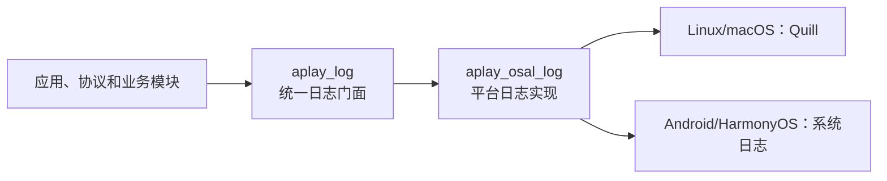

+++
title = "CMake object library 的延迟解析与对象文件传递"
date = 2026-07-13

[taxonomies]
categories = ["Tools"]
tags = ["CMake", "C++", "Object Library", "生成器表达式", "构建系统", "链接器"]
+++

给日志模块整理依赖时，目标很朴素：业务代码只面对 `aplay_log`，平台相关的输出实现留在 `aplay_osal_log`。

Linux 和 macOS 的平台实现要用 Quill；Android 和 HarmonyOS 则各自调用系统日志。这样一来，协议、播放器、渲染器都不需要知道平台日志头文件在哪里，也不该直接链接平台日志模块。

依赖图本来应该很干净：



改完后，CMake 配置顺利结束，绝大部分 `.cpp` 也正常编译。看起来一切都很好。直到最后链接 `APlayReceiver` 时，终端冒出了几行很不客气的话：

```text
/usr/bin/ld: .../core/log/.../log.cpp.o:
undefined reference to `aplay::osal::log::initialize()'
undefined reference to `aplay::osal::log::write(...)'
collect2: error: ld returned 1 exit status
```

这两个函数明明已经实现，为什么链接器还说找不到？

## 链接器不认识“我有这个 target”

先别急着怀疑函数签名或者命名空间。链接器只认最终传给它的输入：对象文件、静态库和动态库。于是把最终链接命令展开一看，答案其实已经在那里了。

`log.cpp.o` 在，Quill 相关库也在，但定义 `aplay::osal::log::initialize()` 的 `log_platform.cpp.o` 不在。

这就是问题的全貌：不是 C++ 没有编译平台实现，而是平台实现编译得到的对象文件没有被带到最终可执行文件里。

要理解这一点，得先认识 CMake 里的 object library。它不是 `.a`，也不是 `.so`：

```cmake
add_library(aplay_osal_log OBJECT log_platform.cpp)
```

这条命令会编译 `log_platform.cpp`，但不会把它打包成可直接链接的库。CMake 官方在 [`add_library()` 的 object library 文档](https://cmake.org/cmake/help/latest/command/add_library.html#object-libraries)里给出的用法是，把对象显式引用到另一个 target：

```cmake
$<TARGET_OBJECTS:aplay_osal_log>
```

可以把 object library 想成“已经切好的食材”：它确实存在，但不会自己跑进菜里。最终的可执行文件或 shared library 必须明确把这批 `.o` 加进去。

## 那条看似没有问题的 CMake

项目使用一层 Android.mk 风格的 CMakeHelper。它是一个独立的轻量构建辅助库，源码在 [kgbook/CMakeHelper](https://github.com/kgbook/CMakeHelper)。业务模块通过 `LOCAL_*` 变量描述“当前模块叫什么、有哪些源码、依赖谁”，helper 再统一创建原生 CMake target。

例如，下面这段不是 Android 构建脚本，最终仍然会落到 `add_library()`、`target_link_libraries()` 和 `target_sources()`：

```cmake
include(${CLEAR_VARS})
set(LOCAL_MODULE aplay_log)
set(LOCAL_SRC_DIRS src)
set(LOCAL_EXPORT_C_INCLUDES include)
set(LOCAL_OBJECT_LIBRARIES aplay_osal_log)
include(${BUILD_OBJECT_LIBRARY})
```

这种写法的好处是模块声明很整齐；代价是 helper 必须把这些声明准确翻译成 CMake 的 target 语义。否则业务层明明只写了正确的依赖关系，最后仍可能在链接阶段丢对象文件。

本例的修复因此放在 CMakeHelper，而不是在应用、协议或 OSAL 业务模块里逐个补 `$<TARGET_OBJECTS:...>`。前者让所有消费者遵守同一条规则，后者会让上层模块知道本不该知道的平台实现细节。

本文对应的 helper 改动已经合并为一个独立提交：[`425e32b Support deferred object library sources`](https://github.com/kgbook/CMakeHelper/commit/425e32b851fc6446274b23f1b78039fee5da850d)。阅读代码时，可以直接查看这笔 commit 的 diff，再回到下面的简化代码对照。

日志门面原本写成下面这样：

```cmake
include(${CLEAR_VARS})
set(LOCAL_MODULE aplay_log)
set(LOCAL_SRC_DIRS src)
set(LOCAL_EXPORT_C_INCLUDES include)
set(LOCAL_INTERFACE_LIBRARIES aplay_osal_log xdebug_static)
include(${BUILD_OBJECT_LIBRARY})
```

helper 里有一段自动处理 object library 的代码。它会遍历依赖，检查 target 类型；发现是 object library 后，就把 `$<TARGET_OBJECTS:...>` 放进 `target_sources()`：

```cmake
foreach(dep IN LISTS dependencies)
    if(TARGET ${dep})
        get_target_property(type ${dep} TYPE)
        if(type STREQUAL "OBJECT_LIBRARY")
            target_sources(${target} INTERFACE
                $<TARGET_OBJECTS:${dep}>)
        endif()
    endif()
endforeach()
```

这段代码平时工作得很好，问题恰好藏在 `if(TARGET ${dep})` 里。

加载 CMakeLists 时，`core/log` 在前，`osal/linux/log` 在后。当 helper 处理 `aplay_log` 时，`aplay_osal_log` 这个 target 还没有创建：

```text
配置 core/log
  └─ 配置 aplay_log：aplay_osal_log 尚不存在

配置 osal/linux/log
  └─ 创建 aplay_osal_log
```

于是判断为假，helper 什么也没做。平台 target 稍后虽然创建了，但之前那次“要不要发布对象文件”的机会已经过去了。

这正是 CMake 配置顺序带来的小陷阱：依赖关系的名字写对了，不代表 helper 在那个时刻已经能查询到 target 的类型。

## `add_dependencies()` 能不能救场？

很容易想到补上一句：

```cmake
add_dependencies(aplay_log aplay_osal_log)
```

它不能修复这个链接错误。

[`add_dependencies()` 官方文档](https://cmake.org/cmake/help/latest/command/add_dependencies.html)描述的是顶层 target 的构建顺序：先把 `aplay_osal_log` 编译完，再继续 `aplay_log`。它不会把任何 `.o` 加入链接命令，也不会传递头文件、编译定义或库依赖。

换一种说法：

```text
“请先做完这批食材”      —— add_dependencies()
“请把食材放进这道菜里”  —— $<TARGET_OBJECTS:...>
```

这次缺的是第二件事。

## 把“对象依赖”说清楚

修复时没有再发明一个“延迟 object library”变量，而是让已有的 `LOCAL_OBJECT_LIBRARIES` 说清楚自己的含义。

```cmake
include(${CLEAR_VARS})
set(LOCAL_MODULE aplay_log)
set(LOCAL_SRC_DIRS src)
set(LOCAL_EXPORT_C_INCLUDES include)
set(LOCAL_INTERFACE_LIBRARIES xdebug_static)
set(LOCAL_OBJECT_LIBRARIES aplay_osal_log)
include(${BUILD_OBJECT_LIBRARY})
```

这里的语义很直白：`aplay_log` 不只是“知道” `aplay_osal_log`，而是真的要消费它的对象文件。

helper 随后不再对 `LOCAL_OBJECT_LIBRARIES` 做配置期的 `TARGET()` 判断，而是直接把生成器表达式写进接口源：

```cmake
function(publish_local_object_sources target visibility)
    set(non_object_dependencies ${ARGN})
    list(REMOVE_ITEM non_object_dependencies ${LOCAL_OBJECT_LIBRARIES})

    # 已存在的普通依赖仍按原逻辑立即处理。
    foreach(dep IN LISTS non_object_dependencies)
        if(TARGET ${dep})
            get_target_property(type ${dep} TYPE)
            if(type STREQUAL "OBJECT_LIBRARY")
                target_sources(${target} ${visibility}
                    $<TARGET_OBJECTS:${dep}>)
            endif()
        endif()
    endforeach()

    # 显式声明的 object 依赖留给生成阶段解析。
    foreach(obj IN LISTS LOCAL_OBJECT_LIBRARIES)
        target_sources(${target} ${visibility}
            $<TARGET_OBJECTS:${obj}>)
    endforeach()
endfunction()
```

[`target_sources()` 文档](https://cmake.org/cmake/help/latest/command/target_sources.html)说明，`INTERFACE` 项会写入 `INTERFACE_SOURCES`，由依赖该 target 的消费者使用；它也允许生成器表达式。这样，`$<TARGET_OBJECTS:aplay_osal_log>` 不必在 helper 执行的那一刻立刻展开，而是等 CMake 生成最终构建系统时再解析。

这里所谓“延迟解析”，并不是把整个依赖图拖到最后处理。普通 target 的 include、编译选项和库依赖仍然立即建立；延迟的只有这一小段对象引用。

## 为什么同时还要保留 target 依赖

对象文件和使用要求是两件不同的事。

平台日志 target 还会导出 `platform_log.hpp` 所在的 include 目录，并且在不同平台携带不同依赖：Linux/macOS 是 Quill，Android 是 `liblog`，HarmonyOS 是 HiLog。仅仅写 `$<TARGET_OBJECTS:aplay_osal_log>`，并不能自然表达这些使用要求。

[`target_link_libraries()` 关于 object library 的文档](https://cmake.org/cmake/help/latest/command/target_link_libraries.html#linking-object-libraries)对此区分得很明确：链接 object library target 可以传递 usage requirements；而 `$<TARGET_OBJECTS:...>` 负责把对象文件放进最终链接输入。官方还专门展示了把 object target 和对象表达式同时放进 interface target 的写法。

所以这里的规则是：

```text
target 依赖：头文件目录、编译定义、平台库
对象表达式：真正实现符号所在的 .o
```

这也解释了为什么不该为了“先让它编过”而写：

```cmake
set(LOCAL_C_INCLUDES ../../render/vrender/include)
```

这种目录穿透会绕开模块边界。头文件、库、编译选项都应由拥有它们的 target 对外导出，消费者只链接 target。

## 为什么不干脆改成 static library

把 `aplay_osal_log` 改为 static library，链接错误确实会消失：链接器可以从 `.a` 中按需取出符号。

但那只是换了交付形式，并没有修复“helper 不知道如何处理稍后创建的 object target”这个模型缺口。项目既然选择 object library 来把平台适配代码并入最终产物，就应该把对象传递规则写正确，而不是因为一次依赖顺序问题把所有 object library 改成 static library。

CMake 从 3.21 起对在链接上下文中使用 `$<TARGET_OBJECTS:...>` 提供了更完整的支持：对象会放在库之前，并自动建立所需的构建顺序。细节见 [官方文档的说明](https://cmake.org/cmake/help/latest/command/target_link_libraries.html#linking-object-libraries-via-target-objects)。

## 从这次日志里学到的排查方式

以后再看到“编译完全通过，最后 undefined reference”的 object library 问题，可以按这个故事倒着查：

- 先从 undefined symbol 找到它定义在哪个 `.cpp`；
- 看最终链接命令里有没有对应 `.o`、`.a` 或 `.so`；
- 如果定义来自 object library，确认是否有 `$<TARGET_OBJECTS:...>`；
- 如果 helper 用了 `if(TARGET ...)`，再看它判断时目标是否已经创建；
- 最后检查同一个 object library 是否被两条路径重复注入，以免出现 duplicate symbol。

object library 并不神秘。它只是把“编译”和“最终装配”拆成了两步。看清构建顺序、使用要求和对象文件这三件事各自负责什么，链接日志里的 undefined reference 往往就不再难查了。
