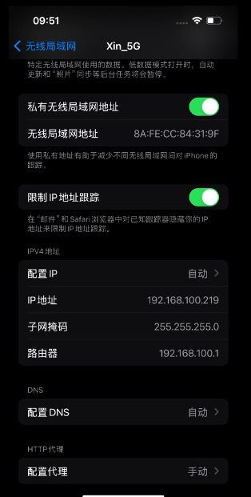
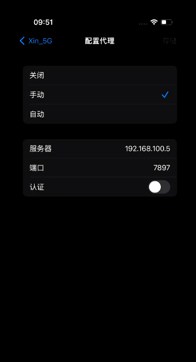

+++
title = "让 iPhone 通过电脑代理访问网络：测试 YouTube 投屏"
date = 2026-07-14

[taxonomies]
categories = ["Tools"]
tags = ["iPhone", "YouTube", "AirPlay", "Clash Verge", "HTTP 代理"]
+++

## 背景

调试 AirPlay 投屏时，经常会遇到这样的环境：电脑和 iPhone 已经连到同一个局域网，电脑上的 AirPlay 接收端也能被发现，但 iPhone 所在的网络不能直接访问 YouTube。这样连视频都打不开，自然没办法继续测试播放和投屏流程。

本文的大前提是：**电脑可以正常访问外部网络，并且同时运行 AirPlay 接收端和 Clash Verge 等代理软件**。iPhone 只需要在当前 Wi-Fi 中填写这台电脑的 IP 和代理端口，就能通过电脑访问 YouTube，再向同一台电脑发起投屏。

本文使用的网络链路如下：

```text
iPhone 192.168.100.219
  -> HTTP 代理 192.168.100.5:7897
  -> 运行 Clash Verge 和 AirPlay 接收端的电脑
  -> 外部网络 / YouTube
```

配置完成后，iPhone 可以正常打开 YouTube，也就方便在外网访问受限的测试环境中验证 YouTube 投屏播放。

这里先说明一个容易混淆的地方：本文是在 iPhone 上配置 **Wi-Fi HTTP 代理**。`7897` 是电脑端代理软件对局域网开放的监听端口，iPhone 会直接连接电脑的 `192.168.100.5:7897`，整个过程不需要端口转发。

## 准备工作

需要准备：

- 一台可以正常访问外部网络的电脑。
- 电脑上已经运行 AirPlay 接收端。
- 电脑上已安装并运行 Clash Verge、Mihomo 或其它提供 HTTP 代理的工具。
- iPhone 和电脑接入同一个局域网，确保 iPhone 能发现电脑上的 AirPlay 接收端。

本文使用下面这组示例地址：

| 设备或服务 | 地址 |
| --- | --- |
| 电脑局域网 IP | `192.168.100.5` |
| 电脑代理端口 | `7897` |
| iPhone IP | `192.168.100.219` |

实际配置时，电脑 IP 和端口要以自己的网络环境为准。不要照搬 iPhone 的 `192.168.100.219`，这个地址只是截图中手机自己获取到的局域网地址。

## 第一步：让电脑提供局域网代理

以 Clash Verge 为例，先检查两个设置：

1. 打开“允许局域网连接”。如果没有打开，代理通常只监听 `127.0.0.1`，iPhone 无法连接。
2. 确认 HTTP 或 Mixed 代理端口。本文使用 `7897`。

还要确认电脑的系统防火墙允许局域网设备访问 TCP `7897` 端口。只打开 Clash Verge 的开关，但被系统防火墙拦住，也会表现为 iPhone 配置代理后完全无法上网。

可以先在电脑上测试代理本身：

```sh
curl -x http://127.0.0.1:7897 https://www.youtube.com
```

能收到 HTTP 响应，就说明本机代理基本正常。如果这里已经连接失败，应先检查代理端口、节点和规则，不要急着修改 iPhone。

电脑的 IP 可以在系统网络设置中查看，也可以使用命令查询：

```sh
# Windows
ipconfig

# Linux
ip addr

# macOS，常见的 Wi-Fi 接口是 en0
ipconfig getifaddr en0
```

本文电脑的局域网地址是：

```text
192.168.100.5
```

建议在路由器中给这台电脑设置 DHCP 地址保留，也就是常见的“IP 与 MAC 绑定”。否则电脑 IP 变化后，iPhone 中保存的代理地址也要跟着修改。

电脑端的 Clash Verge 配置，可以参考此前的文章：[给不能上外网的编译服务器配置 Codex：让 AI 写代码、修 bug](@/articles/AI/codex-offline-build-server/index.md)。

## 第二步：在 iPhone 中配置代理

打开 iPhone，依次进入：

```text
设置
-> 无线局域网
-> 点击当前 Wi-Fi 右侧的 ⓘ
-> 拉到页面最下面的“配置代理”
-> 选择“手动”
```

当前 Wi-Fi 的详情页如下。在页面底部可以看到“配置代理”，截图中已经显示为“手动”。



进入“配置代理”后填写：

```text
服务器：192.168.100.5
端口：7897
认证：关闭
```



其中：

- “服务器”填写运行代理软件的 **电脑局域网 IP**。
- “端口”填写 Clash Verge 的 HTTP 或 Mixed 端口。
- 只有电脑端的代理服务配置了用户名和密码时，才需要打开“认证”。本文的局域网测试代理没有启用认证，所以保持关闭。

填写完成后点击右上角“存储”。这个代理只对当前 Wi-Fi 生效，切换到其它 Wi-Fi 或移动数据后不会继续使用。

## 第三步：验证 iPhone 能否访问 YouTube

先不要急着投屏，按从简单到复杂的顺序检查：

1. 在 Safari 中打开一个原来无法访问的网站。
2. 打开 YouTube App，刷新首页。
3. 随便播放一个短视频，确认画面和声音正常。

如果配置代理后所有网站都打不开，通常不是 YouTube 的问题，而是 iPhone 到 `192.168.100.5:7897` 这段链路没有打通。优先检查电脑 IP、代理端口、“允许局域网连接”和电脑防火墙。

iPhone 的手动代理是标准 HTTP 代理。访问 HTTPS 网站时，客户端通常通过 `CONNECT` 建立隧道，所以正常情况下不需要在 iPhone 上安装证书。不要为了这个配置随意安装来源不明的根证书。

## 第四步：测试 YouTube 投屏播放

确认 YouTube 在 iPhone 上可以播放后，再开始投屏测试：

1. 保持 iPhone 和 AirPlay 接收端连接在同一个局域网。
2. 打开 YouTube 并播放视频。
3. 使用播放页中的投屏入口，或者打开控制中心选择“屏幕镜像”。
4. 选择正在调试的 AirPlay 接收端。
5. 观察接收端能否被发现、能否建立会话，以及画面、声音和播放控制是否正常。

这里有两条同时工作的网络链路：

```text
访问 YouTube：iPhone -> 电脑 HTTP 代理 -> 外部网络

发现和连接投屏设备：iPhone <-> 同一台电脑上的 AirPlay 接收端
```

HTTP 代理负责让 iPhone 访问 YouTube；AirPlay 的设备发现和投屏连接仍然在 iPhone 与电脑之间通过局域网完成。由于这台电脑本身已经能够访问外部网络，无论 iPhone 通过代理访问 YouTube，还是电脑上的接收端需要访问网络，都使用电脑现有的网络能力，不需要再为接收端增加其它网络配置。

## 总结

这套配置真正需要记住的只有三点：

1. 电脑上的代理要允许局域网连接，并监听 `7897` 端口。
2. iPhone 在当前 Wi-Fi 的“配置代理”中选择“手动”，填写电脑地址 `192.168.100.5` 和端口 `7897`。
3. iPhone 访问 YouTube 走电脑代理，AirPlay 设备发现和投屏连接则在 iPhone 与同一台电脑之间通过局域网完成。

这样既不需要修改 iPhone 系统，也不需要给手机安装额外的代理 App，就能在受限网络环境中打开 YouTube，继续验证 AirPlay 设备发现、连接、播放和控制流程。
