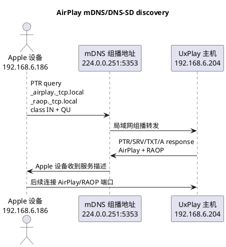
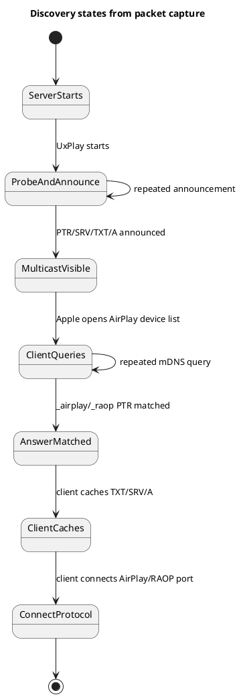
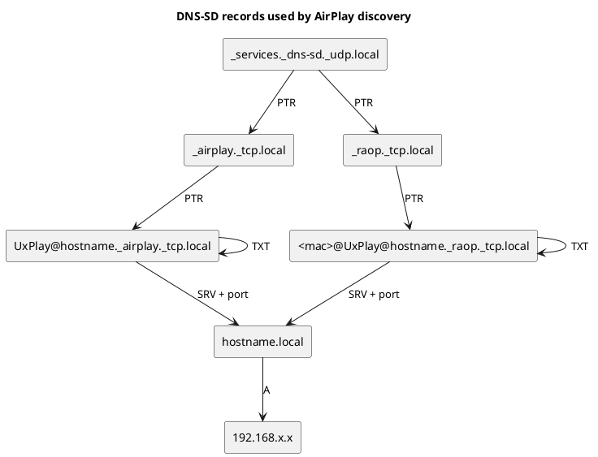
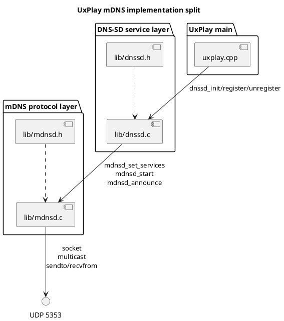
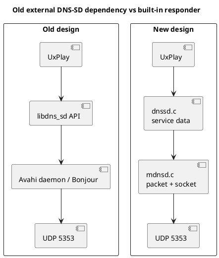
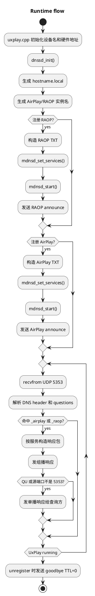

+++
title = "AirPlay 投屏设备发现"
date = 2026-05-16
path = "2026/05/16/airplay_mdns_discovery"
[taxonomies]
categories = ["Android"]
tags = ["AirPlay", "mDNS", "DNS-SD", "Android", "网络分析"]
+++

[TOC]

## 背景：设备发现到底是什么？

AirPlay 设备发现不是"手机去扫局域网里所有 IP"，而是通过 mDNS/DNS-SD 完成的。

可以把它理解成局域网里的"小广播查询"：

1. Apple 设备向 `224.0.0.251:5353` 发 UDP 组播查询。
2. 查询内容是"谁提供 `_airplay._tcp.local` 服务？"以及"谁提供 `_raop._tcp.local` 服务？"。
3. Airplay投屏器/APP 收到查询后，也向 `224.0.0.251:5353` 或查询方单播地址回复。
4. 回复里包含服务名、端口、主机名、IP 地址和能力字段。
5. Apple 设备拿到这些信息后，才知道后续 AirPlay/RAOP 连接该连到哪里。

这里有两个关键词。

`mDNS` 是 multicast DNS，即组播 DNS。它不依赖路由器上的 DNS 服务器，而是在本地链路里用 `224.0.0.251:5353` 直接问答。

`DNS-SD` 是 DNS Service Discovery，即用 DNS 记录描述"这里有什么服务"，AirPlay 设备发现用的就是 DNS-SD。

## 一、为什么要重做

原来的做法依赖外部 DNS-SD 实现，常见路径是：

- Linux 发行版上通过 Avahi 的 `avahi-compat-libdns_sd`
- macOS 上通过系统 Bonjour
- Windows 上通过 Bonjour SDK 或 `dnssd.dll`

这个方案在桌面系统上可用，但移植到 Android 或轻量环境时会遇到几个实际问题。

第一，`avahi-daemon` 对这个场景偏重。它是系统级 daemon，功能完整，但 Airplay投屏接收端只需要回答两个服务类型的查询：`_airplay._tcp.local` 和 `_raop._tcp.local`。

第二，Android 环境不适合假设存在 Avahi。Android 应用或 Native 服务更常见的部署方式是自己创建 socket，自己处理网络协议，而不是要求系统额外安装并运行一个 mDNS daemon。

第三，跨平台依赖变复杂。Linux、macOS、Windows、Android 的 DNS-SD 库和头文件都不一样。项目里为了处理这些差异，需要保留很多动态加载、条件编译和错误分支。

第四，排查成本高。一旦发现失败，要同时考虑`libdns_sd`、Avahi daemon、系统服务状态、动态库路径、权限、端口占用、防火墙和组播转发。问题边界不清楚。

所以这次重做的目标很明确：

- 去掉 Avahi/Bonjour SDK/libdns_sd 运行时依赖。
- 内置一个只覆盖 Airplay投屏接收器/APP 所需能力的 mDNS responder。
- 代码保持简单，不做通用 mDNS 框架。
- 对外行为尽量保持和抓包里的 AirPlay 设备期望一致。

## 二、抓包环境

抓包现场有两个关键地址：

- Apple 设备：`192.168.6.186`
- Airplay投屏器主机：`192.168.6.204`

其它敏感字段在本文里会脱敏，比如 MAC 地址、公钥等只展示结构，不展示完整值。

## 三、设备发现总流程

先用一张时序图看完整流程。



关键点是：设备发现阶段只解决"服务在哪里"和"服务能力是什么"，并不传输投屏画面，真正的投屏连接发生在设备发现之后。

## 四、从抓包时间线还原发现过程

只看单个包容易丢掉上下文。设备发现要按时间线看，才能理解 Apple 设备和 Airplay投屏器/APP 各自在做什么。

下面是抓包里和 AirPlay/RAOP 发现相关的一段简化时间线。为了避免泄漏设备标识，服务实例里的 MAC 和公钥都做了脱敏。

| 帧 | 相对时间 | 源地址 | 目的地址 | 类型 | 关键信息 |
| --- | ---: | --- | --- | --- | --- |
| 19 | 2.483s | `192.168.6.204` | `224.0.0.251` | query-like announcement | 带 AirPlay/RAOP 服务实例和 known-answer |
| 21 | 2.734s | `192.168.6.204` | `224.0.0.251` | query-like announcement | 重复公告，用于提高局域网内可见性 |
| 23 | 2.985s | `192.168.6.204` | `224.0.0.251` | query-like announcement | 再次公告 |
| 24 | 3.186s | `192.168.6.204` | `224.0.0.251` | response | RAOP: TXT/PTR/SRV/A/AAAA/services |
| 26 | 3.186s | `192.168.6.204` | `224.0.0.251` | response | AirPlay: TXT/PTR/SRV/services |
| 32 | 4.388s | `192.168.6.204` | `224.0.0.251` | response | AirPlay + RAOP 合并响应 |
| 65 | 6.590s | `192.168.6.204` | `224.0.0.251` | response | 再次完整响应 |
| 77 | 7.993s | `192.168.6.186` | `224.0.0.251` | query | Apple 设备查询 `_airplay` 和 `_raop` |
| 81 | 8.512s | `192.168.6.186` | `224.0.0.251` | query | Apple 设备重复查询 |

这条时间线说明两件事。

第一，服务端不能只在启动时公告一次。局域网里 mDNS 是 UDP 组播，包可能丢，客户端也可能在任意时刻打开投屏面板。启动时多次公告和查询时即时响应都需要支持。

第二，Apple 设备不是只问 `_airplay._tcp.local`。它会同时问 `_raop._tcp.local`。如果只发布 AirPlay，不发布 RAOP，客户端可能认为设备能力不完整。

设备发现可以画成更细的状态图：



## 五、抓包分析：Apple 设备怎么问

抓包里一个典型查询包来自 `192.168.6.186`，发往 `224.0.0.251:5353`。

简化后的字段如下：

```text
Multicast Domain Name System (query)
Transaction ID: 0x0000
Flags: 0x0000 Standard query
Questions: 2
Answer RRs: 2
Additional RRs: 1

Queries:
  _airplay._tcp.local: type PTR, class IN, QU question
  _raop._tcp.local:    type PTR, class IN, QU question

Known answers:
  _airplay._tcp.local -> UxPlay@debian._airplay._tcp.local
  _raop._tcp.local    -> <mac>@UxPlay@debian._raop._tcp.local
```

这几个字段很重要。

`Transaction ID` 是 `0x0000`。mDNS 通常使用 `0`，因为它不是传统 DNS 那种客户端发一个随机 ID、服务器原样带回的请求响应模型。

`Questions: 2` 表示一个包里同时问了两个服务类型：

- `_airplay._tcp.local`
- `_raop._tcp.local`

`type PTR` 表示它不是在问"某个域名的 IP 是什么"，而是在问"这个服务类型下面有哪些实例"。这就是 DNS-SD 的入口。

`QU question` 表示查询方希望收到 unicast response。也就是说，除了普通组播回复以外，服务端最好也支持直接回给查询方。

`Answer RRs: 2` 在 query 包里不是普通响应，而是 known-answer。Apple 设备告诉局域网里的 responder："我已经知道这些答案了，如果没有变化，可以按 mDNS 规则减少重复回复"。实现上可以先不做复杂抑制，但必须能正确解析这种包，不能因为 query 包里带了 answers 就误判成 response。

这里的 known-answer 对排查很有价值。如果抓包里看到 Apple 设备一直带着旧服务实例名重复查询，但 UxPlay 侧没有新的响应，通常要检查：

- responder 是否真的绑定到了 UDP 5353。
- 是否加入了 `224.0.0.251` 组播。
- query 包里带 answers 时，解析逻辑是否提前返回。
- QU 位是否被正确识别。
- 防火墙或 Wi-Fi AP 是否丢弃了 mDNS 组播。

从协议角度看，query 包里带 known-answer 是正常行为，不能把它当成异常包。

## 六、抓包分析：服务端应该怎么答

一个完整的 AirPlay/RAOP DNS-SD 服务描述不是单条记录，而是一组记录。



这里每种记录有不同作用。

`PTR` 记录把服务类型映射到服务实例。例如 `_airplay._tcp.local` 指向 `UxPlay@debian._airplay._tcp.local`。

`SRV` 记录告诉客户端服务运行在哪台主机、哪个端口。例如实例指向 `debian.local:42609`。

`TXT` 记录描述能力。AirPlay/RAOP 很多能力不是靠后续连接猜出来的，而是在 TXT 里先告诉客户端。

`A` 记录把 `debian.local` 解析成 IPv4 地址 `192.168.6.204`。

### 6.1 RAOP 响应包

抓包里 RAOP 响应包大约 `466` 字节，包含 `6` 条 answer。

简化后如下：

```text
Flags: 0x8400 Standard query response, authoritative, no error
Answer RRs: 6

TXT <mac>@UxPlay@debian._raop._tcp.local
PTR _raop._tcp.local -> <mac>@UxPlay@debian._raop._tcp.local
SRV <mac>@UxPlay@debian._raop._tcp.local -> debian.local:42609
AAAA debian.local -> <ipv6 address>
A debian.local -> 192.168.6.204
PTR _services._dns-sd._udp.local -> _raop._tcp.local
```

其中 TXT 字段包括：

```text
ch=2
cn=0,1,2,3
da=true
et=0,3,5
vv=2
ft=0x527FFEE6,0x0
am=AppleTV3,2
md=0,1,2
rhd=5.6.0.0
pw=false
sr=44100
ss=16
sv=false
tp=UDP
txtvers=1
sf=0x4
vs=220.68
vn=65537
pk=<redacted>
```

这些字段的含义可以粗略理解为：

| 字段 | 含义 |
| --- | --- |
| `ch` | 声道数 |
| `cn` | 支持的音频编码能力集合 |
| `et` | 支持的加密方式 |
| `ft` | feature bits，设备能力位 |
| `am` | 设备型号 |
| `md` | metadata 能力 |
| `pw` | 是否需要密码 |
| `sr` | 采样率 |
| `ss` | sample size |
| `tp` | 传输协议 |
| `sf` | service flags |
| `vs` | server version |
| `pk` | 公钥，本文脱敏 |

RAOP 主要对应音频能力。即使 AirPlay 镜像是主目标，RAOP 记录也会影响客户端对设备能力的判断。

### 6.2 AirPlay 响应包

AirPlay 响应包大约 `392` 字节，包含 `4` 条 answer。

简化后如下：

```text
Flags: 0x8400 Standard query response, authoritative, no error
Answer RRs: 4

TXT UxPlay@debian._airplay._tcp.local
PTR _airplay._tcp.local -> UxPlay@debian._airplay._tcp.local
SRV UxPlay@debian._airplay._tcp.local -> debian.local:42609
PTR _services._dns-sd._udp.local -> _airplay._tcp.local
```

TXT 字段包括：

```text
deviceid=<mac-redacted>
features=0x527FFEE6,0x0
pw=false
flags=0x4
model=AppleTV3,2
pk=<redacted>
pi=2e388006-13ba-4041-9a67-25dd4a43d536
srcvers=220.68
vv=2
```

AirPlay 记录更偏向视频、镜像、配对和设备身份描述。

### 6.3 TTL 和 cache flush

抓包里能看到两个常见 TTL：

- 服务和 TXT 的 TTL：`4500` 秒
- 主机 A/SRV 相关记录 TTL：`120` 秒

这符合 mDNS/DNS-SD 的常见做法：服务描述可以缓存更久，主机地址和具体连接目标缓存短一点。

还有一个容易忽略的字段是 `cache flush`。

对 `TXT`、`SRV`、`A` 这类唯一记录，响应里会带 cache flush。它的意思是：客户端如果缓存了同名旧记录，应该用这条新记录替换。

对 `PTR` 这类"一个服务类型可以对应多个实例"的记录，不应该带 cache flush。否则可能把局域网里其他同类型服务错误清掉。

### 6.4 为什么响应要拆包

抓包里能看到 UxPlay 主机会有几种响应：

| 包类型 | 大小 | answer 数 |
| --- | ---: | ---: |
| RAOP 单独响应 | 约 `466` 字节 | `6` |
| AirPlay 单独响应 | 约 `392` 字节 | `4` |
| AirPlay + RAOP 合并响应 | 约 `764` 字节 | `10` |

原始抓包里的合并响应不算太大，是因为 DNS 名称可以压缩。自己实现一个简单 responder 时，如果一开始不做 DNS name compression，合并包会明显变大。

为了让实现保持简单，同时避免 UDP 包接近 MTU，最终选择是：按服务拆分响应。

也就是说：

- AirPlay 查询命中时，发 AirPlay 记录包。
- RAOP 查询命中时，发 RAOP 记录包。
- 两者都命中时，分别发两个包。

这比先实现完整 DNS 压缩更直接，也足够满足 UxPlay 的服务发现需求。

## 七、设计方案

代码上把职责拆成两层。



`dnssd.c` 保留业务含义：

- 设备名
- MAC 地址
- AirPlay/RAOP 实例名
- TXT 字段
- feature bits
- PIN/密码策略

`mdnsd.c` 只处理协议：

- DNS name 编码和解析
- PTR/SRV/TXT/A 记录编码
- UDP 5353 socket
- 加入 `224.0.0.251` 组播
- mDNS 查询解析
- 组播响应和 QU 单播响应
- goodbye 包

这样拆完后，`dnssd.c` 不需要知道 DNS 包怎么拼，`mdnsd.c` 也不需要理解 AirPlay feature bit 的业务含义。

旧方案和新方案的边界差异如下。



旧方案把发现能力交给系统服务，新方案把发现能力收回到 UxPlay 进程内。这样做不是为了重复造一个完整 Avahi，而是因为 UxPlay 只需要一个很小的协议子集。

这个子集包括：

- `_services._dns-sd._udp.local` 的 PTR 枚举。
- `_airplay._tcp.local` 的 PTR 枚举。
- `_raop._tcp.local` 的 PTR 枚举。
- AirPlay/RAOP 实例的 SRV/TXT。
- hostname 的 A 记录。
- goodbye TTL=0。

不包括：

- 通用 DNS resolver。
- 跨网段 DNS-SD。
- 完整 service browser。
- 完整 DNS cache。
- 全量 name compression。

## 八、实现流程

运行时流程可以画成这样：



实现里没有做成通用 mDNS 框架，原因是 UxPlay 不需要完整框架。它只需要服务发现所需的最小闭环。

### 8.1 关键实现点

第一，打开 UDP socket。

mDNS 使用固定端口 `5353`，IPv4 组播地址是 `224.0.0.251`。responder 启动时需要：

- 创建 UDP socket
- 设置 `SO_REUSEADDR`
- 设置 multicast TTL
- 设置 multicast loop
- bind 到 `0.0.0.0:5353`
- 加入 `224.0.0.251`

第二，选择出站地址。

本机可能有多张网卡，代码用 UDP `connect()` 到 `224.0.0.251:5353` 的方式让内核选择默认出站接口，再通过 `getsockname()` 得到本机 IPv4 地址。这个地址用于 A 记录。

第三，解析 DNS name。

DNS name 是 label 格式，例如：

```text
_airplay._tcp.local
```

在线上包里会编码成：

```text
8 "_airplay"
4 "_tcp"
5 "local"
0
```

解析时还要处理 DNS compression pointer。即使当前实现生成响应时为了简单不做压缩，也必须能解析别人发来的压缩名称。

第四，识别查询类型。

主要命中条件是：

- `_services._dns-sd._udp.local` 的 PTR 查询
- `_airplay._tcp.local` 的 PTR 查询
- `_raop._tcp.local` 的 PTR 查询
- 服务实例名的 TXT/SRV 查询
- hostname 的 A 查询

第五，构造响应记录。

响应包 header 使用：

```text
Transaction ID: 0x0000
Flags: 0x8400
Questions: 0
Answer RRs: N
```

`0x8400` 表示这是 response，并且是 authoritative answer。

第六，处理 QU。

Apple 设备的查询带 QU。实现上如果发现 query class 最高位是 `0x8000`，就除了组播响应外，再向查询来源地址发一份单播响应。

第七，处理 goodbye。

服务取消注册时发送 TTL 为 `0` 的记录，告诉客户端清掉缓存。否则客户端可能在一段时间内继续显示已经退出的设备。

### 8.2 为什么不直接实现完整 DNS 压缩

DNS name compression 可以显著减少包大小，但它会引入更多状态：

- 需要记录每个 name suffix 在包里的 offset
- 要避免生成非法 pointer
- 要处理压缩指针嵌套和循环风险
- 要保证不同 RR 的 name 和 rdata 都能正确引用

对 UxPlay 当前需求来说，这个复杂度不划算。按服务拆包后，不压缩也能保持包很小，而且逻辑更容易审查。

这是一个有意的取舍：先用简单方案解决真实问题，而不是先做一个完整 DNS 库。

### 8.3 Android 平台考虑

Android 上最重要的约束是部署形态不同。

在传统 Linux 发行版里，可以说"请安装 Avahi 并启动服务"。但 Android 上通常不能这么要求。即使设备有 root 或定制系统，把 Avahi daemon 带进去也会引入额外问题：

- daemon 生命周期谁管理
- SELinux 策略怎么放行
- UDP 5353 权限和组播权限怎么处理
- 多应用或多服务争用 5353 怎么协调
- 动态库和头文件怎么随系统构建

内建 mDNS responder 后，UxPlay 只需要依赖 socket 能力。对 Android Native 层来说，这比外部 daemon 更可控。

当然，Android 仍然要注意：

- Wi-Fi 网络必须允许 multicast
- 进程需要具备加入组播的网络权限
- 如果系统已有 mDNSResponder，需要确认 UDP 5353 复用策略
- 某些设备的省电策略可能影响组播收发

这些是网络和系统权限问题，但至少不再额外依赖 Avahi。

## 九、验证方式

编译验证：

```bash
cmake -B build
cmake --build build
```

运行验证：

```bash
timeout 4 ./build/uxplay -n UxPlay -nh -vs 0 -as 0
```

抓包验证可以用：

```bash
tshark -i <iface> -f "udp port 5353"
```

也可以用字段过滤看 mDNS 记录：

```bash
tshark -r airplay-mdns.pcapng \
  -Y "mdns && ip.src == 192.168.6.204" \
  -T fields \
  -e frame.number \
  -e frame.len \
  -e dns.count.answers \
  -e dns.resp.name \
  -e dns.ptr.domain_name \
  -e dns.srv.target \
  -e dns.srv.port \
  -e dns.a \
  -e dns.txt
```

验证重点不是"有没有包"，而是以下几项都要成立：

- Apple 设备会查询 `_airplay._tcp.local` 和 `_raop._tcp.local`。
- UxPlay 会响应 PTR、SRV、TXT、A 记录。
- SRV 端口和 UxPlay 实际监听端口一致。
- TXT 字段里 feature、model、version、password 标志符合预期。
- QU 查询能收到响应。
- unregister 或退出时能发送 TTL 为 `0` 的 goodbye。

## 十、代码下载

[UxPlay](https://github.com/kgbook/UxPlay)

## 总结

这次重做的核心不是"自己写一个 mDNS 库"，而是把 UxPlay 需要的设备发现闭环收进项目内部。

从抓包看，AirPlay 发现流程并不神秘：Apple 设备问 `_airplay._tcp.local` 和 `_raop._tcp.local`，服务端回复 PTR/SRV/TXT/A。只要把这些记录按 mDNS/DNS-SD 规则说清楚，客户端就能发现设备。

从工程角度看，内建 responder 带来的收益更明显：

- Linux 上少一个外部 daemon 依赖。
- Android 和嵌入式平台更容易部署。
- 发现问题时边界更清楚。
- 代码结构更直接，`dnssd.c` 负责业务，`mdnsd.c` 负责协议。

这也是这次选择重做 mDNS 发现方案的根本原因。
