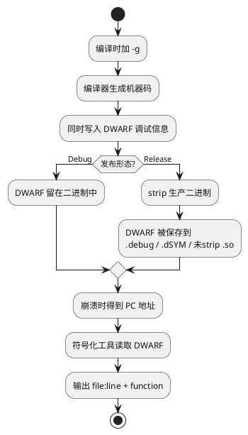
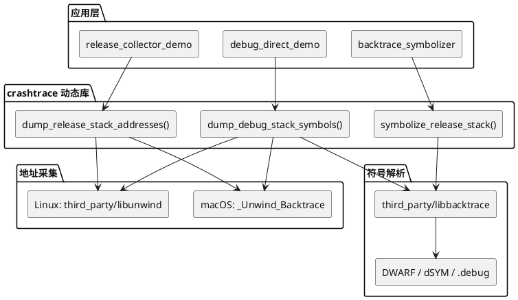
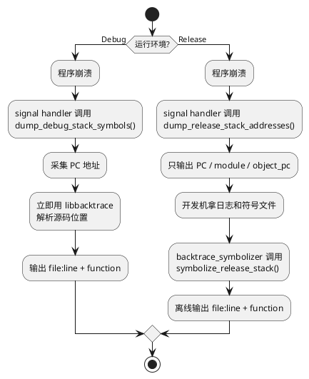
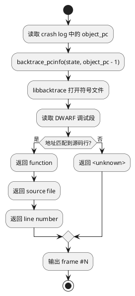
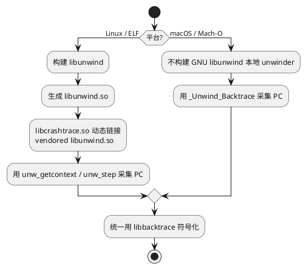
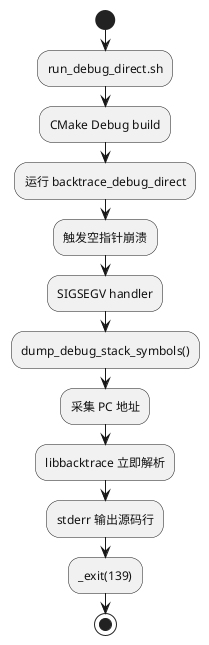
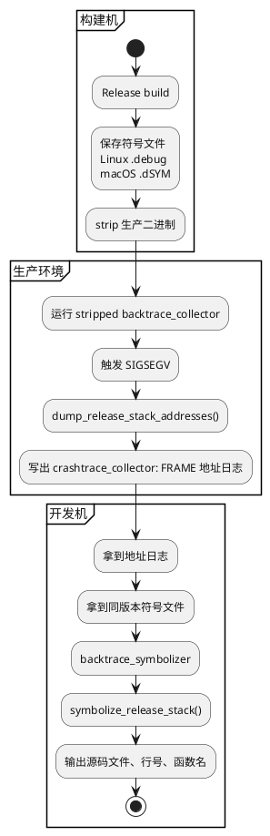

+++
title = "C++ 崩溃栈回溯：从原理到工具，手把手教你看懂 crash"
date = 2026-05-19

[taxonomies]
categories = ["Linux"]
tags = ["C/C++", "Crash", "Debug", "libunwind", "libbacktrace"]
+++

[TOC]

## 一、问题背景

C++ 程序线上崩溃时，最常见的日志可能只有一句：

```text
Segmentation fault (11)
```

这句话只告诉我们程序收到了 `SIGSEGV`，也就是访问了不该访问的内存。但它没有告诉我们：

- 崩溃发生在哪个函数。
- 这个函数是谁调用的。
- 对应源码文件和行号是什么。
- 线上 release 二进制被 strip 后还能不能还原现场。

`crashtrace` 这个仓库就是为了解决这个问题：它把 C++ 崩溃栈能力拆成一套小型库、两个 demo、一个离线符号化工具和一组脚本，让你能分别处理调试环境和生产环境。

仓库结构如下：

```text
crashtrace/
├── lib/                         # libcrashtrace
│   ├── include/crashtrace/crashtrace.hpp
│   └── src/crashtrace.cpp
├── demo/
│   ├── debug_direct_demo.cpp    # Debug 场景，崩溃时直接输出源码位置
│   └── release_collector_demo.cpp # Release 场景，崩溃时只输出地址
├── tools/
│   └── release_symbolizer.cpp   # 离线符号化工具
├── scripts/
│   ├── build_release_symbols.sh
│   ├── run_debug_direct.sh
│   ├── run_release_collect.sh
│   └── symbolize_release_log.sh
├── docs/
├── third_party/
│   ├── libbacktrace/
│   └── libunwind/
└── CMakeLists.txt
```

## 二、先把概念讲清楚

### 2.1 什么是调用栈

调用栈可以理解成函数调用的路线图。假设程序这样执行：

```text
main()
  -> run_app()
      -> handle_request()
          -> parse_payload()
              -> crash_here()
```

如果 `crash_here()` 里访问空指针，程序崩溃时我们想看到的不是一句 `Segmentation fault`，而是整条调用链：

```text
crash_here()
parse_payload()
handle_request()
run_app()
main()
```

这条链就是 stack trace，也叫 backtrace。

### 2.2 PC 地址是什么

CPU 执行的是机器指令，每条指令在进程地址空间里都有地址。这个地址通常叫 PC，Program Counter，也可以理解为"当前执行到哪条机器指令"。

崩溃栈的第一步不是直接得到源码行号，而是先得到一串 PC：

```text
0x102049210
0x1020491c4
0x1020491a8
```

机器喜欢地址，人不喜欢地址。人真正想看的是：

```text
demo/release_collector_demo.cpp:42
(anonymous namespace)::doSomething()
```

从地址变成源码位置的过程，就叫符号化，symbolication。

### 2.3 为什么 Debug 和 Release 要分开

Debug 版本通常保留调试信息，崩溃时可以直接把地址解析成函数名、文件名和行号。

Release 版本通常会 strip 掉符号，原因包括：

- 二进制更小。
- 启动和发布更轻。
- 不把源码路径和符号信息直接带到生产环境。

所以生产环境更推荐这样做：

- 崩溃现场只采集地址。
- 开发侧保存同版本调试符号。
- 拿"地址日志 + 符号文件"离线解析。

### 2.4 DWARF 是什么

DWARF 是一种调试信息格式。可以把它理解成"机器地址到源码世界的地图"。

编译器在生成二进制时，如果带了 `-g`，就会额外写入调试信息。调试信息里保存了很多映射关系，例如：

```text
机器指令地址 0x1000011c3
  -> 函数: doSomething()
  -> 文件: demo/release_collector_demo.cpp
  -> 行号: 42
  -> 变量、类型、作用域等更多调试信息
```

其中"地址 -> 文件/行号/函数名"的信息，就是崩溃符号化最常用的部分。

DWARF 不是某一个工具，而是一种数据格式。不同平台保存 DWARF 的方式不同：

- Linux/ELF: DWARF 可以在可执行文件或 `.so` 里，也可以被 `objcopy --only-keep-debug` 分离到 `.debug` 文件。
- macOS/Mach-O: 编译产物里也有 DWARF，发布前通常用 `dsymutil` 整理成 `.dSYM` bundle。
- Android/NDK: 未 strip 的 `.so` 里通常保留 DWARF，`ndk-stack` 通过 `-sym` 指向这些未 strip `.so`。

所以 `.debug`、`.dSYM`、未 strip `.so` 不是三种完全不同的"符号原理"，它们本质上都是在保存或组织调试信息。符号化工具要做的事，就是读取这些调试信息，把地址查回源码位置。



## 三、crashtrace 的整体设计

### 3.1 一句话概括

`crashtrace` 做了两件事：

- 采集调用栈地址。
- 把调用栈地址解析成源码位置。

Debug 场景把这两件事放在崩溃现场做。Release 场景只在崩溃现场做第一件事，把第二件事留给离线工具。

### 3.2 架构图



### 3.3 两条工作流



## 四、核心依赖

### 4.1 libbacktrace 负责"地址转源码"

`libbacktrace` 的作用是读取调试信息。它能根据 PC 地址查询 DWARF 信息，返回文件名、行号和函数名。

更具体地说，`libbacktrace` 并不是"猜"源码位置，而是在读编译器留下来的 DWARF 映射表：

```text
object_pc
  -> 查找 .debug_line: 这个地址属于哪个源码文件、哪一行
  -> 查找 .debug_info / .debug_aranges: 这个地址属于哪个函数、哪个编译单元
  -> 返回 file:line + function
```

所以符号化能否准确，取决于三个条件：

- 崩溃日志里的地址口径是对的，例如 `object_pc` 或正确换算后的 `module_offset`。
- 使用的是同一版本构建产物对应的 DWARF。
- 编译时没有把调试信息丢掉，或者已经单独归档为 `.debug` / `.dSYM` / 未 strip `.so`。

仓库里固定使用：

```text
third_party/libbacktrace
```

不会使用包管理器安装的系统版本。

核心调用在 `resolve_frame()` 里：

```cpp
const uintptr_t lookup_pc = object_pc > 0 ? object_pc - 1 : object_pc;
const int result = backtrace_pcinfo(state,
                                    lookup_pc,
                                    resolved_frame_callback,
                                    backtrace_error_callback,
                                    &context);
```

这里有一个细节：查询时使用 `object_pc - 1`。因为返回地址通常指向调用指令之后的位置，减 1 更容易落回真正的调用点所在源码行。

DWARF 查询过程可以简化成这张图：



### 4.2 Linux 用 libunwind 采集栈地址

Linux 上使用仓库内置的 GNU `libunwind`， 当前构建策略是把它编译成 shared `.so`，而不是静态 `.a`，这样做更接近真实 Linux/ARM Linux/Android native 发布形态：`libcrashtrace.so` 作为业务侧 crash 库动态链接 vendored `libunwind*.so*`，发布时把这些 `.so` 放在同一目录，通过 `$ORIGIN` rpath 优先加载随包携带的版本，避免误用系统或包管理器里的 `libunwind`。

它通过当前 CPU 上下文初始化游标，然后一帧一帧向上走：

```cpp
unw_context_t context;
unw_cursor_t cursor;

unw_getcontext(&context);
unw_init_local(&cursor, &context);

do {
    unw_word_t ip = 0;
    unw_get_reg(&cursor, UNW_REG_IP, &ip);
    pcs.push_back(static_cast<uintptr_t>(ip));
} while (unw_step(&cursor) > 0);
```

### 4.3 macOS 用 _Unwind_Backtrace 采集栈地址

macOS 是 Mach-O 生态，而 GNU `libunwind` 的本地 unwinder 更偏 ELF 生态。直接在 macOS 上构建它的本地 unwinder，会遇到 `<elf.h>`、`<link.h>` 和 `ucontext` 相关问题。

因此当前实现采用：

```cpp
_Unwind_Backtrace(callback, &context);
```

这不是包管理器里的 `libunwind`，而是编译器运行时提供的标准 unwinding 接口。符号解析仍然使用 vendored `libbacktrace`。

平台策略可以总结成这张图：



### 4.4 构建依赖

通用依赖：

```bash
cmake
C/C++17 compiler
make 或 gmake
```

Linux 额外依赖：

```bash
sudo apt-get install -y cmake build-essential autoconf automake libtool binutils
```

原因是 GNU `libunwind` 子模块提供的是 `configure.ac`，不是生成好的 `configure`，所以构建时需要 `autoreconf`。

macOS 额外依赖：

```bash
xcode-select --install
```

Release 符号产物需要 `dsymutil`。

Linux arm 交叉编译额外依赖（也可以配置使用芯片厂商提供的工具链)：

```bash
sudo apt-get install -y \
  gcc-arm-linux-gnueabihf \
  g++-arm-linux-gnueabihf \
  binutils-arm-linux-gnueabihf # objdump
```

## 五、symbolizer 怎么选

看到这里你可能会问：地址转源码位置，不是 `addr2line`、`ndk-stack`、`llvm-symbolizer` 这些工具也能做吗？

答案是：能。它们解决的是同一类问题，都是把"地址"翻译成"函数名、文件名、行号"。区别在于它们面向的场景不同：有些适合命令行临时排查，有些适合 Android tombstone，有些适合 LLVM 工具链，有些适合嵌入自己的 crash 平台。

这也是这个项目的背景：真正目标不是 macOS 或 Linux desktop 上跑一个 demo，而是在 Linux、ARM Linux、Android/NDK 这类生产环境里，把 crash 地址采集、符号归档和离线解析串成自己的工具链。macOS 和 Linux desktop 只是更方便本地验证构建、信号处理、地址归一化和符号化流程。

### 5.1 addr2line 适合命令行排查

Linux 上，如果你已经有符号文件和地址，可以直接用 `addr2line`：

```bash
addr2line -e artifacts/symbols/backtrace_collector.debug \
  -f -C 0x11c4
```

常用参数：

- `-e`: 指定可执行文件或符号文件。
- `-f`: 输出函数名。
- `-C`: demangle C++ 符号名，把 `_Z...` 还原成可读函数名。

如果你的日志里记录的是 `module_offset`，通常可以把它传给 `addr2line`。如果日志里记录的是运行时 `pc`，要先减去模块加载基址：

```text
module_offset = pc - module_base
```

这也是 `crashtrace` 日志同时输出 `pc`、`module_base`、`module_offset`、`object_pc` 的原因：不同工具需要的地址口径不同。

### 5.2 ndk-stack 适合 Android native crash

Android NDK 提供了 `ndk-stack`，专门用来解析 Android native crash。它的输入通常是 tombstone 或 logcat crash dump，符号目录则是包含未 strip `.so` 的目录。

类似下面这种用法：

```bash
ndk-stack -sym app/build/intermediates/cmake/debug/obj/arm64-v8a \
  -dump crash.log
```

你给出的帮助信息可以概括为：

```text
usage: ndkstack.pyz [-h] -sym SYMBOL_DIR [-i INPUT]

Symbolizes Android crashes.

options:
  -h, --help            show this help message and exit
  -sym SYMBOL_DIR, --sym SYMBOL_DIR
                        directory containing unstripped .so files
  -i INPUT, -dump INPUT, --dump INPUT
                        input filename
```

它的特点很明确：

- 输入是 Android crash dump。
- `-sym` 指向未 strip 的 `.so` 目录。
- 它理解 Android tombstone/logcat 里的 native backtrace 格式。
- 它更像"Android 现成符号化工具"，不是通用 C++ crash 库。

如果你的业务只跑 Android，并且 crash 日志格式就是系统 tombstone，优先用 `ndk-stack` 很合理。它已经处理了 Android ABI、`.so` 路径和 tombstone 格式。

但如果你要在自己的 Linux/ARM Linux 服务、嵌入式设备、非 Android runtime 或自定义日志上传链路里做 crash 解析，`ndk-stack` 的输入格式和平台假设就不一定合适。

### 5.3 llvm-symbolizer / llvm-addr2line 适合 LLVM 工具链

LLVM 也提供符号化工具，常见的是：

```bash
llvm-symbolizer --obj=artifacts/debug/backtrace_collector 0x11c4
llvm-addr2line -e artifacts/debug/backtrace_collector -f -C 0x11c4
```

它们和 GNU `addr2line` 很像，也适合命令行或脚本里做离线解析。使用 Clang/LLVM 交叉编译时，`llvm-symbolizer` 往往比系统 `addr2line` 更容易和目标工具链保持一致。

典型应用场景：

- Clang/LLVM 编译出来的 Linux 或 Android native 二进制。
- CI 里验证某个地址能否解析。
- sanitizer 日志符号化。
- 交叉编译环境下，避免宿主机 GNU binutils 与目标架构不匹配。

限制也类似：它是外部命令。你仍然要自己处理 crash 日志格式、模块路径匹配、地址归一化和批量调用策略。

### 5.4 libbacktrace 适合嵌入程序和批量处理

`libbacktrace` 是库，不是命令行工具。它适合放进自己的工具链里，例如这个项目的 `backtrace_symbolizer`：

```cpp
backtrace_state* state =
    backtrace_create_state(symbol_file, 1, backtrace_error_callback, nullptr);

backtrace_pcinfo(state,
                 lookup_pc,
                 resolved_frame_callback,
                 backtrace_error_callback,
                 &context);
```

它的优势是：

- 可以直接嵌入 C/C++ 程序。
- 不需要为每一帧 fork 一个外部命令。
- 方便解析自定义崩溃日志格式。
- 方便和上传、归档、批量解析系统集成。
- 可以在同一个进程里维护解析状态，处理大量帧时更自然。

### 5.5 工具应用场景对比

| 工具 | 更适合 | 优点 | 局限 |
|---|---|---|---|
| `addr2line` | 人工排查、临时命令行分析、CI 中简单验证 | 系统工具，简单直接，不用写代码 | 需要自己处理日志解析、地址换算、批量调用和平台差异 |
| `ndk-stack` | Android NDK tombstone/logcat native crash | 理解 Android crash 格式，直接吃未 strip `.so` 目录 | 主要面向 Android，不适合通用 Linux 自定义 crash 日志 |
| `llvm-symbolizer` / `llvm-addr2line` | LLVM/Clang 工具链、sanitizer、交叉编译排查 | 和 LLVM 工具链一致，支持多架构场景更自然 | 仍是外部命令，日志解析和批处理要自己封装 |
| `libbacktrace` | 写成库、嵌入崩溃平台、批量符号化、自定义输出格式 | 可编程、可封装、适合自动化系统 | 需要写代码集成，构建依赖更复杂 |

可以这么理解：

- 你手里只有一两个地址，想马上查源码行，用 `addr2line` 很方便。
- 你在 Android 上拿到 tombstone，用 `ndk-stack` 很方便。
- 你在 LLVM/Clang 体系里排查，尤其是 sanitizer 或交叉编译，用 `llvm-symbolizer` 很自然。
- 你要做一个可复用 crash 工具、解析大量自定义日志、跨平台组织产物，用 `libbacktrace` 更合适。

### 5.6 为什么 crashtrace 选择 libbacktrace

这个项目的目标不是只演示"一条命令查一个地址"，而是演示一条完整链路：

```text
生产环境崩溃
  -> 采集结构化地址日志
  -> 上传或保存日志
  -> 开发侧拿同版本符号文件
  -> 工具批量解析
  -> 输出统一格式的 file:line + function
```

这条链路需要把符号化能力封装成 API：

```cpp
int symbolize_release_stack(FILE* output,
                            const char* symbol_file,
                            FILE* crash_log_input);
```

所以仓库内选择 `libbacktrace` 作为离线解析引擎，同时你仍然可以在排查单个 Linux 地址时使用 `addr2line` 辅助验证。

换句话说，`crashtrace` 并不是要替代 `addr2line`、`ndk-stack` 或 `llvm-symbolizer`。这些工具都很有价值。这个项目更关注的是：当你需要自己定义 crash 日志格式、自己归档符号、自己做 Linux/ARM Linux 批量离线符号化时，如何把底层能力封装成可控的 C++ API 和自动化脚本。

## 六、三个核心 API

公开头文件是：

```cpp
#include <crashtrace/crashtrace.hpp>
```

DumpOptions：

```cpp
struct DumpOptions {
    std::size_t max_frames = 64;
    std::size_t skip_frames = 1;
};
```

`max_frames` 控制最多采集多少帧。`skip_frames` 用来跳过最顶部的库内部帧，默认跳过 1 帧。

### 6.1 dump_release_stack_addresses

```cpp
int dump_release_stack_addresses(FILE* output,
                                 int signo,
                                 void* fault_address,
                                 const DumpOptions& options = {});
```

这个接口用于生产环境。它只输出地址，不做 DWARF 或 dSYM 解析。

典型输出：

```text
crashtrace_collector: CRASH signal=11 fault=0x0 pid=39709
crashtrace_collector: FRAME index=0 pc=0x102049210 module_base=0x102048000 module_offset=0x1210 object_pc=0x100001210 module=/path/backtrace_collector
```

这里采用类似 Android `LOG_TAG` 的格式：冒号左边是日志来源 tag，冒号右边才是结构化事件。这样生产日志里混入其他模块输出时，仍然可以用 `crashtrace_collector` 快速筛选崩溃栈记录。

字段含义：

- `pc`: 进程运行时地址。
- `module_base`: 当前模块在进程中的加载基址。
- `module_offset`: `pc - module_base`。
- `object_pc`: 归一化到目标文件地址空间后的地址，离线符号化主要用它。
- `module`: 地址所属模块路径。

### 6.2 symbolize_release_stack

```cpp
int symbolize_release_stack(FILE* output,
                            const char* symbol_file,
                            FILE* crash_log_input);
```

这个接口用于开发侧离线解析。输入是：

- 生产环境采集到的地址日志。
- 同一版本的符号文件。

它只解析 `crashtrace_collector: FRAME ...` 行。`crashtrace_collector: CRASH ...` 只是崩溃摘要，业务日志、其他 `LOG_TAG` 或没有 tag 的行都会被跳过。这样你的 crash 日志可以和普通业务日志写在同一个文件里，离线解析工具仍然只消费真正的栈帧记录。

输出类似：

```text
frame #2 object_pc=0x1000011c4 lookup_pc=0x1000011c3 function=(anonymous namespace)::doSomething() at demo/release_collector_demo.cpp:42
frame #3 object_pc=0x1000011a8 lookup_pc=0x1000011a7 function=main at demo/release_collector_demo.cpp:50
```

### 6.3 dump_debug_stack_symbols

```cpp
int dump_debug_stack_symbols(FILE* output,
                             const char* executable_path,
                             int signo,
                             void* fault_address,
                             const DumpOptions& options = {});
```

这个接口用于调试环境。它会在崩溃现场完成"采集地址 + 符号解析"两步。

调试环境可以这样做，是因为 Debug 二进制保留了调试信息。生产环境不建议这样做，因为信号处理函数里做复杂解析和 I/O 风险更高。

## 七、调试环境怎么跑

调试环境脚本：

```bash
./scripts/run_debug_direct.sh
```

脚本核心逻辑：

```bash
cmake -S "${ROOT_DIR}" -B "${BUILD_DIR}" -DCMAKE_BUILD_TYPE=Debug "$@"
cmake --build "${BUILD_DIR}" --target backtrace_debug_direct

if [[ "$(uname -s)" == "Darwin" ]]; then
    dsymutil "${BUILD_DIR}/backtrace_debug_direct" -o "${BUILD_DIR}/backtrace_debug_direct.dSYM"
fi

"${BUILD_DIR}/backtrace_debug_direct"
```

它做了三件事：

- 用 Debug 模式编译 demo。
- macOS 下生成 dSYM。
- 运行 demo，让它主动触发 `SIGSEGV`。

demo 里的信号处理函数大致是：

```cpp
void SIGSEGV_handler(int signo, siginfo_t* info, void*) {
    crashtrace::dump_debug_stack_symbols(stderr,
                                         g_executable_path,
                                         signo,
                                         info != nullptr ? info->si_addr : nullptr);
    _exit(128 + signo);
}
```

这里 `_exit(128 + signo)` 是 Unix 常见约定。`SIGSEGV` 是 11，所以退出码是 `139`。

调试链路图：



## 八、生产环境怎么跑

生产环境分三步：

```bash
./scripts/build_release_symbols.sh
./scripts/run_release_collect.sh
./scripts/symbolize_release_log.sh
```

### 8.1 第一步：构建 release 和符号文件

```bash
./scripts/build_release_symbols.sh
```

这个脚本会生成：

```text
artifacts/
├── release/
│   ├── backtrace_collector
│   └── libcrashtrace.so 或 libcrashtrace.dylib
│   └── libunwind*.so*                 # Linux
├── symbols/
│   ├── backtrace_collector.debug        # Linux
│   └── backtrace_collector.dSYM/        # macOS
├── tools/
│   ├── backtrace_symbolizer
│   └── libcrashtrace.so 或 libcrashtrace.dylib
│   └── libunwind*.so*                 # Linux
└── sdk/
    ├── include/
    └── libcrashtrace.so 或 libcrashtrace.dylib
    └── libunwind*.so*                 # Linux
```

Linux 上用 `objcopy` 分离符号：

```bash
objcopy --only-keep-debug \
  "${BUILD_DIR}/backtrace_collector" \
  "${SYMBOLS_DIR}/backtrace_collector.debug"

strip --strip-debug --strip-unneeded "${RELEASE_DIR}/backtrace_collector"

objcopy "--add-gnu-debuglink=${SYMBOLS_DIR}/backtrace_collector.debug" \
  "${RELEASE_DIR}/backtrace_collector"
```

macOS 上用 `dsymutil` 生成 dSYM：

```bash
dsymutil "${BUILD_DIR}/backtrace_collector" \
  -o "${SYMBOLS_DIR}/backtrace_collector.dSYM"
strip -S "${RELEASE_DIR}/backtrace_collector"
```

### 8.2 第二步：生产环境只采集地址

```bash
./scripts/run_release_collect.sh
```

输出示例：

```text
crashtrace_release_demo: START mode=release_collector
crashtrace_collector: CRASH signal=11 fault=0x0 pid=39709
crashtrace_collector: FRAME index=0 pc=0x102049210 module_base=0x102048000 module_offset=0x1210 object_pc=0x100001210 module=/path/backtrace_collector
crashtrace_collector: FRAME index=2 pc=0x1020491c4 module_base=0x102048000 module_offset=0x11c4 object_pc=0x1000011c4 module=/path/backtrace_collector
collector_exit_code=139
```

注意这里没有源码行号，只有地址。这样做的好处是崩溃现场轻量，不需要读取 DWARF 或 dSYM。

这里要特别说明：本文 demo 用 `run_release_collect.sh` 和 shell 重定向 `>` 得到崩溃日志，只是为了让读者在本机快速看到一份完整输入。真实项目里不建议依赖"手工运行程序再重定向"的方式。

更常见的做法是把这套能力接入已有日志链路：

- 服务端程序可以写入自己的日志库，例如 spdlog、glog、log4cplus 或业务内部日志组件。
- 嵌入式 Linux/ARM Linux 可以写入固定 crash 日志文件、环形缓冲区或设备侧上报通道。
- Android NDK 场景可以接入 tombstone、logcat 或自研 crash SDK。
- 崩溃日志里建议带上版本号、git commit、build id、ABI、设备型号和模块路径。

本文使用的 `>` 重定向只是在桌面 Linux/macOS 验证链路时最简单的取样方法。项目真正落地时，关键不是 `>`，而是让 `crashtrace_collector: FRAME ...` 这类结构化地址记录稳定进入你的日志系统，并能在服务端找到同版本符号文件。

离线解析工具会先按 tag 过滤，只处理 `crashtrace_collector: FRAME ...`。这意味着同一个日志文件里可以同时存在业务日志、启动日志、崩溃摘要和栈帧地址，解析阶段不会把无关日志当作 crash frame。

### 8.3 第三步：开发侧离线解析

```bash
./scripts/symbolize_release_log.sh
```

输出示例：

```text
frame #2 object_pc=0x1000011c4 lookup_pc=0x1000011c3 function=(anonymous namespace)::doSomething() at demo/release_collector_demo.cpp:42
frame #3 object_pc=0x1000011a8 lookup_pc=0x1000011a7 function=main at demo/release_collector_demo.cpp:50
```

如果是在 Linux 上临时排查，也可以直接用 `addr2line` 验证某一帧。比如日志里有：

```text
module_offset=0x11c4 object_pc=0x11c4
```

可以执行：

```bash
addr2line -e artifacts/symbols/backtrace_collector.debug \
  -f -C 0x11c4
```

但 `addr2line` 只负责"给定地址，输出位置"。它不会替你解析 `crashtrace_collector: FRAME` 日志，也不会自动处理一整份崩溃日志的格式化输出。`backtrace_symbolizer` 封装 `libbacktrace` 的价值就在这里：它把日志解析、地址口径、C++ demangle 和批量输出串成一个工具。

生产链路图：



## 九、脚本和产物分析

### 9.1 build_release_symbols.sh

这个脚本是生产发布链路的核心。它负责：

- CMake Release 构建。
- 编译 `backtrace_collector`。
- 编译 `backtrace_symbolizer`。
- 复制 `libcrashtrace` 动态库。
- Linux 下复制 vendored `libunwind*.so*` 运行库。
- 生成或拆分调试符号。
- strip 生产二进制。

动态库名按平台选择：

```bash
case "$(uname -s)" in
    Darwin)
        CRASHTRACE_LIBRARY_NAME="libcrashtrace.dylib"
        ;;
    Linux)
        CRASHTRACE_LIBRARY_NAME="libcrashtrace.so"
        ;;
esac
```

因为 demo 和工具都链接 `libcrashtrace` 动态库，脚本会把库复制到 release、tools 和 sdk 目录。Linux 下 `libcrashtrace.so` 还会动态依赖 vendored `libunwind*.so*`，所以脚本也会把这些 `.so` 复制到同一批目录，配合 `$ORIGIN` rpath 保证运行时加载随产物携带的 libunwind。

### 9.2 run_release_collect.sh

这个脚本模拟生产运行：

```bash
"${COLLECTOR}" >"${LOG_PATH}" 2>&1
STATUS=$?
```

这里的重定向只是 demo 取样。真实生产环境通常不会靠 shell `>` 收集 crash，而是把 `FILE* output` 替换成业务可控的输出目标，或者在更外层把采集到的地址记录写入日志库、crash reporter、诊断文件或上传队列。

它预期退出码是 139。如果不是 139，说明 demo 没有按预期通过 `SIGSEGV` 退出。

### 9.3 symbolize_release_log.sh

这个脚本按平台选择符号文件：

```bash
if [[ "$(uname -s)" == "Darwin" ]]; then
    SYMBOLS="${ROOT_DIR}/artifacts/symbols/backtrace_collector"
elif [[ -f "${ROOT_DIR}/artifacts/symbols/backtrace_collector.debug" ]]; then
    SYMBOLS="${ROOT_DIR}/artifacts/symbols/backtrace_collector.debug"
else
    SYMBOLS="${ROOT_DIR}/artifacts/symbols/backtrace_collector.unstripped"
fi
```

最后调用：

```bash
backtrace_symbolizer --symbols "${SYMBOLS}" --frames "${LOG_PATH}"
```

## 十、GitHub Actions 自动编译

仓库新增了 GitHub Actions workflow，push 和 pull request 都会自动编译。

矩阵包含：

- macOS x86_64: `macos-13`
- macOS arm64: `macos-14`
- Linux x86_64: `ubuntu-latest`
- Linux arm64: `ubuntu-24.04-arm`
- Linux arm32: `ubuntu-latest` + `arm-linux-gnueabihf` 交叉编译

arm32 交叉编译的 CMake 参数：

```bash
cmake -S . -B build \
  -DCMAKE_BUILD_TYPE=RelWithDebInfo \
  -DCMAKE_SYSTEM_NAME=Linux \
  -DCMAKE_SYSTEM_PROCESSOR=arm \
  -DCMAKE_C_COMPILER=arm-linux-gnueabihf-gcc \
  -DCMAKE_CXX_COMPILER=arm-linux-gnueabihf-g++ \
  -DBACKTRACE_DEMO_AUTOTOOLS_HOST_TRIPLE=arm-linux-gnueabihf
```

这里的 `BACKTRACE_DEMO_AUTOTOOLS_HOST_TRIPLE` 会传给 `third_party/libunwind` 和 `third_party/libbacktrace` 的 configure 脚本，避免交叉编译时把 host 误判成本机。

CI 编译目标：

```bash
cmake --build build --parallel \
  --target backtrace_debug_direct backtrace_collector backtrace_symbolizer
```

## 十一、常见问题

### 11.1 为什么生产环境不直接输出源码行号

因为 release 二进制通常没有完整调试信息。即使能带符号，也不建议在信号处理函数里做复杂解析。生产环境只记录地址更稳，离线解析更可控。

### 11.2 为什么日志里有些帧是 unknown

常见原因：

- 那一帧属于系统库，没有对应符号文件。
- 地址不在当前符号文件覆盖范围内。
- 编译优化导致部分帧被合并或省略。
- 没有保留帧指针，unwind 难度增加。

项目默认加了：

```text
-fno-omit-frame-pointer
-fno-optimize-sibling-calls
-g
-gdwarf-4
```

这些选项能提高栈回溯和符号化的稳定性。

### 11.3 为什么要保存同版本符号文件

地址必须和构建产物一一对应。同一份源码重新编译后，函数地址可能变化。拿旧日志配新符号文件，很可能解析到错误行号。

推荐把下面这些作为同一版本产物一起归档：

- stripped release 二进制。
- `.debug` 或 `.dSYM` 符号文件。
- build id、git commit、版本号。
- 崩溃地址日志。

### 11.4 macOS 为什么不用 third_party/libunwind

当前项目要求不使用包管理器 libunwind。Linux 上 vendored GNU `libunwind` 可以稳定构建并链接。macOS 上 GNU `libunwind` 本地 unwinder 会触发 ELF 头文件和 Mach-O 平台差异问题，因此项目使用编译器运行时 `_Unwind_Backtrace` 采集地址。

这不影响符号解析。macOS 仍然用 `third_party/libbacktrace` 读取符号信息，并配合 `dsymutil` 生成 dSYM。

## 十二、代码下载

[crashtrace](https://github.com/kgbook/crashtrace)