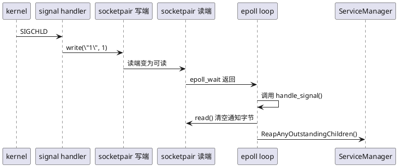
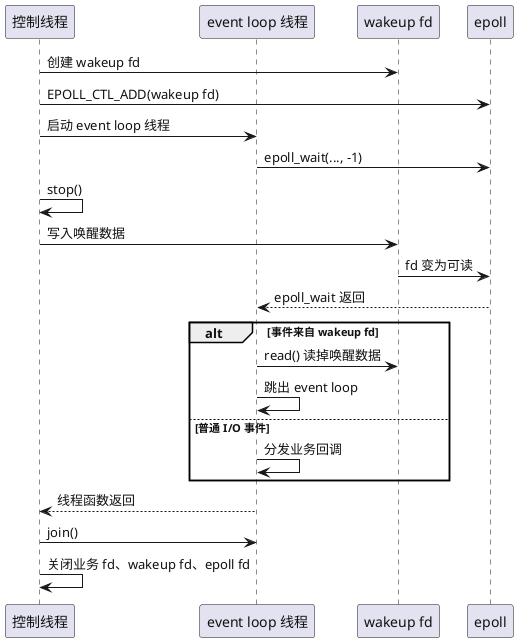
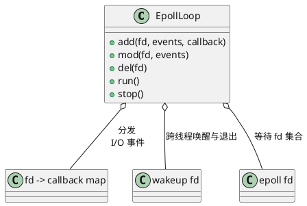

+++
title = "epoll 实用技巧与事件驱动编程"
date = 2026-05-21

[taxonomies]
categories = ["Linux"]
tags = ["epoll", "Linux", "C/C++", "网络编程", "事件循环"]
+++

`epoll` 经常被介绍成"高性能网络 I/O 多路复用接口"，这句话没错，但它只讲了最常见的一半用法。

在真实工程里，`epoll` 更像一个统一的事件入口。网络读写、退出通知、信号处理等事件都可以汇入同一个 wait 点，主线程只需要围绕这个 wait 点做分发，而不必在多个阻塞点和轮询逻辑之间来回切换。

这篇文章会围绕 Linux "一切皆文件" 的设计思想，整理几个 `epoll` 的实用技巧：

1. 用 `socketpair` 或 `signalfd` 把信号处理并入 `epoll`。
2. 用 pipe、socketpair 或 `eventfd` 主动唤醒 `epoll_wait()`，让线程退出并清理资源。
3. 把 `epoll` 封装成事件驱动程序的 event loop。
4. 用 `epoll` 管理网络连接，实现多路复用。

## 一切皆文件

Unix/Linux 的一个重要传统是"一切皆文件"。这句话不是说所有东西都真的存在磁盘文件里，而是说内核尽量给不同资源提供统一的 fd 访问接口。

例如：

- 网络连接：通过 socket fd `read()`/`write()`。
- 管道通信：通过 pipe fd 或 socketpair fd 读写字节。
- 进程信号：可以通过 signalfd 变成一个可读 fd。
- 定时器：可以通过 timerfd 变成一个可读 fd。
- 线程通知：可以通过 eventfd 变成一个可读 fd。
- 文件系统变化：可以通过 inotify fd 读取事件。

这个统一抽象带来的好处是：业务不必为每类事件写一套阻塞等待逻辑。只要它们都能表现为 fd，就可以统一注册到 `epoll`，由同一个 event loop 分发。

所以 `epoll` 的实用价值可以概括为一句话：把 Linux 中各种"可等待的事情"统一成 fd 事件。

## epoll 的核心模型

`epoll` 的使用过程可以拆成三步：

```c
int epfd = epoll_create1(EPOLL_CLOEXEC);

struct epoll_event ev = {};
ev.events = EPOLLIN;
ev.data.fd = fd;
epoll_ctl(epfd, EPOLL_CTL_ADD, fd, &ev);

struct epoll_event events[64];
int n = epoll_wait(epfd, events, 64, -1);
```

这段代码背后的设计重点不是"等待网络 fd"，而是"维护一个 fd 集合，然后等待其中任意 fd 的状态变化"。其中，`epoll_create1()` 创建等待集合，`epoll_ctl()` 增删改 fd，`epoll_wait()` 取出已经就绪的事件。

## 技巧一：信号处理不要在 signal handler 里做重活

信号处理有一个很容易踩的坑：信号处理函数的执行上下文很特殊，只能安全调用 async-signal-safe 的函数。像加锁、分配内存、写日志、遍历容器、重启服务这类操作，都不应该直接放在 signal handler 里做。

Android init 在 Android 7.1.2 里的 `SIGCHLD` 处理就是一个很好的工程例子。源码参考：

- [signal_handler.cpp](https://xrefandroid.com/android-7.1.2_r28/xref/system/core/init/signal_handler.cpp)
- [init.cpp](https://xrefandroid.com/android-7.1.2_r28/xref/system/core/init/init.cpp)

它的思路很符合"一切皆文件"：把异步信号转换成一个普通 fd 的可读事件。

流程可以画成这样：



关键代码片段如下。先创建一个 `socketpair`：

```cpp 
int s[2];
socketpair(AF_UNIX, SOCK_STREAM | SOCK_NONBLOCK | SOCK_CLOEXEC, 0, s);
signal_write_fd = s[0];
signal_read_fd = s[1];
```

然后配置 `SIGCHLD` handler，向写端写 1 字节数据：

```cpp
struct sigaction act;
memset(&act, 0, sizeof(act));
act.sa_handler = SIGCHLD_handler;
act.sa_flags = SA_NOCLDSTOP;
sigaction(SIGCHLD, &act, 0);

static void SIGCHLD_handler(int) {
    // 收到信号后写入 socket，触发 epoll 可读事件
    TEMP_FAILURE_RETRY(write(signal_write_fd, "1", 1));
}
```

最后把读端注册到 init 进程的 `epoll` 里：

```cpp
static void handle_signal() {
    char buf[32];
    read(signal_read_fd, buf, sizeof(buf));
    ServiceManager::GetInstance().ReapAnyOutstandingChildren();
}

void register_epoll_handler(int fd, void (*fn)()) {
    epoll_event ev;
    ev.events = EPOLLIN;
    ev.data.ptr = reinterpret_cast<void*>(fn);
    if (epoll_ctl(epoll_fd, EPOLL_CTL_ADD, fd, &ev) == -1) {
        ERROR("epoll_ctl failed: %s\n", strerror(errno));
    }
}

register_epoll_handler(signal_read_fd, handle_signal);
```

当 `signal_read_fd` 可读时，`epoll_wait()` 返回并分发回调：

```cpp
int main(int argc, char **argv){
  // ...
  while (true) {
      //...
  
      epoll_event ev;
      int nr = TEMP_FAILURE_RETRY(epoll_wait(epoll_fd, &ev, 1, timeout));
      if (nr == -1) {
          ERROR("epoll_wait failed: %s\n", strerror(errno));
      } else if (nr == 1) {
          ((void (*)()) ev.data.ptr)();
      }
  }
}
```

这里最重要的是职责划分：

- signal handler 只写 1 字节，用来唤醒主循环。
- 真正的业务处理放回 event loop 普通上下文。
- `epoll` 统一调度信号事件和其他 fd 事件。

如果是新项目，也可以考虑 `signalfd`, 最新的 Android 16 也是用的 `signalfd`， 参考[CreateAndRegisterSignalFd](https://xrefandroid.com/android-16.0.0_r2/xref/system/core/init/init.cpp#CreateAndRegisterSignalFd)。它更直接：阻塞目标信号，然后用 `signalfd()` 创建 fd，再把这个 fd 加入 `epoll`。但 `socketpair`/pipe 技巧仍然非常通用，尤其适合兼容旧系统或已经有自定义 signal handler 的代码。

## 技巧二：主动唤醒 epoll_wait，优雅退出并清理资源

很多线程模型会写成这样：

```c
while (running) {
    epoll_wait(epfd, events, max_events, -1);
}
```

问题是：当另一个线程把 `running` 改成 `false` 时，当前线程可能仍然卡在 `epoll_wait(..., -1)`，没有任何 fd 事件就不会返回。这样析构函数、资源释放、线程 `join` 都可能被卡住。

解决方法是给 event loop 增加一个"退出 fd"。这同样是在利用"一切皆文件"：退出请求本来只是一个内存里的布尔状态，但我们把它转换成 fd 可读事件，交给 `epoll` 统一处理。



这里有一个细节需要特别注意：如果使用 `eventfd`，应该写入 `uint64_t` 类型的 `1`，不要写 `0`。`eventfd` 的语义是计数器，写入值会累加到计数器上；写 `0` 不适合作为唤醒信号。

```c++
eventfd_write(exit_event_fd, 1);
```

如果使用 `pipe` 或 `socketpair`，则是写 1 字节：

```c++
uint8_t exitFlag = 1;
write(exit_pipe_write_fd, &exitFlag, sizeof(exitFlag));
```

一个简化版退出唤醒类可以这样设计：

```c++
class EventLoop {
public:
    EventLoop() {
        epfd_ = epoll_create1(EPOLL_CLOEXEC);
        exitfd_ = eventfd(0, EFD_NONBLOCK | EFD_CLOEXEC);

        epoll_event ev = {};
        ev.events = EPOLLIN;
        ev.data.fd = exitfd_;
        epoll_ctl(epfd_, EPOLL_CTL_ADD, exitfd_, &ev);
    }

    ~EventLoop() {
        stop();
        close(exitfd_);
        close(epfd_);
    }

    void stop() {
        if (!running_) {
            return;
        }
        running_ = false;
        eventfd_write(exitfd_, 1);
    }

    void run() {
        running_ = true;

        while (running_) {
            epoll_event events[32];
            int n = epoll_wait(epfd_, events, 32, -1);
            if (n < 0) {
                if (errno == EINTR) {
                    continue;
                }
                break;
            }

            for (int i = 0; i < n; ++i) {
                if (events[i].data.fd == exitfd_) {
                    uint64_t v;
                    read(exitfd_, &v, sizeof(v));
                    running_ = false;
                    break;
                }

                handle_io(events[i]);
            }
        }
    }

private:
    void handle_io(const epoll_event&) {
    }

    int epfd_ = -1;
    int exitfd_ = -1;
    bool running_ = false;
};
```

你也可以不用 `eventfd`，直接用 `socketpair`：

```c++
int fds[2];
socketpair(AF_UNIX, SOCK_STREAM | SOCK_NONBLOCK | SOCK_CLOEXEC, 0, fds);

int wake_read_fd = fds[0];
int wake_write_fd = fds[1];

char byte = 1;
write(wake_write_fd, &byte, 1);
```

`pipe`/`socketpair` 和 `eventfd` 的区别：

- pipe/socketpair：可以写 1 字节。
- eventfd：必须写 8 字节整数，适合计数型通知，常用于线程唤醒。
- 两者都可以加入 `epoll`。
- 两者都要在事件触发后读掉数据，否则水平触发模式下会反复唤醒。

## 技巧三：把 epoll 封装成 event loop

当程序里只有一个 socket，直接 `read()` 就可以。真正需要 `epoll` 的场景，通常是程序里同时有多类事件：

- 多个网络连接。
- 服务退出请求。
- 信号事件。
- 定时器事件。
- 子进程回收。
- 本地控制命令。

这些事情原本属于不同领域：网络、进程、时间、控制命令。但在 Linux 里，它们都可以落到 fd 上。这时不要把 `epoll_wait()` 散落在业务代码里，而应该封装成 event loop。

一个简单 event loop 可以包含这些职责：



伪代码如下：

```c++
using Callback = std::function<void(uint32_t events)>;

class EpollLoop {
public:
    void add(int fd, uint32_t events, Callback cb);
    void mod(int fd, uint32_t events);
    void del(int fd);
    void run();
    void stop();

private:
    int epfd_ = -1;
    int wakefd_ = -1;
    std::unordered_map<int, Callback> callbacks_;
};
```

`epoll_event.data` 可以存 fd，也可以存指针：

```c++
ev.data.fd = fd;
```

或者：

```c++
ev.data.ptr = connection;
```

存 fd 简单，适合小程序；存指针适合网络服务器，因为回调里通常需要拿到连接状态、输入缓冲区、输出缓冲区、协议解析状态等。

Android init 的 `register_epoll_handler()` 选择把函数指针放进 `ev.data.ptr`，主循环里取出来直接调用。这个设计很轻量，适合 `init` 这种事件种类少、回调方法签名统一的程序。

## 技巧四：网络通信和多路复用

网络服务器里，`epoll` 最常见的用法是监听 fd 加多个连接 fd。

这也是"一切皆文件"最直观的例子：一个 TCP 连接不是一个特殊对象，而是一个 socket fd。监听 socket 是 fd，客户端连接也是 fd。服务端要做的事，就是把这些 fd 放进同一个事件集合里，根据可读、可写、关闭等状态推进连接生命周期。

如下：

```c++
// 多发送端，比如多路手机投屏到智能电视
bool Receiver::threadLoop() {
    if (receiver_fd_ < 0) {
        LOGE("socket not create well, or close already!");
        return false;
    }
    int fdNum = epoll_->waitReady();
    if (fdNum < 1) {
        return true;
    }

    for (int i = 0; i < fdNum; ++i) {
        int fd = epoll_->getReadySock(i);
        SOCKSTATUS status = getsockstate(fd);
        if ((status == SOCKET_BROKEN) ||
            (status == SOCKET_NONEXIST) ||
            (status == SOCKET_CLOSED)) {
            removeClient(fd, status);
        } else if (fd == receiver_fd_) {
            if (status == SOCKET_LISTENING) {
                acceptClient();
            }
        } else {
            recvFrame(fd);
            printStats(fd);
        }
    }
    return true;
}
```

这里有几个经验规则：

- fd 一定要设为非阻塞，避免一个 fd 卡住整个 event loop。

如果某个 fd 是阻塞的，当你把内核缓冲区读空后，下一次 `read` 会阻塞，而不是返回 `EAGAIN`。event loop 就挂住了。
`read` 可能卡住。这样 event loop 就停在这个连接上，其他连接、退出 fd、信号 fd、定时器 fd 都无法处理。 

非阻塞 fd 的好处是：没有数据就返回 `-1`，`errno` == `EAGAIN`，event loop 可以继续处理其他事件。

- 边沿触发`EPOLLIN` 触发后要循环读到 `EAGAIN`。

ET 模式只在状态变化时通知一次。正确写法是循环读：

```cpp
for (;;) {
    ssize_t n = read(fd, buf, sizeof(buf));
    if (n > 0) {
    // 处理数据
    continue;
    }
    
    if (n == -1 && errno == EAGAIN) {
      break; // 数据读干净了
    }
    
    // n == 0 或其他错误：关闭连接
    break;
}
```

## 水平触发和边沿触发怎么选

`epoll` 有两种常见触发方式：

- LT，Level Trigger，水平触发，默认模式。
- ET，Edge Trigger，边沿触发，需要设置 `EPOLLET`。

水平触发的语义是：只要 fd 仍然可读或可写，下次 `epoll_wait()` 还会继续返回它。

边沿触发的语义是：状态从不可读变成可读时通知一次。如果你没有把数据读干净，后面不一定会再次收到通知。

所以 ET 模式一般必须配合：

- 非阻塞 fd。
- `read()` 或 `accept()` 循环到 `EAGAIN`。
- 输出缓冲区没写完时再关注 `EPOLLOUT`。

对大多数业务程序来说，先用 LT 更稳。等你确认性能瓶颈在事件通知频率，再考虑 ET。很多线上问题不是因为 LT 太慢，而是因为 ET 没有读到 `EAGAIN`，导致连接卡死。

## 常见坑

### 1. 在 signal handler 里做复杂逻辑

不要在 signal handler 里回收所有子进程、打印复杂日志、加锁或操作容器。更稳的做法是写 1 字节唤醒 event loop，把真实处理放到普通上下文。

Android init 进程的 `SIGCHLD` 处理就是这个模式。

### 2. 退出标志改了，但 `epoll_wait` 没醒

`running = false` 不能打断 `epoll_wait(epfd, events, max, -1)`。必须让某个已注册的 fd 变为可读，例如写 `pipe`、`socketpair` 或 `eventfd`。

这也是 fd 抽象给我们的约束：event loop 等的是 fd 状态，不是普通变量状态。普通变量改变后，必须转换成 fd 事件，`epoll_wait()` 才能感知。

### 3. eventfd 写 `0`

如果用 `eventfd` 做退出通知，写入值应该是 `1` 或其他非零值。写 `0` 不适合作为唤醒事件。

### 4. 忘记 drain wakeup fd

`pipe`/`socketpair` 被唤醒后，要读掉数据。`eventfd` 也要读掉计数值。否则 LT 模式下它会持续可读，event loop 可能反复处理同一个 wakeup 事件。

### 5. 误用 EPOLLOUT

socket 通常大多数时间都是可写的。只有输出缓冲区里确实有数据没写完时，才应该关注 `EPOLLOUT`；写完后要取消。

### 6. close 顺序混乱

多线程 event loop 中，不要在 event loop 线程还没退出时直接关闭它正在等待的 fd。先写 wakeup fd，让 `wait` 返回，再 `join`，最后统一清理。

## 总结

`epoll` 不只是网络服务器里的连接多路复用工具。它真正好用的地方，是把不同来源的事件统一成 fd，再交给一个 event loop 调度。

这正是 Linux "一切皆文件"思想在服务端程序里的落地：网络连接、信号通知、退出请求、定时器、线程间消息，都可以被转成 fd 上的可读或可写事件。程序只需要维护一个清晰的 `wait` 点和一套分发逻辑。

几个实用结论：

- 信号处理：signal handler 只写 1 字节，业务逻辑回到 event loop。
- 退出等待：给 loop 配一个 wakeup fd，停止时写入它，让 `epoll_wait()` 返回。
- 资源清理：先唤醒线程并 `join`，再关闭 fd 和 epoll fd。
- 网络通信：非阻塞 fd + epoll + 每连接状态，是多连接服务器的基本模型。
- 工程设计：把 `epoll_ctl()` 和 `epoll_wait()` 封装进 event loop，业务只关心事件回调。
- 设计思想：把"一切皆文件"理解透，`epoll` 就不只是网络工具，而是统一事件模型的基础设施。

当一个程序同时要处理信号、退出、定时器、网络连接时，`epoll` 的价值就不只是"快"，而是让程序结构变得更可控。
